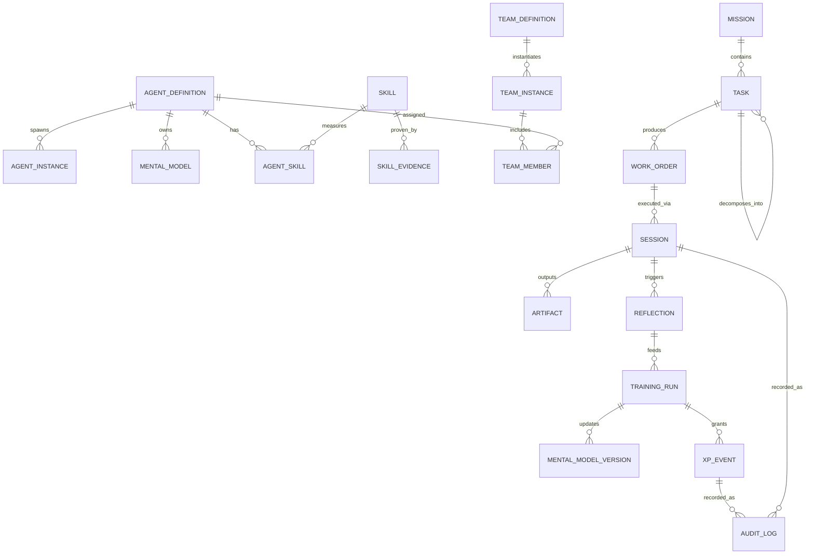
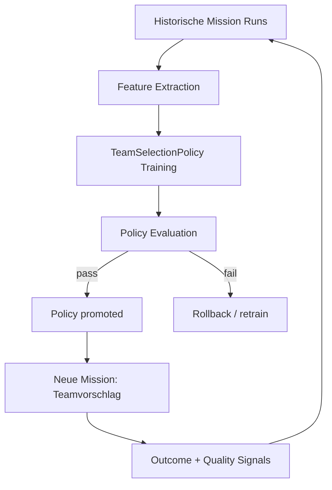

# Deep-Dive-Analyse des ComposioHQ agent-orchestrator als Blueprint für deine lokale, trainierbare Agent‑Orchestrierungs‑App

## Executive Summary

Das Repository von entity["company","ComposioHQ","ai devtools company"] zeigt eine sehr pragmatische, produktionsnahe Architektur für Agent‑Orchestrierung mit einem klaren Schwerpunkt auf **ausführbaren Agent‑Sessions** (z. B. Coding‑Agents), **starker Modularität über Plugins**, und einem **lokalen/operativen Workflow**, der Engineering‑Realität (Terminals, tmux, PRs, CI, Review) ernst nimmt. Zentral ist dabei: *Orchestrierung ist weniger ein “LLM‑Graph” als ein System aus* **Session‑Lifecycle**, **Workspace‑Isolation**, **Runtime‑Isolation**, **UI‑Observability** und **Integration in Toolsysteme**. citeturn7view2turn9view0turn15view0turn12view0

Für deine Zielvision (lokale App, maßgeschneiderte Agenten, persistente “Mental Models”, Training via Reflection/NotebookLM‑ähnlicher Recherche, Skill‑Level/Gamification, Meta‑Agent zur Teamzusammenstellung, Qualität>Quantität) lassen sich aus dem Repo vor allem vier belastbare Learnings extrahieren:

Erstens: **Plugin‑Slots als “Systembus”** (Runtime/Workspace/SCM/Tracker/Notifier/Terminal) sind ein sehr tragfähiges Grundmuster, weil sie technische Kopplung minimieren und trotzdem reale Systemeffekte (Prozesse, Repos, Tickets) sauber abstrahieren. Besonders aussagekräftig ist, dass “Workspace” explizit als Mechanismus zur Code‑Isolation modelliert ist. citeturn25view12turn7view2

Zweitens: **Prozess‑ und Interaktions‑Isolation** (z. B. per tmux‑Session pro Agent) wird nicht nur als Sicherheits‑/Concurrency‑Thema behandelt, sondern als Debuggability‑ und Robustheitsfeature: Sessions überleben Orchestrator‑Crashes, sind attachbar, laufen parallel, und bleiben terminal‑korrekt für interaktive Tools. citeturn9view0turn12view0turn11view0

Drittens: **UI/Eventing** ist realistisch umgesetzt: Ein SSE‑Stream liefert “Realtime‑Feeling”, wird aber aktuell per Polling gegen den SessionManager gespeist (kein push aus dem Core). Das ist eine bewusste Trade‑off‑Entscheidung zwischen Implementierungsaufwand und Nutzwert. citeturn15view0turn18view6

Viertens: Das Repo implementiert bereits mehrere **Qualitäts‑Gates** und Observability‑Mechanismen (Correlation IDs, API‑Observations, Verifikation von “merged‑unverified” Items, PR‑Enrichment/Cache‑Strategien). Das ist sehr anschlussfähig an dein “Qualität>Quantität”‑Training, weil du auf dem gleichen Grundmuster aufsetzen kannst: *Messbar machen → auswerten → belohnen/leveln → reflektieren → persistieren.* citeturn23view6turn23view8turn20view0turn25view6

Was im ComposioHQ‑Repo **nicht** als ausformuliertes Konzept sichtbar ist: persistente “Mental Models” pro Agent, Skills als First‑Class‑Domainobjekte und ein Training‑Loop (Reflection, Wissensaufbau) im Sinne deiner Anforderungen. Diese Aspekte sind für deine Erweiterung deshalb “unspecified” (im ComposioHQ‑Repo jedenfalls nicht als dediziertes Modul/Subsystem belegt) und sollten als **neue Kernschicht** in deiner Architektur eingeplant werden. *(unspecified)*

## Repo-Überblick und Architektur-Landkarte

Das Projekt ist als Monorepo strukturiert, mit klar getrennten Verantwortlichkeiten:

- **Core** (Orchestrierungs‑Kern, Session‑Management, Typen, Recovery/Utilities) – erkennbar an `packages/core/src/*` mit zentralen Modulen wie `session-manager.ts`, `lifecycle-manager.ts`, `plugin-registry.ts`, `orchestrator-session-strategy.ts` sowie Querschnitt wie `observability.ts` und `recovery/*`. citeturn8view3turn8view3  
- **Plugins** als austauschbare Adapter für Agenten, Runtimes, Notifications, SCM, Tracker, Terminals, Workspaces. Die Liste der Plugin‑Pakete im Repo macht die Slot‑Denke praktisch greifbar (z. B. `runtime-tmux`, `runtime-process`, `workspace-worktree`, `scm-github`, `tracker-linear`, `notifier-slack`, `terminal-web`). citeturn7view2  
- **Web UI** (Next.js‑basierte App) plus **separate Server‑Komponenten** für Terminal‑Streaming: `packages/web/src/*` für UI + Next API Routes, und `packages/web/server/*` für Terminal‑WebSocket‑Server/Prozess‑Supervisor. citeturn7view0turn10view0turn10view2  
- **CLI** (Entry, Commands, Optionen), sichtbar als `packages/cli/src/*`. citeturn8view0  

Ein paar konkrete Architekturpfade, die für dich besonders relevant sind:

Die UI nutzt einen **SSE‑Endpoint** `/api/events`, um Session‑Zustände (id/status/activity/attentionLevel/lastActivityAt) kontinuierlich an Clients zu liefern. Implementiert ist das als Snapshot‑Stream mit Heartbeat; Zustandsänderungen kommen aktuell über periodisches Polling des SessionManagers. citeturn15view0turn18view6

Session‑Lifecycle wird über API‑Routen wie `/api/spawn` und `/api/sessions/...` bedient: `/api/spawn` triggert `sessionManager.spawn({ projectId, issueId })`. citeturn18view4  
Für einzelne Sessions gibt es u. a. GET `/api/sessions/[id]` (inkl. Metadaten‑Enrichment und PR‑Handling mit Cache‑Strategie) sowie POST‑Endpunkte zum Senden von Messages, Kill, Restore. citeturn20view0turn22view0turn22view1turn23view0

Auf Runtime‑Ebene wird **tmux** als erstklassiger Execution‑Träger behandelt: Pro Agent‑Session wird eine eigene tmux‑Session erzeugt; Nachrichten werden robust in das Terminal “injiziert” (inkl. Spezialbehandlung für Multiline/Long‑Messages), Output wird via `capture-pane` geholt, und Sessions können attached werden. citeturn9view0

Die Web‑App ergänzt das um Terminal‑Zugriff: ein Server startet **Next.js** und parallel Terminal‑Server‑Prozesse (mit Auto‑Restart und Graceful Shutdown). citeturn11view0  
Für Terminal‑UX gibt es zwei Ansätze:  
- ein Server, der pro Session eine **ttyd‑Instanz** startet und im Dashboard via iframe eingebettet wird (mit explizitem TODO für AuthN/AuthZ/Rate Limiting). citeturn12view0turn12view2  
- ein “direct terminal” Server, der Browser‑xterm.js via WebSocket direkt an tmux koppelt (node-pty optional dependency; Motivation u. a. Clipboard/XDA‑Handling). citeturn12view5  

Die API `/api/runtime/terminal` liefert dazu Port‑/Proxy‑Parameter (Terminal‑Ports, optionaler WS‑Proxy‑Pfad). citeturn24view0

## Architektur- und Implementierungs-Learnings

**Plugin-Slots als “Systembus” statt Framework-Lock-in.**  
Das Repo macht deutlich, dass Agent‑Orchestrierung langfristig nicht durch einen monolithischen “Agent Graph” gewinnt, sondern durch stabile Schnittstellen zu *Execution*, *Isolation* und *External Systems*. Besonders wichtig: “Workspace” ist formal als Plugin‑Slot modelliert und explizit für Code‑Isolation zuständig (pro Session isolierte Kopie/Arbeitsumgebung). Das ist ein erstklassiges Muster, um später auch deine “Training‑Sandboxes” und “Mental‑Model‑Experimente” isoliert laufen zu lassen. citeturn25view12turn7view2

**Prozess-Isolation über tmux als Robustheit + Debuggability.**  
Die tmux‑Runtime zeigt mehrere Best‑Practices, die du direkt übernehmen kannst: strikte SessionId‑Validierung zur Injection‑Vermeidung, idempotentes Destroy, robustes Message‑Sending (kurz vs. lang/multiline), Output‑Capture, Keep‑Alive‑Checks, sowie explizite Dokumentation von Crash‑Orphans und Limitations (z. B. keine Resource Limits). Das ist eine sehr konkrete Blaupause für deine lokale App. citeturn9view0

**Input-Sanitization in APIs als “Security by Construction”.**  
Ein sehr anschlussfähiges Detail: Beim Senden von Messages wird die Eingabe validiert und zusätzlich werden Control‑Characters entfernt, explizit um Injection‑Risiken zu reduzieren, wenn Nachrichten an shell‑basierte Runtimes weitergereicht werden. Für deine Trainings‑/Reflection‑Pipelines ist das genauso wichtig (z. B. wenn “Memory Update Prompts” in Tools/CLI‑Runtimes laufen). citeturn22view0

**Session-Restore als First-Class Feature – wichtig für “Training over time”.**  
Restore ist nicht nur “nice to have”: Die API unterscheidet sauber zwischen “nicht restorable” (409) und “Workspace missing” (422). Dieses Pattern ist zentral für persistent arbeitende Systeme und passt direkt zu deinem “persistentes mentales Modell”‑Ziel: *Persistenz ohne Restore‑Story ist immer fragile Persistenz.* citeturn22view1

**UI/Eventing: Realtime-Feeling via SSE, aber laufzeitrealistisch implementiert.**  
Der SSE‑Endpoint sendet initiale Snapshots, Heartbeats und weitere Snapshots alle 5 Sekunden – mit explizitem Kommentar: *kein push aus dem Core, daher Polling.* Das ist ein sehr nützliches Muster, wenn du schnell UX liefern willst, ohne dein Core‑Subsystem sofort event‑getrieben umbauen zu müssen. Gleichzeitig zeigt es eine klare technische Schuld/Weiterentwicklungslinie für später. citeturn15view0turn18view6

**Terminal-Integration: “Don’t reinvent terminal correctness”.**  
Der Terminal‑Server setzt bewusst auf ttyd als “battle‑tested” Lösung für xterm.js/WebSocket/ANSI/Resize/Input‑Details und startet per Demand‑Spawn Instanzen pro Session, jeweils auf eigenen Ports – mit Port‑Pool/Max‑Port‑Schutz gegen unbounded growth. Für eine lokale App (Desktop) ist das ein wertvolles Pattern: Terminal‑UX ist risiko‑ und bug‑anfällig, deshalb lohnt sich ein externer, erprobter Baustein. citeturn12view0turn12view2

**Alternative Direct-Terminal-Route: optional native dependencies und Feature-Gründe.**  
Zusätzlich existiert der “direct terminal” Server, der node-pty optional lädt (native compilation) und die Brücke Browser↔tmux selbst kontrolliert, u. a. wegen tmux‑Spezifika (XDA/Clipboard). Dieses “dual strategy”‑Pattern (robust default + power‑user path) ist ideal für deine späteren Trainings‑/Debug‑Flows: Default einfach, Advanced für Power‑User. citeturn12view5

**Production Process Supervision: kleines, klares “start-all” statt komplexer Dev-Toolchain.**  
`start-all.ts` ersetzt dev‑only `concurrently`, startet Next.js und die Terminal‑Server, hat Restart‑Logik (begrenzte Restarts) und Graceful Shutdown (SIGINT/SIGTERM, Force‑Timer). Das ist eine ausgezeichnete Blaupause für eine lokale Orchestrierungs‑App, wo du mehrere lokale Services kontrolliert hochfahren willst (UI, Event‑Bus, Model‑Store, Vector‑Store, Sandbox‑Runtime). citeturn11view0

**Observability als Produktfeature, nicht nur Logging.**  
Mehrere API‑Routen nutzen Correlation IDs und “recordApiObservation”‑Muster (Outcome, StatusCode, projekt-/sessionbezogene Attribute). Das ist genau die Art Telemetrie, die du für Gamification brauchst: XP/Skill‑Progress kann nur glaubwürdig sein, wenn du Aktionen, Outcomes und Kontext konsistent erfassen kannst. citeturn23view6turn23view0turn23view2

**Qualitätssignale aus Engineering-Prozess sind bereits modelliert.**  
Im Typensystem sind CI‑Checks/Status, Reviews, Merge‑Readiness und PR‑Enrichment‑Daten modelliert (inkl. “blockers”). Und die Session‑API enrich’t PR‑Infos mit Cache‑Strategie (“cacheOnly” zuerst, sonst einmal blockend befüllen). Das ist ein sehr wertvoller Hinweis: *Qualitätsmetriken sollten aus “harte Signale” (CI/Review) gebaut werden, nicht aus Token‑Mengen.* citeturn25view6turn20view0

**CI/Secrets: harte Guardrails, nicht nur README-Tipps.**  
Die Security Policy benennt konkrete Tooling‑Bausteine (Gitleaks, GitHub Dependency Review, npm audit, Husky) und listet sehr konkrete “never commit”‑Patterns sowie lokale Scans (staged, no-git, history). Außerdem wird der Umgang mit Secrets über eine lokale config (`agent-orchestrator.yaml`) inkl. .gitignore‑Hinweis und “Required Secrets” deutlich beschrieben. citeturn25view0turn25view4turn25view2

**Mental-Model-Handling im Sinne deiner Anforderungen.**  
Im ComposioHQ‑Repo ist kein dediziertes Subsystem erkennbar, das “persistente mentale Modelle”, Skill‑Ontologien oder Trainings‑Loops als First‑Class‑Objekte abbildet. Das heißt: Für “Mental Models”, Reflection‑Training, Skill‑Level/Gamification sind Komponenten/Module in deiner Zielarchitektur als *(unspecified)* neu zu definieren; die bestehenden Strukturen liefern aber gute “Carrier” (Session, Workspace, Observability, API‑Surface), auf die du diese Konzepte sauber aufsetzen kannst. *(unspecified)*

## Zielarchitektur: Hierarchische Orchestrierung mit Meta-Agent

Eine zentrale Veränderung gegenüber dem ComposioHQ‑Ansatz ist dein Schritt von **paralleler Orchestrierung** (“spawn mehrere Sessions nebeneinander”) hin zu **hierarchischer Orchestrierung** (“Team aus Lead/Worker, Subteams, strukturierte Delegation, Training/Evaluierung”). Das lässt sich am saubersten erreichen, indem du zwei Ebenen strikt trennst:

- **Execution-Orchestrierung**: “Wie laufen Instanzen stabil, isoliert, beobachtbar?”  
- **Cognitive/Training-Orchestrierung**: “Wie lernt ein Agent, wie werden Skills gemessen, wie werden Teams optimiert?”

Die ComposioHQ‑Architektur ist bereits stark bei Execution‑Orchestrierung (Runtime/Workspace/Terminal/Observability). citeturn9view0turn25view12turn15view0turn11view0  
Du solltest sie deshalb als Unterbau übernehmen und darüber ein eigenes **Agent‑Training‑ und Team‑Layer** setzen.

image_group{"layout":"carousel","aspect_ratio":"16:9","query":["hierarchical multi agent orchestration architecture diagram","multi agent workflow diagram leader worker protocol","skill tree gamification UI mockup","agent orchestration dashboard realtime events"],"num_per_query":1}

### Datenmodell-Entscheidungen für Hierarchie und Training

Empfohlenes Minimalmodell (konzeptionell, nicht DB‑spezifisch):

- **AgentDefinition**: statisches Profil (Name, Spezialisierung, erlaubte Tool‑Scopes, Prompt‑Template, Safety‑/Governance‑Policy Bindings).  
- **AgentInstance**: laufende Instanz (gebunden an Session/RuntimeHandle/Workspace, mit aktuellen “Context Windows”, Nonce/RunId).  
- **MentalModel**: versioniertes, persistentes “Wissens/Verhaltens‑Artefakt” pro Agent (z. B. `model_vN` + Delta‑Updates aus Reflection). *(unspecified für ComposioHQ; neu)*  
- **Skill** + **SkillEvidence**: Skill als Schema/Taxonomie; Evidence als überprüfbares Ergebnis (Tests passed, Review approved, Survey, Benchmark‑Task).  
- **TeamDefinition**: “Blueprint” (Rollen, gewünschte Skills, Constraints).  
- **TeamInstance**: konkrete Zusammenstellung (Lead, Workers, ggf. Subteams) für eine Mission.  
- **Mission**: top‑level Ziel/Outcome (inkl. Qualitätsdefinition).  
- **TaskGraph**: hierarchischer Task‑Baum (WorkOrders, Dependencies, Acceptance Criteria).  
- **TrainingRun**: strukturierter Trainingsprozess (Input: Task+Evidence; Output: MentalModel Update + Skill delta; Audit log).  
- **XPEvent**: Gamification‑Event mit Quellenbezug (Outcome‑gebunden, anti‑gaming).  

Wichtig ist dabei der Anschluss an die vorhandenen “Carrier” aus dem Repo: Session/Workspace/Runtime/Observability. Das Repo zeigt bereits, wie Workspaces als Isolationseinheit gedacht sind und wie Sessions über APIs gesteuert werden. citeturn25view12turn18view4turn22view0turn22view1turn23view6

### APIs und Runtime-Abstraktion

Du kannst viele API‑Muster direkt übernehmen: Input‑Validation, Sanitization, Correlation IDs, Outcome‑Observations. citeturn22view0turn23view6turn23view0turn23view2  

Empfohlene API‑Surface (lokal, offline‑first; AuthZ lokal, aber dennoch sauber):

- `/agents` (CRUD AgentDefinition)  
- `/agents/{id}/mental-model` (get current + history + proposed updates) *(neu)*  
- `/skills` (Skill taxonomy) *(neu)*  
- `/teams` (TeamDefinition; Meta‑Agent kann neue vorschlagen) *(neu)*  
- `/missions` (Mission create/start/stop + Qualitätskriterien) *(neu)*  
- `/missions/{id}/tasks` (TaskGraph) *(neu)*  
- `/sessions` (Execution sessions analog ComposioHQ) – du kannst Muster wie `/api/spawn`, `/api/sessions/[id]/send`, `/kill`, `/restore` nahezu 1:1 übernehmen. citeturn18view4turn22view0turn23view0turn22view1  
- `/events` (SSE – zunächst polling‑basiert, später event‑driven) – direktes Pattern aus `/api/events`. citeturn15view0turn18view6  
- `/training/runs` (start/run/commit mental model update; enthält Evidence‑Links) *(neu)*  
- `/xp/events` (write‑only event ledger, signiert/append‑only) *(neu)*  

Auf Runtime‑Ebene solltest du den “tmux‑Gedanken” generalisieren:

- **RuntimePlugin** (tmux/process/container) – “create, send, getOutput, isAlive, destroy” als Kern, wie es die tmux‑Beschreibung konkretisiert. citeturn9view0  
- **TerminalAccess** als separater Sub‑Service (Default: ttyd; optional: direct node-pty) – exakt wie im Repo als duale Strategie angelegt. citeturn12view0turn12view5  
- **WorkspacePlugin** als Isolationsträger – der Slot ist im Typensystem ausdrücklich dafür vorgesehen. citeturn25view12  

### Delegation/Lead/Worker-Protokolle

Damit hierarchische Orchestrierung stabil wird, brauchst du ein explizites “Arbeitsvertrag”‑Protokoll zwischen Lead ↔ Worker. Ein empfehlenswertes Minimal‑Protokoll:

- **WorkOrder** (Lead→Worker): `task_id`, `objective`, `constraints`, `acceptance_criteria`, `allowed_tools`, `time_budget`, `deliverable_format`  
- **ProgressUpdate** (Worker→Lead): `task_id`, `status`, `evidence_links`, `risks`, `next_steps`, `help_needed`  
- **Deliverable** (Worker→Lead): `artifact_refs`, `verification_steps`, `quality_self_assessment`, `open_questions`  
- **ReviewDecision** (Lead→Worker): `accept/revise/reject`, `required_changes`, `quality_gate_results`  
- **ReflectionTrigger** (System→Worker oder Lead): “nach Abschluss, vor Skill‑Update” *(neu)*  

Wenn du dieses Protokoll konsequent machst, kannst du “Qualität>Quantität” technisch erzwingen: XP/Skill‑Updates werden nur bei erfüllten Acceptance Criteria und nach Evidence‑Check vergeben (siehe Gamification‑Teil).

### Team-Registry und Meta-Agent-Trainingsloop

Der Meta‑Agent ist bei dir nicht primär “ein weiterer Worker”, sondern ein **Policy/Composition‑Agent**, der aus historischen Missionsdaten lernt:

- Input‑Features: Mission‑Typ, Domain, Komplexität, benötigte Tools, Zeitbudget, gewünschte Qualitäts‑Gates.  
- Kandidatenpool: AgentDefinitions + aktuelle Skills + “Reliability”‑Metriken (z. B. Erfolgsquote unter Constraints).  
- Output: TeamDefinition (Rollen + Zuordnung + Delegation‑Strategie).  

Training‑Loop (konzeptionell):

- Nach jeder Mission wird ein **Outcome Summary** erzeugt (harte Qualitätssignale + menschliches Feedback).  
- Der Meta‑Agent optimiert eine “TeamSelectionPolicy”, z. B. durch Bandit‑Logik oder supervised ranking auf Basis historischer Daten. *(Implementierungsdetail unspecified)*  
- Wichtig: Das Repo zeigt bereits, wie “Qualitätssignale” aus CI/Review/mergeable modelliert sind; du kannst diese Art harter Signale als Kern deiner Reward‑Funktion nutzen. citeturn25view6turn20view0  

## Migrationsplan in Phasen

Die folgende Roadmap ist so aufgebaut, dass du früh eine **lokale, nutzbare App** bekommst (ähnlich dem ComposioHQ‑Produktpfad: UI + Sessions + Terminals), während du “Mental Models/Training/Gamification/Meta‑Agent” schrittweise als neue Layer darüber setzt.

| Phase | Ziel | Kernarbeitspakete | Aufwand | Hauptrisiken |
|---|---|---|---|---|
| Fundament | Orchestrator “läuft lokal” mit Sessions, UI, Events | Monorepo/Package‑Schnitt; Session‑API (spawn/send/kill/restore); SSE Events (zunächst polling wie im Repo); Terminal‑Service (ttyd‑basiert) | med | UX‑Komplexität Terminal; Polling‑SSE kann später migriert werden citeturn11view0turn15view0turn12view0turn18view4turn22view0turn22view1 |
| Runtime & Isolation | stabile Execution‑Abstraktion | RuntimePlugins (tmux/process), WorkspacePlugins (worktree/clone), Sanitization‑/Validation‑Layer | med | Security‑Footguns bei Shell‑Runtimes; Resource Limits (tmux: none) citeturn9view0turn22view0turn25view12 |
| Observability-Backbone | Metriken/Tracing als Grundlage für Training & XP | Correlation IDs; API Observations; Health Endpoints; Tool‑/Session‑Logs | low–med | “Mess‑Wüste”: zu viele Metriken ohne Entscheidungspfad; Privacy lokal | citeturn23view6turn23view0turn23view2 |
| Mental Models | persistente, versionierte Agent‑Modelle | MentalModel Store (Versioning, diffs, rollback); Reflection Pipeline; Evidence Capture | high | Datenqualität/Drift; Prompt‑Injection; Modell‑Overfitting auf “Style statt Outcome” *(unspecified)* |
| Hierarchische Orchestrierung | Lead/Worker/Subteams stabil integrieren | TaskGraph + WorkOrders; Delegation‑Protokolle; TeamInstance Lifecycle; Team Registry | high | Koordinations‑Overhead; Debuggability; “Policy” vs “Execution” Vermischung *(unspecified)* |
| Gamification | Skill‑Level & XP aus Qualität ableiten | Skill taxonomy + Evidence; XP ledger; Anti‑Gaming; UI Progression | med | Gaming/Goodhart; falsche Incentives; Frustration bei unfairen Scores *(unspecified)* |
| Meta-Agent | Teamzusammenstellung automatisieren | TeamSelectionPolicy; Training‑Datensatz aus Missionshistorie; Evaluation/AB‑Vergleich | med–high | Feedback‑Loops; Bias; Sicherheits‑/Rechteausweitung (Meta‑Agent darf nicht “alles”) *(unspecified)* |

Ein zentrales Architekturprinzip aus dem ComposioHQ‑Repo, das du bewusst beibehalten solltest: **erst stabile Execution‑Pfade (Session/Runtime/Workspace/UI), dann “intelligente” Layer**. Das Repo zeigt, dass selbst “Realtime‑UX” zunächst mit Polling‑SSE erreicht wird und später optimiert werden kann. citeturn15view0turn9view0turn25view12

## Gamification und Skill-Model

Deine Gamification sollte *nicht* Reward‑Hacking (“mehr Output = mehr XP”) fördern, sondern **evidence‑basierte Qualität**. Das repo‑nahe Learning: CI/Reviews/Merge‑Readiness sind harte, schwer zu “faken” Qualitätssignale. citeturn25view6

### Skill-Schema

Ein robustes Skill‑Schema (konzeptionell):

- `skill_id` (stabil), `domain` (z. B. “backend”, “research”, “security”), `subskills` (Taxonomie), `level_scale` (0–10 oder 0–100), `prerequisites`  
- `evidence_types`: z. B. “tests_passing”, “review_approved”, “benchmark_task_passed”, “human_rating”, “bug_reopened_rate”  
- `evaluation_rubric`: wie Evidence in Punkte übersetzt wird (gewichtete Regeln + ggf. Human‑Override)

### XP-Formel

Empfehlung: XP = **Base × Quality × Difficulty × Novelty × Integrity**, mit starken Dämpfungen.

Beispiel:

- `Base = 10`
- `Quality = clamp(0..2, 0.5 + 0.5*q)` wobei `q` aus harten Signalen kommt (z. B. CI passing, Review approved, keine Reopens). Das Repo modelliert diese Signale explizit (CIStatus, ReviewDecision, MergeReadiness). citeturn25view6  
- `Difficulty` aus Task‑Merkmalen (z. B. Komplexität, Zeitbudget, Risiko)
- `Novelty` hoch, wenn Skill lange nicht trainiert / neuer Bereich
- `Integrity` ist 0, wenn Evidence fehlt oder “suspicious patterns” erkannt werden

Wichtig: XP wird nicht für “Textproduktion” vergeben, sondern **für akzeptierte Deliverables** mit Evidence.

### Anti-Gaming-Mechanismen

- **Evidence‑Gating**: kein Skill‑/XP‑Gain ohne Evidence‑Objekt (CI/Review/Rating/Benchmark). (Designempfehlung; repo‑kompatibel durch vorhandene Quality‑Signale.) citeturn25view6  
- **Diminishing Returns**: für dieselbe Skill‑Kategorie sinkt XP kurzfristig stark (gegen Grinding).  
- **Random Audits**: zufällige Sampling‑Reviews (z. B. 1 von 10 Runs) – bei Fail: XP‑Rücknahme + Penalty.  
- **Reopen Penalty**: wenn Outcome später als “falsch” markiert wird (Bug reopened / Regression), wird XP teilweise zurückgebucht.  
- **Rate Limits per Agent/Skill/Tag**: verhindert “Micro‑Tasks” zum Farmen.  
- **Cross-Agent Review**: Lead bewertet Worker und Worker bewertet Lead (zweiseitiges Signal, reduziert einseitige Manipulation).  

## Security und Governance

Das ComposioHQ‑Repo liefert eine klare, praxisnahe Security‑Baseline, die du für eine lokale App als Minimum übernehmen solltest:

Die Security Policy nennt konkrete Security‑Tooling‑Bausteine: Secret Scanning via Gitleaks, Dependency‑Scanning (GitHub Dependency Review), `npm audit`, und Husky‑basierte Pre‑Commit‑Validierung. citeturn25view0  
Sie dokumentiert zudem explizit, welche Dateimuster nie committed werden sollen (z. B. `.env*`, Keys, `agent-orchestrator.yaml`) und wie man lokal Gitleaks‑Scans ausführt (inkl. staged/protect). citeturn25view4  
Weiterhin wird ein klarer Umgang mit lokaler Konfiguration empfohlen (Beispielconfig kopieren, Secrets einsetzen, nicht committen, Secret‑Manager nutzen) und es werden typische “Required Secrets” benannt (z. B. Tokens für SCM/Tracker/Chat/LLM‑Provider). citeturn25view2

Für deine lokale, trainierende Agent‑App würde ich zusätzlich eine Governance‑Checkliste als “Release Gate” definieren (Designempfehlungen; teils über Repo‑Learnings motiviert):

- **Secret Storage**: OS‑Keychain/Keystore; niemals Klartext‑Secrets im Projekt‑Workspace ablegen; exportierbare Backups nur verschlüsselt. (Anschluss: Repo warnt vor Secret‑Commits.) citeturn25view2turn25view4  
- **Tool Permissions**: pro AgentDefinition ein deklarativer Tool‑Scope (read/write/net/system). Meta‑Agent darf nur “Team‑Planung”, nicht automatisch “Execution‑Superrechte”. *(unspecified)*  
- **Sandboxing**: für riskante Tools (Shell, Git, Netzwerk) standardmäßig Container/VM‑Runtime statt bare process; tmux‑Runtime als Debug‑Pfad, aber nicht als Security‑Boundary. (Repo nennt “no resource limits” und implizit fehlende harte Isolation bei tmux.) citeturn9view0  
- **Audit Log**: append‑only Log für Sessions, Messages, MentalModel‑Updates, XPEvents (mit Correlation IDs, wer/was/warum). Anschlussfähig an repo‑Muster “recordApiObservation”. citeturn23view6turn23view0turn23view2  
- **Prompt/Memory Injection Controls**: Trennung zwischen “User Content”, “Retrieved Content”, “Policy/Rules”; aggressive Sanitization bei Übergabe an shell‑basierte Runtimes (Repo zeigt Control‑Char stripping). citeturn22view0  
- **Data Retention**: definierte Policies für Logs, Artifacts, Embeddings; “Delete Agent Memory” als UX‑Feature. *(unspecified)*  
- **Local-only Observability**: Telemetrie standardmäßig lokal; opt‑in für remote export. *(unspecified)*  
- **Terminal Access Security**: Terminal‑Server hat im Repo offene TODOs zu AuthN/AuthZ/Rate Limiting – in deiner lokalen App solltest du das trotzdem ernst nehmen (z. B. Session‑bound tokens, same‑origin, throttling). citeturn12view0turn12view2  

## Diagramme und Code-Referenzen

### Beispiel-ER-Diagramm



### Ablaufdiagramm für hierarchische Orchestrierung

```mermaid
flowchart TD
  A[Mission erstellt] --> B[Meta-Agent schlägt Team vor]
  B --> C[Team-Lead bestätigt oder editiert]
  C --> D[TaskGraph erstellen / decomposen]
  D --> E[WorkOrders an Worker verteilen]
  E --> F[Worker Sessions starten (Runtime+Workspace)]
  F --> G[Worker liefern Artifacts + Evidence]
  G --> H[Lead Review gegen Acceptance Criteria]
  H -->|ok| I[Mission Outcome erreicht]
  H -->|revise| E
  I --> J[Reflection & TrainingRun]
  J --> K[MentalModel Update versionieren]
  K --> L[XP/Skill Delta buchen]
  L --> M[Team/Meta-Agent Daten für Policy-Lernen speichern]
```

### Ablaufdiagramm für Meta-Agent-Trainingsloop



### Konkrete Code-/Datei-Referenzen aus dem ComposioHQ-Repo

| Pfad | Learning / Zweck | Priorität für deine App |
|---|---|---|
| `packages/plugins/runtime-tmux/README.md` | Sehr konkrete Runtime‑Schnittstelle, tmux‑Session pro Agent, Message‑Injection‑Handling, Attach‑Info, Security (SessionId validation), Limitations | **Übernehmen** citeturn9view0 |
| `packages/web/server/start-all.ts` | Process‑Supervisor: Next.js + Terminal‑Services, Restart‑Policy, Graceful Shutdown | **Übernehmen** citeturn11view0 |
| `packages/web/server/terminal-websocket.ts` | ttyd‑Per‑Session‑Spawn, Port‑Pooling, TODO AuthN/AuthZ, Observability Hooks | **Anpassen** (Auth zwingend) citeturn12view0turn12view2 |
| `packages/web/server/direct-terminal-ws.ts` | “Power path”: direkte WS‑Bridge via node-pty, optional dependency, Feature‑Motivation (XDA/Clipboard) | **Optional übernehmen** citeturn12view5 |
| `packages/web/src/app/api/events/route.ts` | SSE‑Stream mit Heartbeat + Polling‑Snapshots (“no core push yet”) | **Übernehmen**, später **event-driven** citeturn15view0turn18view6 |
| `packages/web/src/app/api/spawn/route.ts` | Spawn‑Endpoint: `sessionManager.spawn({projectId, issueId})`, Observability‑Recording | **Übernehmen** citeturn18view4 |
| `packages/web/src/app/api/sessions/route.ts` | Sessions‑Listing inkl. Filter/Stats/Observability (Correlation IDs) | **Übernehmen** citeturn18view0turn23view6 |
| `packages/web/src/app/api/sessions/[id]/route.ts` | Session‑GET inkl. Metadata‑Enrichment + PR‑Cache‑Strategie | **Anpassen** (für Mental Models) citeturn20view0 |
| `packages/web/src/app/api/sessions/[id]/send/route.ts` | Input‑Validation + Control‑Char stripping для Shell‑Runtimes | **Übernehmen** citeturn22view0 |
| `packages/web/src/app/api/sessions/[id]/kill/route.ts` | Kill‑Endpoint mit Observability‑Eventing; projektbezogene Zuordnung | **Übernehmen** citeturn23view0turn23view1 |
| `packages/web/src/app/api/sessions/[id]/restore/route.ts` | Restore‑Endpoint, differenzierte Fehlerklassen (409/422) | **Übernehmen** citeturn22view1 |
| `packages/web/src/app/api/sessions/[id]/message/route.ts` | Message‑Route mit Observability‑Tracking (messageLength) | **Übernehmen** citeturn23view2 |
| `packages/web/src/app/api/runtime/terminal/route.ts` | Liefert terminal/direkt‑terminal Ports + proxy WS path, no-store caching | **Übernehmen** citeturn24view0 |
| `packages/web/src/app/api/observability/route.ts` | API‑Observability Summary + recorded outcome | **Übernehmen** citeturn23view6 |
| `SECURITY.md` | Security Policy: Gitleaks, Dependency Review, npm audit, Husky; Secret‑Handling + “never commit”‑Patterns + lokale Scan‑Kommandos | **Übernehmen** citeturn25view0turn25view4turn25view2 |
| `packages/core/src/types.ts` (Workspace Slot) | Workspace als expliziter Plugin‑Slot für Code‑Isolation | **Übernehmen** (Konzept) citeturn25view12 |
| `packages/core/src/types.ts` (Issue Interface) | Issue‑Schnittstelle (Prompt‑Gen, list/update/create optional) als Tool‑Boundary | **Anpassen** (auf Skill/Training erweitern) citeturn25view13 |
| `packages/core/src/*` (z. B. `session-manager.ts`, `plugin-registry.ts`, `lifecycle-manager.ts`) | Core‑Backbone für Session/Plugins/Lifecycle (im Listing sichtbar) | **Review + selektiv übernehmen** citeturn8view3 |
| `packages/plugins/*` (z. B. `tracker-linear`, `notifier-slack`, `scm-github`) | Breites Integrationsspektrum als Plugin‑Portfolio | **Pattern übernehmen**, Integrationen selektiv citeturn7view2turn25view2 |
| `packages/web/src/app/api/verify/route.ts` | Verifikations‑Workflow (Issues mit Label, verify/fail) als “Quality Gate”‑Pattern | **Anpassen** (für Skill Evidence) citeturn23view8turn23view8 |

**Hinweis zu “mental-models / agents / skills / extensions” als dedizierte Repo-Bereiche:** Im ComposioHQ‑Repo sind die für dich relevanten Konzepte überwiegend über **Core/Plugins/Web** verteilt (z. B. “Workspace” als Isolation, “Sessions” als Execution‑Träger, “PR/CI/Review” als Qualitätssignale). Dedizierte Ordner wie `mental-models/` oder `skills/` sind im betrachteten Ausschnitt nicht belegt und deshalb hier als *(unspecified)* zu behandeln.