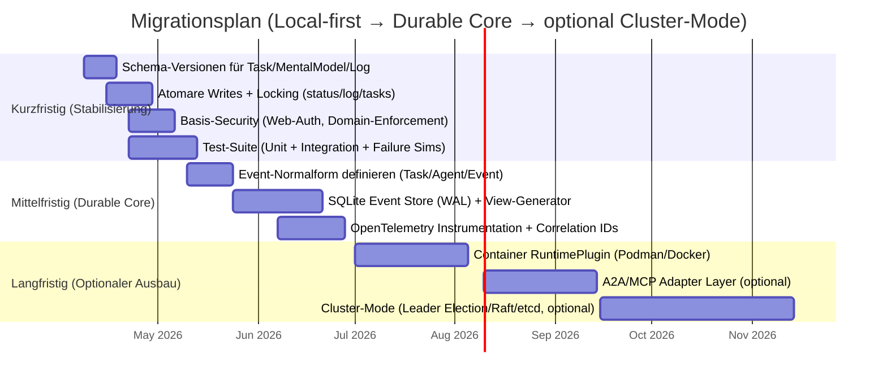

# Analyse der arc42-Architekturdatei für Agent Maestro

## Executive Summary

Die vorliegende arc42-Datei beschreibt **Agent Maestro** als **local-first**, hierarchisches **Multi-Agenten-Orchestrierungssystem** (Maestro → Team-Leads → Worker) mit **dateibasierter Koordination** als kanonischem Zustand, **tmux-basierter Prozessisolation**, **Wave-basierter Ausführung**, **Plan-Freigabe-Gate** sowie einem stark ausgearbeiteten **4‑Level-Memory-Konzept** (Session/Daily/Semantic/Knowledge‑Graph) inklusive Roadmap‑Elementen (*[target]*) wie Plugin-Slots, Training/XP und Git‑Memory. fileciteturn0file0

In der Dokumentation fallen mehrere **starke Punkte** positiv auf: (a) sehr umfangreiche Laufzeit‑/Ablaufdiagramme (Delegation, Plan‑Gate, Reconcile, UI‑Streaming), (b) explizite Cross‑Cutting‑Konzepte mit Zustandsmaschinen, Timeouts, Backpressure, Sicherheits‑ und Observability‑Tabellen, (c) **ADRs** mit Alternativen und Konsequenzen sowie (d) **Quality Scenarios** nach stimulus‑response‑Struktur, was arc42 explizit empfiehlt. fileciteturn0file0 citeturn0search3turn0search11

Die kritischsten **architekturrelevanten Lücken** betreffen weniger „Ideen“, sondern **Betriebs- und Korrektheitsmechanik**: (1) **Konsistenz/Transaktionen** sind bei file‑based state naturgemäß fragil (keine atomaren Multi‑File‑Updates, Race‑Risiken, fehlendes „durables event log“); (2) **Security Controls** sind teils „advisory“/nicht erzwungen (Domain‑Pfadregeln, Web‑Server‑Auth) und benötigen harte Enforcement‑Punkte; (3) **Observability** ist aktuell log‑/file‑zentriert, aber ohne standardisierte Metriken/Traces und ohne durchgängige Correlation‑IDs; (4) **Testbarkeit/Regression‑Sicherheit** ist als „No automated tests“ selbst als Debt gelistet und ist für Orchestrierungssysteme besonders riskant. fileciteturn0file0 citeturn2search0turn2search5

Empfohlen ist eine evolutionäre Stabilisierung in drei Stufen: **(A) Local‑first härten** (Schema‑Versionen, atomare Writes, Locks, Tests, Security‑Enforcement), **(B) Durable Orchestration Core** (Event‑Log/SQLite‑WAL als Transaktionskern + abgeleitete Markdown‑Views), **(C) optionaler „Cluster‑Mode“** nur wenn benötigt (Container‑Runtime, ggf. K8s/Service‑Mesh, Leader‑Election/Consensus via Raft/etcd). Der Nutzen von Transaktions- und Durable‑Mechaniken ist dabei sehr gut mit SQLite‑WAL (same‑host) begründbar; OpenTelemetry liefert ein standardisiertes Fundament für Logs/Traces/Metrics‑Korrelation. citeturn1search0turn2search0turn2search5

## Arc42-Abdeckung und Dokumentationsqualität

arc42 definiert (in der gängigen Struktur) die zentralen Kapitel von „Introduction & Goals“ bis „Glossary“ (12 Kernsektionen) und betont pragmatische, zielgruppenorientierte Architekturdokumentation. citeturn0search0turn4search0turn4search5  
Die Datei folgt dieser Struktur überwiegend, ergänzt aber ein eigenes Roadmap‑Kapitel („Future Improvements“), was als Appendix/Erweiterung sinnvoll sein kann, solange „Ist‑Stand“ vs. „Zielbild“ strikt unterscheidbar bleibt. fileciteturn0file0

### Abdeckungs- und Reifegradbewertung der verlangten Bereiche

| Bereich (vom Auftrag) | In der Datei vorhanden? | Reifegrad | Hauptkritik / Lücke |
|---|---:|---|---|
| Kontext | Ja (Systemkontext + Business‑Kontext) | gut | Security-/Trust‑Boundary‑Sicht fehlt (Datenflüsse/Angriffsflächen nicht als Kontextdiagramm). |
| Requirements | nur indirekt | mittel | Business-/Quality‑Goals vorhanden, aber **funktionale Anforderungen**, Prioritäten, Akzeptanzkriterien und Nicht‑Ziele fehlen bzw. sind verstreut. |
| Constraints | Ja | gut | Gute Transparenz; aber Auswirkungen auf Supportability/Portabilität (z. B. Windows) nicht als bewusste Trade‑off‑Entscheidung ausgearbeitet. |
| Building Block View | Ja (C4‑Container + Komponenten + Code‑Level) | gut | Hohe Detailtiefe; aber Schnittstellen-/Vertragsdefinitionen (API‑Schemas) fehlen. |
| Runtime View | Ja (Sequenzdiagramme) | sehr gut | Stark. Ergänzbar um Failure‑Path‑Sequenzen (z. B. Partial Writes, Concurrent Edit Konflikte). |
| Deployment | Ja (Single‑Machine) | gut | „Localhost only“ erwähnt, aber Härtung (AuthN/AuthZ, Secrets, Update/Package) nicht operationalisiert. |
| Crosscutting Concerns | Ja | sehr gut | Umfangreich; allerdings ungleichgewichtet (Memory/Training dominieren ggü. API‑Versionierung/Schema‑Evolution). |
| Quality Scenarios | Ja | gut | Struktur vorhanden; Metriken teils zu grob (Messfenster/SLO‑Definitionen fehlen). arc42 empfiehlt messbare Szenarien inkl. Response Measure. citeturn0search10turn0search11 |
| Risiken | Ja | gut | Solide Risiko-/Debt‑Tabellen; Owner/Trigger gut. Ergänzbar um Security Threat Model & Supply‑Chain. |
| Entscheidungen (ADRs) | Ja | gut | ADRs vorhanden und hilfreich; jedoch besser als separate, verlinkte ADR‑Sammlung (Index, Status: accepted/superseded) pflegen. citeturn1search1 |
| Glossar | Ja | gut | Gut für Onboarding; aber Definitionen sollten konsequent zu File‑/API‑Schemas referenzieren. |
| Appendices | implizit (Roadmap) | teilweise | Kein formaler Appendix (z. B. Betriebs-/Runbook, Schema‑Definitionen, Checklisten, Migrationsskripte). |

**Bewertung:** Insgesamt ist die arc42-Struktur **weitgehend vollständig** (Kernsektionen vorhanden) – die größte „Komplettheitslücke“ liegt in einer **expliziten Requirements-/Scope‑Schärfung** (funktional + Nicht‑Ziele) sowie in **operationalisierten Verträgen** (Versionierung, Dateiformate, API‑Schemas, Migrationsregeln). fileciteturn0file0 citeturn4search0turn0search0

Die Nutzung des **C4-Modells** für Context/Container/Component/Code ist sauber anschlussfähig und passt als konkrete Ausprägung der arc42 „Building Block View“. fileciteturn0file0 citeturn0search6

image_group{"layout":"carousel","aspect_ratio":"16:9","query":["arc42 Schrank 12 Schubladen","C4 model diagrams overview Simon Brown","Raft consensus algorithm leader election diagram","OpenTelemetry collector reference architecture diagram"],"num_per_query":1}

## Architekturschwächen und Qualitätsrisiken

Diese Sektion adressiert explizit die geforderten Themen (Skalierung, Fehlertoleranz, Konsistenz, Latenz, Security, Observability, Operability, Deployment-Automation, Testing, Versionierung/Backward Compatibility, Datenmodelle/APIs, Agent‑Koordination, Leader‑Election, Failure Handling, State/Persistence/Transactions, Performance). Wo die Datei keine Angaben macht, ist das als **„nicht spezifiziert“** markiert.

### Skalierbarkeit, Performance und Latenz

Das System ist bewusst auf **Single‑Developer / Single‑Machine** ausgelegt. In diesem Rahmen ist die gewählte Parallelisierung über tmux‑Panes und ein Spawn‑Budget (z. B. ~10 parallele Agents) pragmatisch, aber es entstehen harte Skalierungsgrenzen: CPU/RAM/IO/LLM‑Rate‑Limits sind die realen Bottlenecks und nicht die Architektur‑Hierarchie an sich. fileciteturn0file0

**Kernschwäche:** Die „Wave‑based Scheduling“-Strategie reduziert Konflikte, kann aber die **Lead‑Time** erhöhen, sobald Abhängigkeiten zu grob modelliert sind (z. B. wenn Aufgaben in Wave N+1 bereits für Teilbereiche fertig wären). Das ist ein klassischer Trade‑off „Korrektheit/Einfachheit vs. Durchsatz/Latenz“. fileciteturn0file0

**UI‑Latenz:** Pane‑Output wird per `capture-pane` alle 2,5 s gepollt – ausreichend für „human‑in‑the‑loop“, aber nicht für fein granularen Live‑Stream oder spätere Remote‑Betriebsmodi. Gleichzeitig erzeugt Polling bei vielen Panes vermeidbare Last. fileciteturn0file0

**Empfehlung:** mittelfristig auf **Push‑basiertes PTY‑Streaming** (node‑pty/ttyd, wie im Dokument ohnehin als Target genannt) umstellen, um Latenz und Overhead zu senken. fileciteturn0file0

### Konsistenz, State-Management, Persistence und Transactions

Die Datei definiert Files als „message bus“/kanonischen Zustand und nennt explizit: **keine atomaren Transaktionen**, **keine Concurrent‑Write‑Protection**, **keine Query‑Capability**. Das ist fachlich korrekt und zentral für die Risikoanalyse. fileciteturn0file0

**Kritischer Punkt:** Orchestrierungssysteme sind von Natur aus „stateful“. Sobald mehrere Agents schreiben (Tasks, Logs, Status), brauchen Sie zumindest:

- **atomare Writes** (write‑temp + fsync + rename) für kritische Dateien (z. B. `status.md`),  
- **Locking/Serialisierung** für Shared‑State (auch wenn nur „advisory“),  
- **idempotente Events** (damit Retries nicht verdoppeln),  
- **Schema‑Evolution** (damit ältere Task‑Files nach Updates lesbar bleiben).

Zwar sind in der Datei Locking/Atomic Writes als Target angesprochen, aber die **Konsequenz** ist: Solange kanonischer State in Markdown‑Dateien liegt, sind **Transaktionen über mehrere Artefakte** praktisch nicht zuverlässig modellierbar (z. B. „Task completed“ + „Status update“ + „Log entry“ als atomisches Paket). fileciteturn0file0

**Konkrete Alternative (Local‑first‑kompatibel):** Ein **durables Event‑Log in SQLite** (WAL‑Mode) als „Source of Truth“, plus **generierte Markdown‑Views** (goal/plan/status/log) für Lesbarkeit und Git‑Diffs. SQLite‑WAL ist explizit für atomare Commits und Concurrency (readers block writers nicht) dokumentiert, mit der wichtigen Einschränkung „same host“ – was Ihrem Local‑first‑Constraint entspricht. citeturn1search0

### Fehlertoleranz, Failure Handling, Recovery

Die Datei hat ein gutes „Defense in Depth“-Narrativ: tmux‑Resilienz, Resume‑Mechanik, Stall‑Detection, Retry‑&‑Escalation‑Ladders, Reconcile‑Loops. Das ist „richtig gedacht“ und im lokalen Betrieb robust. fileciteturn0file0

**Schwachstelle:** Der aktuell beschriebene „in‑memory ActiveWorkers Map“ plus File‑Status‑Rekonstruktion beim Resume ist anfällig für **Split‑Brain‑Zustände** innerhalb eines einzigen Hosts (z. B. tmux‑Pane lebt, Task‑File fehlt/korrupt, oder umgekehrt). Die Datei erwähnt Klassifikatoren („live/dead/partial/unrecoverable“) als Target, aber nicht den deterministischen Algorithmus (z. B. Prioritätsregeln, automatische Reparatur). fileciteturn0file0

**Empfehlung:** Recovery‑Mechanik als „state machine“ mit expliziten Invarianten implementieren und testen (Property‑Tests). Für durable Orchestrierung ist ein Write‑Ahead‑Queue/Event‑Log (auch als Target genannt) ein großer Hebel. fileciteturn0file0

### Security

Die Datei benennt relevante Security‑Themen (Isolation, Pfad‑Controls, Secrets, Prompt‑Injection, Web‑Server‑Bind). Gleichzeitig sind zentrale Kontrollen **nicht erzwungen** oder **nicht spezifiziert**:

- Domain‑Pfadrestriktionen sind als „advisory“/Ziel‑Enforcement markiert ⇒ aktuell keine harte Policy‑Durchsetzung. fileciteturn0file0  
- Web‑Server‑Auth ist als Technical Debt geführt ⇒ ein lokaler Web‑Server ist zwar „localhost‑only“, aber das ist kein vollständiges Sicherheitsmodell (SSRF/Browser‑Extension‑Risiken, „localhost exposure“, unbeabsichtigtes Port‑Forwarding). „Nicht spezifiziert“: Threat Model, AuthZ‑Modell, Session‑Lifetimes, Audit‑Retention, Secret‑Rotation. fileciteturn0file0  
- Secret‑Handling derzeit: env vars; Ziel: OS‑Keychain. Das ist sinnvoll, aber ohne konkrete Threat‑Szenarien (Leak via Logs, Crash dumps, child processes) bleibt es unvollständig. fileciteturn0file0

**Erweiterung:** Wenn künftig A2A/MCP‑Integration kommt, steigen die Angriffsflächen deutlich. A2A ist als offener Standard für agentische Interoperabilität spezifiziert (inkl. Transport und AuthN/AuthZ‑Kapitel) und sollte dann mit einem klaren Trust‑Boundary‑Design kombiniert werden. citeturn6search0turn6search3turn6search1  
MCP wird von Anthropic als Standard für Tool-/Context‑Anbindung dokumentiert; Integration braucht Governance (server trust, permissions, audit). citeturn5search0

### Observability und Operability

Aktuell besteht Observability primär aus Markdown‑Logs, Task‑Files, per‑Agent stdout/stderr und WebSocket‑Broadcasting. Das ist für Local‑first gut debuggbar, aber skaliert schlecht zu **systematischen Analysen** (SLO‑Tracking, Trend‑Analyse, Incident‑Debugging über Runs). fileciteturn0file0

Ein industrielles Minimum für Orchestrierung wäre:

- strukturierte Events (TaskLifecycleEvent, ToolCallEvent, ProviderCallEvent, FileWriteEvent),  
- durchgehende Correlation IDs pro Delegationsbaum,  
- Metriken (Queue depth, spawn latency, stall rate, retry counts, token usage),  
- Tracing (Delegation→LLM‑Call→Tool‑Call→File‑Write).

OpenTelemetry spezifiziert genau diese Idee der **Korrelation über Logs/Traces/Metrics** (z. B. TraceId/SpanId in Logs) und bietet ein standardisiertes Datenmodell sowie Collector‑Pipeline. citeturn2search0turn2search5

**Operability‑Lücke („nicht spezifiziert“):** Update‑/Release‑Prozess, Rollback‑Mechanismen, Config‑Migrationen, sowie „Runbook“ (standardisierte Troubleshooting‑Steps) – im Dokument nur indirekt über Roadmap/Targets. fileciteturn0file0

### Deployment-Automation, Testing, Versioning, Backward Compatibility

Die Datei listet „No automated tests“ als Debt. Bei Orchestrierungssystemen ist das ein High‑Risk‑Debt, weil viele Fehler nicht durch Kompilierung/Unit‑Tests des Produktcodes sichtbar werden, sondern durch **Zustandsübergänge, Timeouts, Retries, Race Conditions**. fileciteturn0file0

**Versionierung/Backward Compatibility** ist konzeptionell erwähnt (z. B. „API design … versioning strategy“ im Knowledge‑Graph‑Index), aber nicht als Vertragsmodell ausgearbeitet. „Nicht spezifiziert“: Schema‑Versionen für Task‑Files, Mental‑Models, Daily Protocols, Log‑Tabellen, sowie Migrationstools. fileciteturn0file0

## Struktur- und Traceability-Kritik der Datei

### Klarheit und Modularisierung

Die Datei ist in sich konsistent (TOC, Kapitel, Diagramme, Glossar). Allerdings entsteht ein Wartbarkeitsrisiko durch die **Mischung von Ist‑Architektur und Zielbild** in einem Dokument: „*[target]*“ ist hilfreich, aber ohne konsequente Sichttrennung können Leser aus Versehen nicht implementierte Kontrollen als vorhanden annehmen (klassischer Dokumentations‑Fehler: „paper controls“). fileciteturn0file0

**Empfehlung:** Eine klare Trennung in zwei Ebenen:

- **Arc42‑Ist** (implementiert, inklusive Einschränkungen, Metriken, Risiken)  
- **Arc42‑Ziel** (geplante Komponenten + Migration, mit Gate‑Kriterien)

…oder ein klarer Mechanismus pro Sektion („Current / Target / Delta“).

### Traceability: Anforderungen → Design → Entscheidungen → Tests

Positiv: Business-/Quality‑Goals und Quality‑Scenarios sind vorhanden. fileciteturn0file0 citeturn0search3turn0search11

Es fehlt aber eine explizite **Traceability‑Kette**:

- Welche Business Goals werden durch welche Building Blocks/Runtime Flows konkret erfüllt?  
- Welche ADRs adressieren welche Quality Scenarios?  
- Welche Tests/Checks sichern welche Invarianten?  
- Welche Risiken (R*) werden durch welche Maßnahmen/Implementierungen reduziert?

**Konkreter Verbesserungsvorschlag:** Ein „Traceability‑Index“ (eine Seite) mit IDs:

- BG‑xx (Business Goals), QG‑xx (Quality Goals), QS‑xx (Quality Scenarios), ADR‑xx, R‑xx, D‑xx, TEST‑xx  
- plus eine Matrix (QS‑xx → betroffene Komponenten → ADR‑xx → TEST‑xx).

Das verhindert „Design drift“ und macht Reviews deutlich effizienter.

### ADR-Qualität und Entscheidungshygiene

Die ADRs sind ein starker Bestandteil: Sie folgen dem Grundprinzip „Decision + Rationale + Trade‑offs“, was genau dem Sinn von ADRs entspricht. fileciteturn0file0 citeturn1search1

Verbesserbar ist die **Auffindbarkeit/Weiterentwicklung** (klassische Praxis):

- ADRs als einzelne Dateien (z. B. `docs/adr/ADR-008.md`)  
- klarer **Status** (Proposed/Accepted/Superseded)  
- tiefe Verlinkung aus relevanten Kapiteln (z. B. Security‑Kapitel → ADR „Secrets & Auth“).

### Naming und „Architektur-API“

Die Umbenennung „Orchestrator“ → „Maestro“ wird erklärt; gleichzeitig bleiben Dateipfade/Code artefaktisch auf „orchestrator“ stehen. Das ist nachvollziehbar (Kompatibilität), erzeugt aber Naming‑Debt (mentaler Overhead, spätere refactors). fileciteturn0file0

**Empfehlung:** Definieren Sie eine „öffentliche“ Terminologie (Maestro) und eine „interne“ (legacy orchestrator), und planen Sie entweder (a) eine klare Deprecation‑Phase oder (b) eine dauerhafte Dualität mit strikter Dokumentation („public vs internal names“).

## Technologie- und Implementierungsbewertung

### Aktuelle Technologieentscheidung im Kontext „Local-first“

Die Kernentscheidungen sind im Local‑first‑Kontext pragmatisch:

- **tmux** als Isolation/Debugbarkeit (attach, capture)  
- **Node.js/TypeScript + Express + WebSocket** als leichtgewichtige UI-/API‑Schicht  
- **Chokidar** als File‑Watch  
- **Dateibasierte Artefakte** als auditierbarer Run‑Record  
- **Pi‑Agent‑Framework** als Agent Runtime

Das Pi‑Projekt positioniert sich als minimaler, hackbarer Agent‑Harness mit Tool‑Calling und Session‑Persistenz. citeturn5search4turn5search3

### Code-/Snippet-Kritik (Korrektheit & Anti-Patterns)

**Frontmatter‑Schema – Tool‑Permissions:** Im Beispiel werden Tool‑Flags als Liste von Single‑Entry‑Maps notiert (`- read: true`, etc.). Das ist YAML‑gültig, aber ein Anti‑Pattern für Konfiguration, weil:

- Duplikate schwerer erkennbar sind (z. B. zweimal `read`)  
- das Parsen unnötig aufwendiger wird  
- Migrations-/Schema‑Validierung schwieriger ist

Empfehlung: Tools als Map (`tools: { read: true, write: true, ... }`) und zusätzlich `schema_version` im Frontmatter.

**YAML‑Parsing via python3:** Als Debt korrekt identifiziert; das ist unnötig für Node‑Ecosystem und verschlechtert Portabilität/Operability. Besser: native YAML‑Lib + sehr striktes Schema‑Validation (z. B. JSON‑Schema für YAML‑Struktur). fileciteturn0file0

**JSONL‑DAG (Session Context):** Konzeptionell sinnvoll (append‑only, crash safe). Kritisch zu klären („nicht spezifiziert“): (a) Garbage Collection/Compaction, (b) Konsistenzregeln für Branch‑Rewind, (c) Datenschutz (welche Inhalte werden wie lange persistiert). fileciteturn0file0

### Protokolle, Messaging, Konsens, Orchestrierung: passende Alternativen

Da das System heute nicht verteilt ist, sind „Consensus/Leader Election“ **aktuell nicht zwingend**, aber die Datei nennt künftige Remote-/Plugin‑Runtimes; dafür sollten Optionen dokumentiert werden.

- **Wenn Local‑first bleibt:** Leader Election ist trivial (Single Maestro). Fokus liegt auf **Single‑Host‑Transaktionen** (SQLite WAL). citeturn1search0  
- **Wenn Multi‑Node/Cluster‑Mode kommt:** Leader‑Election/Log‑Replication z. B. via **Raft** (Leader‑basiert, replizierter Log). citeturn0search48turn0search7  
  Kubernetes selbst nutzt **etcd** als hochverfügbaren KV‑Store im Control Plane; das ist ein verbreitetes Pattern für koordinierten Cluster‑State. citeturn7search2

**Agent‑Interoperabilität:**  
A2A ist als Standard für agentische Interaktion/Discovery/Transport ausgelegt und wird von entity["company","Google","technology company"] dokumentiert; MCP ist ein Standard zur Tool-/Context‑Anbindung von entity["company","Anthropic","ai company"]. Beide sind relevant, wenn Sie von „konfigurierten lokalen Agents“ zu „dynamischen externen Agenten“ wachsen. citeturn6search0turn6search3turn5search0

**Service Mesh (nur bei K8s‑Mode):** Istio liefert Telemetrie (Metrics/Traces/Logs) und Traffic‑Management in einem Mesh, reduziert aber die operative Einfachheit erheblich. Für Local‑first ist das typischerweise Overkill, für „optional distributed“ kann es sinnvoll sein. citeturn7search1turn7search4

## Verbesserungen, Alternativen und Migrationsplan

### Zielbildvorschlag in drei Evolutionsstufen

**Stufe A: Local‑first härten (ohne Architektur-Bruch)**  
Pros: schnell, kompatibel, hohe Risikoreduktion.  
Cons: bleibt konzeptionell file‑zentriert; Query/Analytics eingeschränkt.

Kernelemente:
- atomare Writes + Locks für Shared‑Files  
- Schema‑Versionierung (Task/MentalModel/Log)  
- Security Enforcement (Domain‑Policies, Web‑Auth)  
- automatisierte Tests (Unit + Integration + „failure simulation“)  
- Correlation IDs im gesamten Delegationspfad

**Stufe B: Durable Orchestration Core (SQLite Event Store + Views)**  
Pros: Transaktionssicherheit, Replay, Query, robuste Recovery; bleibt Local‑first.  
Cons: zusätzliche Komplexität; Migration der bestehenden Artefakte.

SQLite‑WAL ist als Mechanismus dokumentiert, der atomaren Commit und bessere Reader/Writer‑Concurrency bereitstellt (same‑host). citeturn1search0

**Stufe C: Optionaler Distributed/Cluster‑Mode**  
Pros: horizontale Skalierung, Remote‑Agents, Team‑Multi‑User.  
Cons: sehr hohe Komplexität (Netzwerk, Security, Leader Election, Observability, Ops).

Hier wären A2A/MCP‑Integrationen inhaltlich passend – A2A beschreibt Interoperabilität/Discovery und enthält Spezifikationskapitel zu Transport und Auth, MCP standardisiert Tool‑Anbindung. citeturn6search3turn5search0

### Vergleichstabellen für Alternativen

#### Alternative Koordinations- und Zustandskerne

| Option | Kurzbeschreibung | Vorteile | Nachteile | Geeignet für |
|---|---|---|---|---|
| File‑based (Status quo) | Markdown/YAML als kanonischer State | maximal transparent, Git‑diffbar, geringe Abhängigkeiten | keine Transaktionen, Race‑Risiken, schwierige Queries | reine Local‑first Prototypen |
| Event‑Log (JSONL) + Views | append‑only Events, Views generiert | idempotent/replay‑fähig, weniger Konflikte | braucht View‑Builder, Schema-Disziplin | Local‑first mit hoher Robustheit |
| SQLite (WAL) | DB als Source of Truth + Views | atomare Commits, Concurrency, Query, Recovery | DB‑Migration, DB‑Schema‑Evolution | Local‑first „production grade“ |
| Workflow Engine (Temporal) | Durable Workflows/Activities, Retries | eingebaute Timeouts/Retries/State‑Persistenz, Visibility | schwergewichtig, Service‑Betrieb nötig | „Cluster‑Mode“ oder komplexe Orchestrierung |

Grundlagen: SQLite‑WAL (atomare Commits, Concurrency) citeturn1search0; Temporal positioniert Workflows als durable und fault tolerant mit eingebauten Retries/Task‑Queues. citeturn9search0turn10search1

#### Alternative Isolation/Execution Runtimes

| Option | Vorteile | Nachteile | Sicherheits-/Ops-Notiz |
|---|---|---|---|
| tmux | sehr leichtgewichtig, attach/debug | keine harten Resource Limits | gut für Local‑Dev, weniger für Multi‑User |
| Docker | starke Isolation + Ressourcenlimits | Setup/Overhead | Resource Limits sind dokumentiert; sinnvoll für „Stronger Isolation“. citeturn7search0 |
| Podman (rootless) | rootless‑Betrieb, gute lokale Sicherheit | mehr moving parts | Rootless User‑Namespaces beschrieben; Local‑first‑freundlich. citeturn7search3 |
| Kubernetes Pods | Skalierung/Isolation/Orchestrierung | massiv erhöhte Komplexität | Control Plane/etcd/scheduler etc. dokumentiert; nur für Cluster‑Mode. citeturn7search2 |

### Konkreter Migrationsplan mit Schritten und Trade-offs

Die Migration sollte **nicht** zuerst „K8s/Service Mesh“ adressieren, sondern die **Orchestrierungs-Korrektheit** (State/Transactions/Tests/Security). Ein sinnvoller Fahrplan:

Begründungen: SQLite‑WAL bietet atomic commit/rollback und bessere Reader/Writer‑Concurrency für same‑host‑Setups. citeturn1search0  
OpenTelemetry unterstützt Korrelation von Logs/Traces/Metrics über Trace‑Kontext (TraceId/SpanId in Logs). citeturn2search0turn2search5  
A2A ist als Inter‑Agent‑Standard spezifiziert (Discovery/Transport/Auth) – sinnvoll erst, wenn Agents „über Prozessgrenzen“ interoperieren müssen. citeturn6search3turn6search0  
MCP standardisiert Tool-/Context‑Anbindung und ist in Anthropic‑Dokumentation beschrieben. citeturn5search0

## Offene Fragen und priorisierte Maßnahmenliste

### Annahmen/Entscheidungen challengen

1) **„File system = message bus“ als Default**  
Offene Frage: Welche Korrektheitsgarantien sind _wirklich_ notwendig (genau‑einmal vs mindestens‑einmal vs best‑effort) – und für welche Artefakte? Ohne diese Antwort ist schwer zu entscheiden, ob Event‑Log/SQLite zwingend ist oder ob Locking ausreicht. fileciteturn0file0

2) **„Unlimited depth“ vs „max_delegation_depth“**  
Offene Frage: Ist Tiefe ein „Feature“ (unbounded) oder ein „Safety Guard“ (bounded)? Als Architekturentscheidung sollte klar dokumentiert werden: „unbounded in model, bounded in execution“. fileciteturn0file0

3) **Security‑Modell „localhost only“**  
Offene Frage: Wird jemals Remote‑Zugriff / Multi‑User benötigt? Wenn ja, muss AuthN/AuthZ/Threat‑Model jetzt als Architektur‑Contract definiert werden (nicht erst als Debt). fileciteturn0file0

4) **NotebookLM/Playwright‑Automation**  
Offene Frage (nicht spezifiziert): Stabilität/Rate‑Limits/ToS‑Risiken, deterministisches Verhalten, Testbarkeit. Für „production‑grade“ Orchestrierung ist Browser‑Automation häufig ein fragiler Abhängigkeitsvektor.

5) **A2A/MCP‑Adoption**  
Offene Frage: Welche Agent‑Interoperabilität wird tatsächlich gebraucht (remote agents, marketplace, dynamic discovery)? A2A ist gut spezifiziert, aber Integration lohnt erst bei klaren Use‑Cases. citeturn6search1turn6search3turn5search0

### Priorisierte Maßnahmenliste mit Aufwand und Impact

| Priorität | Zeithorizont | Maßnahme | Aufwand | Impact | Begründung/Ergebnis |
|---|---|---|---|---|---|
| P0 | kurz | **Schema‑Versionen** (Frontmatter/Task/MentalModel/Log) + Validator | niedrig (1–3 PT) | hoch | verhindert Format‑Drift, ermöglicht Migration/Backward Compatibility. |
| P0 | kurz | **Atomare Writes** + **Locking** für `status/log` + kritische Task‑Updates | mittel (3–7 PT) | hoch | reduziert Race/Corruptions; adressiert R4 direkt. |
| P0 | kurz | **Test-Suite** (Parser, Prompt‑Assembly, Delegation/Resume, Failure‑Sims) | mittel (5–10 PT) | hoch | Orchestrierung ist ohne Tests regressionsanfällig (Debt D2). |
| P0 | kurz | **Web‑Auth + Domain‑Enforcement** (deny‑by‑default) | mittel (3–8 PT) | hoch | macht Security Controls „real“, nicht nur dokumentiert. |
| P1 | mittel | **Correlation IDs** durchgängig + strukturierte Events | mittel (5–10 PT) | hoch | Basis für Debugging/Analytics; entspricht Zielbild in Observability. |
| P1 | mittel | **SQLite Event Store (WAL)** als durable core + Markdown‑Views | hoch (10–25 PT) | hoch | Transaktionen/Queries/Recovery; passt zum „same host“-Constraint. citeturn1search0 |
| P2 | mittel | **PTY Push‑Streaming** (node‑pty/ttyd) statt `capture-pane` Polling | mittel (5–10 PT) | mittel | bessere Latenz/CPU; verbessert UX/Operability. |
| P2 | mittel | **OpenTelemetry Instrumentation** (traces/metrics/log correlation) | mittel (5–12 PT) | mittel–hoch | Standardisierte Observability/Correlation. citeturn2search0turn2search5 |
| P3 | lang | **Container RuntimePlugin** (Docker/Podman, Resource Limits) | hoch (15–30 PT) | mittel | stärkere Isolation; Docker Limits sind klar dokumentiert. citeturn7search0turn7search3 |
| P3 | lang | **A2A/MCP Adapter Layer** (optional) | hoch (20–40 PT) | variabel | lohnt nur bei echten Remote‑/Interoperabilitäts‑Use‑Cases. citeturn6search3turn5search0 |
| P4 | lang | **Cluster‑Mode** mit Leader‑Election/Consensus (Raft/etcd) + ggf. Mesh | sehr hoch (40+ PT) | variabel | nur wenn Multi‑User/Horizontal‑Scale zwingend; Raft als Basis. citeturn0search48turn7search2 |

**Hinweis zu Aufwandsschätzung:** PT = Personentage. Diese Werte sind bewusst grob (high/med/low im Sinne des Auftrags) und müssen nach Scope‑Schärfung (z. B. „welche Artefakte müssen transaktional sein?“) verfeinert werden.

**Zusammenfassendes Risikobild:** Die größten realen Risiken sind (a) **Korrektheit im State‑Handling** (Race/Corruption/Recovery), (b) **fehlende Test- und Vertragsdisziplin** (Schemas, Versionierung), (c) **Security Enforcement**, (d) **Observability‑Standardisierung**. Alles andere (K8s, Service‑Mesh, Consensus) ist nachgelagert und nur dann sinnvoll, wenn sich das Produktziel über Local‑first hinaus verschiebt. fileciteturn0file0