# Agent Maestro — Target Architecture Documentation (arc42)

> **Version:** 4.0
> **Last Updated:** 2026-04-07
> **Status:** Target-state architecture and implementation-planning guide
> **Scope:** This document defines the intended architecture for Agent Maestro in enough concrete detail to guide implementation planning and phased execution. Where the current repository materially differs, the architecture uses short **Implementation status note** callouts instead of parity-heavy prose.

---

**Table of Contents**

1. [Introduction and Goals](#1-introduction-and-goals)
2. [Constraints](#2-constraints)
3. [Context and Scope](#3-context-and-scope)
4. [Solution Strategy](#4-solution-strategy)
5. [Building Block View](#5-building-block-view)
6. [Runtime View](#6-runtime-view)
7. [Deployment View](#7-deployment-view)
8. [Cross-cutting Concepts](#8-cross-cutting-concepts)
9. [Architecture Decisions](#9-architecture-decisions)
10. [Quality Requirements](#10-quality-requirements)
11. [Risks and Technical Debt](#11-risks-and-technical-debt)
12. [Glossary](#12-glossary)
13. [Future Improvements and Evolution Roadmap](#13-future-improvements-and-evolution-roadmap)

---

## 1. Introduction and Goals

### 1.1 Business Context

Agent Maestro is a **local-first, hierarchical multi-agent orchestration system** that coordinates specialized AI agents to collaboratively tackle software engineering projects. It runs entirely on the developer's machine -- no cloud deployment, no SaaS dependency.

The system implements an **unlimited-depth, tree-structured agent hierarchy** with a clear level-based role model:
- **Level 1 -- Maestro:** The root agent that holds the strategic overview, decomposes goals, delegates tasks, and manages the central project memory.
- **Level 2 to n-1 -- Team-Leads:** Intermediate agents that create strategies for specific domains (e.g., Backend, DevOps, Validation), manage domain-specific expertise files, and coordinate their sub-agents.
- **Level n -- Worker-Agents:** Leaf agents that execute atomic tasks in isolated sandboxes and deliver structured handoff reports back to their leads.

Any agent with the `delegate` tool can spawn sub-agents, who can in turn spawn their own -- forming a recursive tree with no hard-coded depth limit. Unlike flat agent dispatchers that treat all sessions as peers, this system emphasizes **structured delegation, quality gates, and persistent agent learning** at every level of the tree.

### 1.2 Business Goals

| Priority | Goal | Description |
|----------|------|-------------|
| 1 | **Reliable hierarchical delegation** | Complex software tasks decomposed and delegated through an unlimited-depth agent tree (Maestro -> Team-Leads -> Worker-Agents) with clear accountability at every level |
| 2 | **Persistent agent improvement** | Agents learn from completed tasks through reflection-based training -- append-only mental models with evidence-backed skill progression, not weight fine-tuning |
| 3 | **Extensible plugin architecture** | New agents, skills, runtimes, and integrations addable without core changes -- plugin-slot pattern (Runtime/Workspace/SCM/Tracker/Notifier/Terminal) *[target]* |
| 4 | **Observable, quality-gated execution** | Every delegation, reconciliation, and mental model update traceable end-to-end with evidence-based gamification *[target]* |

### 1.3 Quality Goals

| Priority | Quality Goal | Motivation |
|----------|-------------|------------|
| 1 | **Reliability** | Wave-based delegation must never lose tasks or produce orphaned processes |
| 2 | **Extensibility** | New agents, skills, runtimes addable without modifying core orchestration logic |
| 3 | **Observability** | Full traceability from goal decomposition through task execution to outcome |
| 4 | **Resilience** | Sessions restorable after crashes; workspace state always recoverable |
| 5 | **Security** | Process isolation, input sanitization, secret protection |

### 1.4 Stakeholders

| Stakeholder | Role | Expectations |
|-------------|------|-------------|
| Developer | Primary user | Reliable task execution, transparent progress, quality outcomes |
| Maestro (Level 1) | Top-level coordinator | Clear goal decomposition tools, delegation and monitoring capabilities, central project memory management |
| Team-Leads (Level 2..n-1) | Domain managers at any intermediate tree level | Review tools, sub-agent coordination, quality gate enforcement, domain-specific expertise management |
| Worker-Agents (Level n) | Specialists at leaf level | Clear task descriptions, appropriate skills/tools, structured handoff report format |
| LLM Providers | External services | Stable API access (Google Gemini, Anthropic Claude) |

### 1.5 Reading Conventions

This document is optimized for **implementation planning**, not just descriptive architecture review. It uses four notation patterns consistently:

| Convention | Meaning | Planning rule |
|------------|---------|---------------|
| **Implementation status note** | Brief statement about where the current repository is narrower or different than the target architecture | Keep to 2–3 sentences; explain why the gap matters for planning |
| **Open option** | A viable unresolved path that the architecture intentionally keeps open | Always include tradeoffs/consequences |
| **Decision trigger** | The event, phase, or milestone that should collapse an open option into a committed choice | Use concrete triggers like "before first remote runtime" or "before provider failover implementation" |
| **Planned marker** (`*[target]*`, dashed lines, or explicit proposed ADR status) | A target-only element that is not yet required to exist in the current repository | Use to keep ambition visible without pretending current parity |

The arc42/C4 mapping in this document is also explicit:
- **Section 3** provides the **System Context** (C4 Level 1 / C1)
- **Section 5.1** provides the **Container view** (C4 Level 2 / C2)
- **Section 5.2** provides **Component views** (C4 Level 3 / C3)
- **Section 5.3** provides **Code-level seams and contracts** (C4 Level 4 / C4)
- **Section 6** complements the static views with runtime and verification flows

---

## 2. Constraints

### 2.1 Technical Constraints

| Constraint | Description |
|------------|-------------|
| Local-only execution | No cloud deployment; everything runs on the developer's machine |
| tmux + container runtime | tmux for Maestro/Team-Leads; Docker/Podman for Worker-Agent isolation (Linux/macOS only) |
| LLM provider dependency | Requires API access to Google Gemini or Anthropic Claude via ACP OAuth |
| Node.js 22+ runtime | Web server and TypeScript compilation require modern Node.js |
| Web server baseline | Express **4.21.x** is the supported baseline for v1. Express 5 remains deferred until route and error-handling compatibility is validated by automated tests |
| Deterministic orchestrator | The Maestro is a TypeScript control loop that validates plans, computes waves, drives monitoring, and invokes agent runtimes; it is not a free-running LLM agent |
| Agent framework | Agent runtime uses **Pi** (`@mariozechner/pi-coding-agent`) by default via a formal `AgentRuntime` interface; alternate runtimes remain replaceable behind the same contract |
| File-based coordination | Markdown/YAML files in `workspace/` are the canonical state -- no database |
| Git dependency | Memory subsystem requires Git for automated checkpoints, branch-per-worker isolation, and audit trail |

### 2.2 Organizational Constraints

| Constraint | Description |
|------------|-------------|
| Single-developer operation | System designed for one developer orchestrating multiple AI agents |
| No persistent database (yet) | SQLite planned for scores/training history *[target]* |

### 2.3 Convention Constraints

| Constraint | Description |
|------------|-------------|
| Agent format | Markdown files with YAML frontmatter (model, skills, tools, domain permissions). Granting `delegate: true` in tools enables the agent to spawn sub-agents, placing it at any level of the hierarchy tree. |
| Memory system | 4-level memory: session DAG (JSONL), daily protocols (Markdown), long-term expertise (MEMORY.md/EXPERT.md), knowledge graph (Markdown tree) |
| Coordination protocol | All state flows through workspace files (goal.md, plan.md, status.md, log.md, tasks/) |
| Planning precedence | `workspace/plan.md` is authoritative when present. If it is absent, the Maestro may request structured JSON decomposition from the LLM, then validates dependencies and computes waves deterministically |
| Shared-state durability | `workspace/status.md`, `workspace/log.md`, and `workspace/plan.md` are coordination primitives and must be written atomically via write-temp-then-rename |
| Handoff reports | Four mandatory sections: Changes Made / Patterns Followed / Unresolved Concerns / Suggested Follow-ups. Acceptance is a lead-level quality gate, not a prompt-only convention |

---

## 3. Context and Scope

### 3.1 System Context (C4 Level 1)

The System Context diagram shows Agent Maestro as a black box and its interactions with external actors and systems.

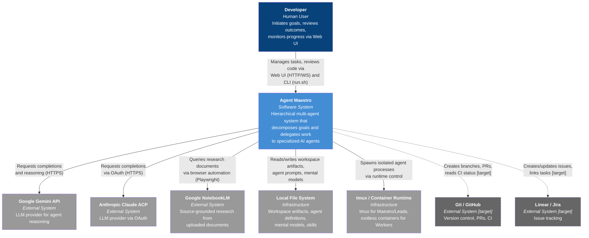
```mermaid
graph TB
    Developer["<b>Developer</b><br/><i>Human User</i><br/>Initiates goals, reviews outcomes,<br/>monitors progress via Web UI"]

    System["<b>Agent Maestro</b><br/><i>Software System</i><br/>Hierarchical multi-agent system that<br/>decomposes goals and delegates work<br/>to specialized AI agents"]

    Gemini["<b>Google Gemini API</b><br/><i>External System</i><br/>LLM provider for agent reasoning"]
    Claude["<b>Anthropic Claude ACP</b><br/><i>External System</i><br/>LLM provider via OAuth"]
    NotebookLM["<b>Google NotebookLM</b><br/><i>External System</i><br/>Source-grounded research from<br/>uploaded documents"]
    FileSystem["<b>Local File System</b><br/><i>Infrastructure</i><br/>Workspace artifacts, agent definitions,<br/>mental models, skills"]
    RuntimeInfra["<b>tmux / Container Runtime</b><br/><i>Infrastructure</i><br/>tmux for Maestro/Leads,<br/>rootless containers for Workers"]
    Git["<b>Git / GitHub</b><br/><i>External System [target]</i><br/>Version control, PRs, CI"]
    Tracker["<b>Linear / Jira</b><br/><i>External System [target]</i><br/>Issue tracking"]

    Developer -- "Manages tasks, reviews code via<br/>Web UI (HTTP/WS) and CLI (run.sh)" --> System
    System -- "Requests completions<br/>and reasoning (HTTPS)" --> Gemini
    System -- "Requests completions<br/>via OAuth (HTTPS)" --> Claude
    System -- "Queries research documents<br/>via browser automation (Playwright)" --> NotebookLM
    System -- "Reads/writes workspace artifacts,<br/>agent prompts, mental models" --> FileSystem
    System -- "Spawns isolated agent processes<br/>via runtime control" --> RuntimeInfra
    System -. "Creates branches, PRs,<br/>reads CI status [target]" .-> Git
    System -. "Creates/updates issues,<br/>links tasks [target]" .-> Tracker

    style System fill:#438DD5,color:#fff
    style Developer fill:#08427B,color:#fff
    style Gemini fill:#999,color:#fff
    style Claude fill:#999,color:#fff
    style NotebookLM fill:#999,color:#fff
    style FileSystem fill:#999,color:#fff
    style RuntimeInfra fill:#999,color:#fff
    style Git fill:#666,color:#fff,stroke-dasharray: 5 5
    style Tracker fill:#666,color:#fff,stroke-dasharray: 5 5
```


> **Implementation status note:** The current repository already contains a deterministic local orchestrator, runtime abstraction, and research helpers, but not every provider/tool boundary shown in this section exists yet as a first-class in-repo integration. This context model defines the external contract surface that future implementation should converge toward.

The target context boundary is intentionally explicit about four external capability planes: reasoning providers, research/tool surfaces (NotebookLM and future MCP-backed tools), local execution/runtime control, and optional delivery integrations such as SCM or issue tracking.

> **Open option — provider integration seam:** Keep provider access primarily behind the Pi runtime/harness layer, or introduce first-class in-repo provider adapters for planning, execution, and research services. **Tradeoffs:** harness mediation reduces custom client code and centralizes auth; first-class adapters improve observability, policy control, and testability. **Decision trigger:** decide before implementing provider failover and richer NotebookLM/MCP-backed integrations as core orchestration services.

### 3.2 Business Context

| Communication Partner | Input | Output | Protocol |
|----------------------|-------|--------|----------|
| Developer | Goals, plan approvals, config changes | Task outcomes, progress updates, handoff reports | HTTP REST, WebSocket, CLI |
| Google Gemini API | Prompts with system context | LLM completions, tool calls | HTTPS (API key) |
| Anthropic Claude ACP | Prompts with system context | LLM completions, tool calls | HTTPS (OAuth token) |
| Google NotebookLM | Research questions | Source-grounded answers from uploaded docs | Browser automation (Playwright) |
| Local File System | File reads | Workspace artifacts, config, agent definitions | Node.js fs / shell |
| tmux / container runtime | Session/pane/container commands | Process isolation, output capture | Shell exec |

---

## 4. Solution Strategy

The following fundamental decisions shape the architecture:

| # | Decision | Rationale |
|---|----------|-----------|
| 1 | **Unlimited-depth hierarchical delegation** | Recursive tree structure: any agent with the `delegate` tool can spawn sub-agents to any depth. Level 1 is always the Maestro, levels 2..n-1 are Team-Leads, and level n agents are Worker-Agents. Teams and sub-teams can be added without architectural changes. |
| 2 | **File-based coordination** | Markdown/YAML files in `workspace/` as canonical state. Human-readable, git-trackable, crash-recoverable. No database needed for core orchestration. |
| 3 | **Deterministic Maestro + Pi runtime contract** | The Maestro is a TypeScript controller that validates plans, computes waves, and supervises execution. Delegated agents run through a formal `AgentRuntime` interface, with Pi as the default implementation for v1. |
| 4 | **Tiered process isolation** | Maestro and Team-Leads run in tmux panes (debuggable via `attach`). Worker-Agents run in containers with cgroup resource limits. Dev-mode fallback: all agents in tmux. |
| 5 | **Deterministic wave scheduling** | Developers or LLMs provide tasks plus dependencies; the Maestro validates the task graph, rejects cycles, and computes reproducible waves by stable topological sort. |
| 6 | **Runtime-enforced quality gates** | Plan-approval is a two-phase runtime protocol (`phase_1_plan` -> approval/revision -> `phase_2_execute`), reconciliation remains mandatory, and handoff reports are schema-validated before acceptance. |
| 7 | **4-level memory system** | Agent memory organized in 4 levels: L1 Session DAG (ephemeral JSONL), L2 Daily Protocols (episodic Markdown), L3 Expertise (MEMORY.md/EXPERT.md, domain-locked), L4 Knowledge Graph (Maestro-curated Markdown tree). Hierarchy-governed write permissions. Git-integrated audit trail. |
| 8 | **Plugin-slot architecture** *[target]* | Runtime/Workspace/SCM/Tracker/Notifier/Terminal as swappable interfaces. Decouples core from integrations. |
| 9 | **Reflection-based training** *[target]* | Reflexion-style improvement through evidence-backed learnings. Training pipeline: Outcome Evidence -> Reflection Summary -> Skill Update. No weight fine-tuning. |
| 10 | **Evidence-gated gamification** *[target]* | XP = Base x Quality x Difficulty x Novelty x Integrity. XP tied to hard signals (CI pass, review approval, reconcile pass). Anti-gaming mechanisms built in. |
| 11 | **Layered fault tolerance** | Defense-in-depth: tmux/container crash resilience, session resume, LLM failover chains, runtime health checks, and a bounded escalation ladder (`nudge -> interrupt/abort -> reassign`). No single failure should lose completed work. |
| 12 | **Resource-aware backpressure** | Spawn budget (max panes), wave-based scheduling, and delegation depth guards prevent resource exhaustion. New delegations queue when at capacity. |
| 13 | **Context window budgeting** | Token budget allocation per prompt component uses provider-aware counting where available. Mental model pruning, skill progressive disclosure, and sub-agent context isolation prevent context rot in deep hierarchies. |

---

## 5. Building Block View

The Building Block View uses the C4 model's hierarchical decomposition: Container (Level 2) -> Component (Level 3) -> Code (Level 4).

> **Implementation status note:** The current repository already implements many of the responsibilities described below, but they are spread across multiple modules such as `src/main.ts`, `src/orchestration-engine.ts`, `src/delegation-engine.ts`, `src/prompt-assembler.ts`, `src/runtime/*`, and `src/memory/*`. The diagrams in this section define the **target logical decomposition** that future implementation should converge toward or preserve through equivalent seams.

Planning emphasis in this section: explicit agent roles and boundaries, runtime contracts, shared memory/datastore flows, tool/MCP surfaces, and quality-gate checkpoints between delegation steps.

> **Open option — control-plane packaging:** Keep a single logical Maestro runtime that owns all control-plane responsibilities, or split parts of the control plane into more isolated services/plugins over time. **Tradeoffs:** a single control plane keeps local-first debugging simple; deeper separation improves failure isolation and integration boundaries. **Decision trigger:** decide before introducing non-runtime plugins or remote execution providers beyond the local-first baseline.

### 5.1 Level 1 -- Container Diagram (C4 Level 2)

Shows the high-level technical building blocks within the system boundary.


```mermaid
graph TB
    subgraph boundary ["Agent Maestro System"]
        direction TB

        MaestroRT["<b>Maestro Runtime</b><br/><i>TypeScript (maestro.ts)</i><br/>Core orchestration engine with tools:<br/>delegate, monitor, reconcile,<br/>write_task, update_memory"]

        MemorySubsystem["<b>Memory Subsystem</b><br/><i>TypeScript</i><br/>4-level memory management:<br/>SessionDAG, DailyProtocol,<br/>ExpertiseStore, KnowledgeGraph,<br/>GitCheckpoint"]

        WebServer["<b>Web Server</b><br/><i>Express.js, Port 3000</i><br/>REST API for workspace, tasks,<br/>agents, config, session, skills,<br/>memory"]

        WSServer["<b>WebSocket Server</b><br/><i>ws library</i><br/>Real-time file change events,<br/>pane output streaming"]

        FileWatcher["<b>File Watcher</b><br/><i>Chokidar</i><br/>Monitors workspace/, agents/,<br/>memory/, skills/, config"]

        WebClient["<b>Web Client</b><br/><i>Vanilla JS SPA</i><br/>Chat-like delegation view,<br/>Dashboard, Tasks, Agents,<br/>Memory Explorer, Config"]

        RuntimeMgr["<b>Runtime Manager</b><br/><i>tmux / Container / Process</i><br/>Agent process isolation:<br/>tmux panes (dev mode),<br/>containers (production mode),<br/>plain-process fallback"]

        Workspace["<b>Workspace</b><br/><i>File System</i><br/>goal.md, plan.md, status.md,<br/>log.md, tasks/"]

        AgentReg["<b>Agent Registry</b><br/><i>File System</i><br/>agents/maestro.md,<br/>agents/leads/*.md,<br/>agents/workers/*.md"]

        MemoryStore["<b>Memory Store</b><br/><i>File System</i><br/>memory/sessions/ (JSONL DAGs)<br/>memory/daily/ (protocols)<br/>memory/agents/ (MEMORY.md, EXPERT.md)<br/>memory/knowledge-graph/ (Markdown tree)"]

        SkillLib["<b>Skill Library</b><br/><i>File System</i><br/>skills/*.md<br/>Reusable capability documents"]

        GitEngine["<b>Git Engine</b><br/><i>Git CLI</i><br/>Automated checkpoints,<br/>branch-per-worker isolation,<br/>memory commit conventions"]

        TrainingPipeline["<b>Training Pipeline</b><br/><i>[target]</i><br/>Reflection summaries,<br/>outcome evidence, skill updates"]

        ScoreService["<b>Score / XP Service</b><br/><i>SQLite [target]</i><br/>XP ledger, skill progress,<br/>anti-gaming enforcement"]

        MetaAgent["<b>Meta-Agent Service</b><br/><i>[target]</i><br/>Team composition optimization<br/>from historical mission data"]

        PluginRegistry["<b>Plugin Registry</b><br/><i>[target]</i><br/>Runtime/Workspace/SCM/<br/>Tracker/Notifier/Terminal slots"]
    end

    Developer["<b>Developer</b>"]
    LLM["<b>LLM Providers</b><br/><i>Gemini / Claude</i>"]
    NLM["<b>NotebookLM</b>"]

    Developer -- "HTTP / WS" --> WebClient
    Developer -- "CLI (run.sh)" --> MaestroRT
    WebClient -- "REST API" --> WebServer
    WebClient -- "WS" --> WSServer
    WebServer -- "file I/O" --> Workspace
    WebServer -- "file I/O" --> AgentReg
    WebServer -- "file I/O" --> MemoryStore
    WebServer -- "file I/O" --> SkillLib
    WebServer -- "exec" --> RuntimeMgr
    FileWatcher -- "events:<br/>file:changed,<br/>log:entry" --> WSServer
    FileWatcher -- "watches" --> Workspace
    FileWatcher -- "watches" --> AgentReg
    FileWatcher -- "watches" --> MemoryStore
    MaestroRT -- "spawn agents" --> RuntimeMgr
    MaestroRT -- "read/write" --> Workspace
    MaestroRT -- "read" --> AgentReg
    MaestroRT -- "read/write<br/>(all 4 levels)" --> MemorySubsystem
    MaestroRT -- "read" --> SkillLib
    MaestroRT -- "API calls" --> LLM
    MaestroRT -- "queries" --> NLM
    MemorySubsystem -- "read/write" --> MemoryStore
    MemorySubsystem -- "commits/branches" --> GitEngine
    TrainingPipeline -. "reads outcomes" .-> Workspace
    TrainingPipeline -. "updates via" .-> MemorySubsystem
    TrainingPipeline -. "writes" .-> ScoreService
    MetaAgent -. "reads scores" .-> ScoreService
    MetaAgent -. "reads" .-> AgentReg

    style boundary fill:none,stroke:#438DD5,stroke-width:2px
    style MaestroRT fill:#438DD5,color:#fff
    style MemorySubsystem fill:#438DD5,color:#fff
    style WebServer fill:#438DD5,color:#fff
    style WSServer fill:#438DD5,color:#fff
    style FileWatcher fill:#438DD5,color:#fff
    style WebClient fill:#438DD5,color:#fff
    style RuntimeMgr fill:#438DD5,color:#fff
    style Workspace fill:#438DD5,color:#fff
    style AgentReg fill:#438DD5,color:#fff
    style MemoryStore fill:#438DD5,color:#fff
    style SkillLib fill:#438DD5,color:#fff
    style GitEngine fill:#438DD5,color:#fff
    style TrainingPipeline fill:#666,color:#fff,stroke-dasharray: 5 5
    style ScoreService fill:#666,color:#fff,stroke-dasharray: 5 5
    style MetaAgent fill:#666,color:#fff,stroke-dasharray: 5 5
    style PluginRegistry fill:#666,color:#fff,stroke-dasharray: 5 5
    style Developer fill:#08427B,color:#fff
    style LLM fill:#999,color:#fff
    style NLM fill:#999,color:#fff
```

### 5.2 Level 2 -- Component Diagrams (C4 Level 3)

#### 5.2.1 Maestro Runtime Components

Logical control-plane boundary: `src/maestro.ts` / Maestro runtime module. **Implementation status note:** the current repository distributes this logic across `src/main.ts`, `src/orchestration-engine.ts`, `src/delegation-engine.ts`, `src/prompt-assembler.ts`, and related runtime modules.

The Maestro Runtime is the concrete **deterministic control plane** for the target architecture. It owns plan validation, wave computation, monitoring, and recovery logic. Delegated agent execution is abstracted behind `AgentRuntime`, with `PiRuntime` as the default implementation and a plain-process fallback for environments where `tmux` is unavailable.

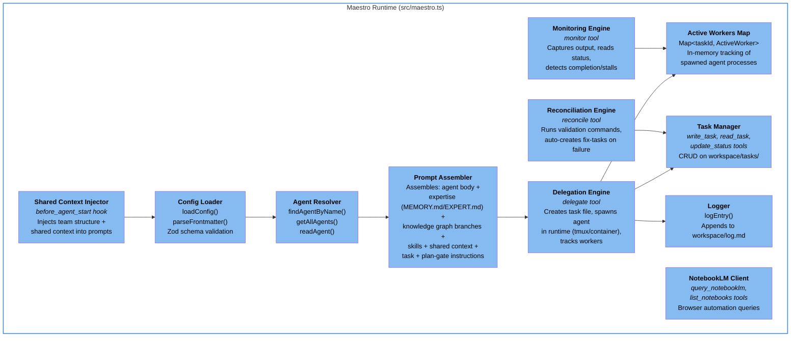
```mermaid
graph TB
    subgraph MaestroRuntime ["Maestro Runtime (src/maestro.ts)"]
        ConfigLoader["<b>Config Loader</b><br/>loadConfig()<br/>parseFrontmatter()<br/>Zod schema validation"]

        AgentResolver["<b>Agent Resolver</b><br/>findAgentByName()<br/>getAllAgents()<br/>readAgent()"]

        PromptAssembler["<b>Prompt Assembler</b><br/>Assembles: agent body +<br/>expertise (MEMORY.md/EXPERT.md) +<br/>knowledge graph branches +<br/>skills + shared context +<br/>task + plan-gate instructions"]

        DelegationEngine["<b>Delegation Engine</b><br/><i>delegate tool</i><br/>Creates task file, spawns agent<br/>in runtime (tmux/container),<br/>tracks workers"]

        MonitorEngine["<b>Monitoring Engine</b><br/><i>monitor tool</i><br/>Captures output, reads status,<br/>detects completion/stalls"]

        ReconcileEngine["<b>Reconciliation Engine</b><br/><i>reconcile tool</i><br/>Runs validation commands,<br/>auto-creates fix-tasks on failure"]

        TaskManager["<b>Task Manager</b><br/><i>write_task, read_task,<br/>update_status tools</i><br/>CRUD on workspace/tasks/"]

        NotebookLMClient["<b>NotebookLM Client</b><br/><i>query_notebooklm,<br/>list_notebooks tools</i><br/>Browser automation queries"]

        ContextInjector["<b>Shared Context Injector</b><br/><i>before_agent_start hook</i><br/>Injects team structure +<br/>shared context into prompts"]

        Logger["<b>Logger</b><br/>logEntry()<br/>Appends to workspace/log.md"]

        ActiveWorkers["<b>Active Workers Map</b><br/>Map&lt;taskId, ActiveWorker&gt;<br/>In-memory tracking of<br/>spawned agent processes"]
    end

    ConfigLoader --> AgentResolver
    AgentResolver --> PromptAssembler
    PromptAssembler --> DelegationEngine
    DelegationEngine --> ActiveWorkers
    DelegationEngine --> TaskManager
    DelegationEngine --> Logger
    MonitorEngine --> ActiveWorkers
    ReconcileEngine --> TaskManager
    ContextInjector --> ConfigLoader

    style MaestroRuntime fill:none,stroke:#438DD5,stroke-width:2px
    style ConfigLoader fill:#85BBF0,color:#000
    style AgentResolver fill:#85BBF0,color:#000
    style PromptAssembler fill:#85BBF0,color:#000
    style DelegationEngine fill:#85BBF0,color:#000
    style MonitorEngine fill:#85BBF0,color:#000
    style ReconcileEngine fill:#85BBF0,color:#000
    style TaskManager fill:#85BBF0,color:#000
    style NotebookLMClient fill:#85BBF0,color:#000
    style ContextInjector fill:#85BBF0,color:#000
    style Logger fill:#85BBF0,color:#000
    style ActiveWorkers fill:#85BBF0,color:#000
```

**Concrete runtime contract (`AgentRuntime`):**

| Concern | Contract |
|---------|----------|
| Launch inputs | `launch({ systemPrompt, taskFilePath, workspaceRoot, allowedTools, timeoutMs, env }) -> RuntimeHandle` |
| Result outputs | `RuntimeResult { exitStatus, handoffReportPath, artifacts[], metrics }` |
| Resume control | `resume(handle, { phase, message, resumeToken })` resumes a previously paused task turn after plan approval or revision |
| Monitoring | `isAlive(handle)` + `getOutput(handle)` provide liveness and diagnostic output independent of the underlying runtime |
| Intervention | `interrupt(handle, reason)` and `destroy(handle)` support the escalation ladder without changing orchestration logic |
| Result signaling | Primary signal is workspace/task status plus `RuntimeResult`; terminal output markers are diagnostic only |

**Contract notes:**
- `systemPrompt` is the fully assembled prompt payload handed to the runtime; storing it on disk as `prompt-task-NNN.md` is an auditability choice, not part of the interface shape.
- `handoffReportPath` must point to the worker-produced task artifact used by lead review and handoff validation.
- `artifacts[]` captures generated files or runtime-produced auxiliary outputs that must survive process teardown.
- `metrics` includes runtime-observable execution data such as duration, token usage when available, and retry/failover counters.
- `phase` is a control-plane concern for `resume()`, not part of the minimal launch input contract.

#### 5.2.2 Memory Subsystem Components

Source: `src/memory/`

The Memory Subsystem is a **first-class container** responsible for operating all four memory levels. Each level is managed by a dedicated component with clear interfaces. The subsystem is accessed by the Maestro Runtime at delegation time (prompt assembly), during agent execution (session writes, flush triggers), and at completion (learning promotion, git checkpoints).

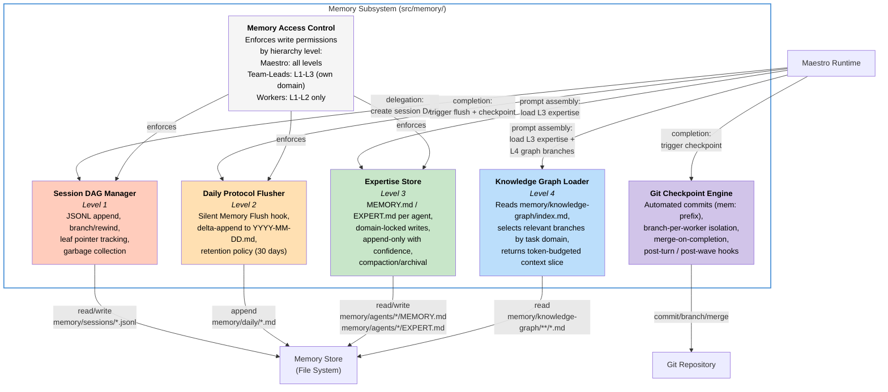
```mermaid
graph TB
    subgraph MemSubsystem ["Memory Subsystem (src/memory/)"]
        SessionDAGMgr["<b>Session DAG Manager</b><br/><i>Level 1</i><br/>JSONL append, branch/rewind,<br/>leaf pointer tracking,<br/>garbage collection"]

        DailyProtocolFlusher["<b>Daily Protocol Flusher</b><br/><i>Level 2</i><br/>Silent Memory Flush hook,<br/>delta-append to YYYY-MM-DD.md,<br/>retention policy (30 days)"]

        ExpertiseStore["<b>Expertise Store</b><br/><i>Level 3</i><br/>MEMORY.md / EXPERT.md per agent,<br/>domain-locked writes,<br/>append-only with confidence,<br/>compaction/archival"]

        KnowledgeGraphLoader["<b>Knowledge Graph Loader</b><br/><i>Level 4</i><br/>Reads memory/knowledge-graph/index.md,<br/>selects relevant branches by task domain,<br/>returns token-budgeted context slice"]

        GitCheckpointEngine["<b>Git Checkpoint Engine</b><br/>Automated commits (mem: prefix),<br/>branch-per-worker isolation,<br/>merge-on-completion,<br/>post-turn / post-wave hooks"]

        MemoryAccessControl["<b>Memory Access Control</b><br/>Enforces write permissions<br/>by hierarchy level:<br/>Maestro: all levels<br/>Team-Leads: L1-L3 (own domain)<br/>Workers: L1-L2 only"]
    end

    MRT["Maestro Runtime"]
    FS["Memory Store<br/>(File System)"]
    Git["Git Repository"]

    MRT -- "prompt assembly:<br/>load L3 expertise +<br/>L4 graph branches" --> KnowledgeGraphLoader
    MRT -- "prompt assembly:<br/>load L3 expertise" --> ExpertiseStore
    MRT -- "delegation:<br/>create session DAG" --> SessionDAGMgr
    MRT -- "completion:<br/>trigger flush + checkpoint" --> DailyProtocolFlusher
    MRT -- "completion:<br/>trigger checkpoint" --> GitCheckpointEngine

    SessionDAGMgr -- "read/write<br/>memory/sessions/*.jsonl" --> FS
    DailyProtocolFlusher -- "append<br/>memory/daily/*.md" --> FS
    ExpertiseStore -- "read/write<br/>memory/agents/*/MEMORY.md<br/>memory/agents/*/EXPERT.md" --> FS
    KnowledgeGraphLoader -- "read<br/>memory/knowledge-graph/**/*.md" --> FS
    GitCheckpointEngine -- "commit/branch/merge" --> Git

    MemoryAccessControl -- "enforces" --> SessionDAGMgr
    MemoryAccessControl -- "enforces" --> DailyProtocolFlusher
    MemoryAccessControl -- "enforces" --> ExpertiseStore

    style MemSubsystem fill:none,stroke:#438DD5,stroke-width:2px
    style SessionDAGMgr fill:#FFCCBC,color:#000
    style DailyProtocolFlusher fill:#FFE0B2,color:#000
    style ExpertiseStore fill:#C8E6C9,color:#000
    style KnowledgeGraphLoader fill:#BBDEFB,color:#000
    style GitCheckpointEngine fill:#D1C4E9,color:#000
    style MemoryAccessControl fill:#F5F5F5,color:#000
```

**Component responsibilities:**

| Component | Memory Level | Trigger | Input | Output |
|-----------|-------------|---------|-------|--------|
| **SessionDAGManager** | L1 (Ephemeral) | Agent spawn / every tool call | Message with `id` + `parentId` | Appended JSONL entry; branch pointer updates |
| **DailyProtocolFlusher** | L2 (Episodic) | `pre_compaction` lifecycle hook; `post_turn` hook | Agent's current session findings | Delta-appended bullets in `YYYY-MM-DD.md` with metadata |
| **ExpertiseStore** | L3 (Semantic) | Team-Lead promotes learning from L2; `update_memory` tool | Curated pattern with confidence score | Appended entry in agent's `MEMORY.md` or `EXPERT.md` |
| **KnowledgeGraphLoader** | L4 (Persistent) | Prompt assembly (delegation time) | Task domain tags + token budget | Token-budgeted Markdown slice from relevant graph branches |
| **GitCheckpointEngine** | Cross-level | `post_turn`, `post_wave`, agent completion | Memory file changes | Git commit with `mem:` prefix; branch management |
| **MemoryAccessControl** | Cross-level | Every memory write operation | Agent hierarchy level + target memory level | Allow / deny decision |

#### 5.2.3 Web Server Components

Source: `web/server/`

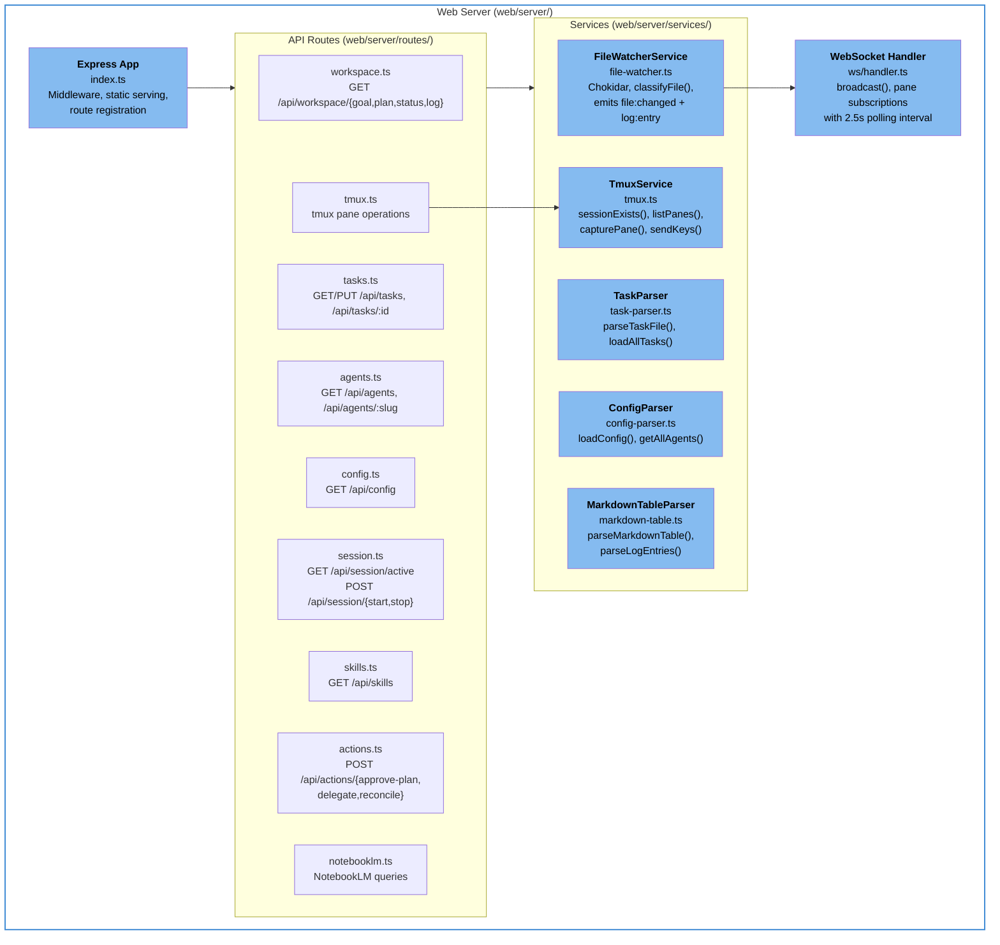
```mermaid
graph TB
    subgraph WebServerBoundary ["Web Server (web/server/)"]
        ExpressApp["<b>Express App</b><br/>index.ts<br/>Middleware, static serving,<br/>route registration"]

        subgraph Routes ["API Routes (web/server/routes/)"]
            WorkspaceR["workspace.ts<br/>GET /api/workspace/{goal,plan,status,log}"]
            TaskR["tasks.ts<br/>GET/PUT /api/tasks, /api/tasks/:id"]
            AgentR["agents.ts<br/>GET /api/agents, /api/agents/:slug"]
            ConfigR["config.ts<br/>GET /api/config"]
            SessionR["session.ts<br/>GET /api/session/active<br/>POST /api/session/{start,stop}"]
            SkillR["skills.ts<br/>GET /api/skills"]
            ActionR["actions.ts<br/>POST /api/actions/{approve-plan,<br/>delegate,reconcile}"]
            TmuxR["tmux.ts<br/>tmux pane operations"]
            NLMR["notebooklm.ts<br/>NotebookLM queries"]
        end

        subgraph Services ["Services (web/server/services/)"]
            FWS["<b>FileWatcherService</b><br/>file-watcher.ts<br/>Chokidar, classifyFile(),<br/>emits file:changed + log:entry"]
            TPS["<b>TaskParser</b><br/>task-parser.ts<br/>parseTaskFile(), loadAllTasks()"]
            CPS["<b>ConfigParser</b><br/>config-parser.ts<br/>loadConfig(), getAllAgents()"]
            MTP["<b>MarkdownTableParser</b><br/>markdown-table.ts<br/>parseMarkdownTable(),<br/>parseLogEntries()"]
            TMS["<b>TmuxService</b><br/>tmux.ts<br/>sessionExists(), listPanes(),<br/>capturePane(), sendKeys()"]
        end

        WSHandler["<b>WebSocket Handler</b><br/>ws/handler.ts<br/>broadcast(), pane subscriptions<br/>with 2.5s polling interval"]
    end

    ExpressApp --> Routes
    Routes --> Services
    FWS --> WSHandler
    TmuxR --> TMS

    style WebServerBoundary fill:none,stroke:#438DD5,stroke-width:2px
    style ExpressApp fill:#85BBF0,color:#000
    style WSHandler fill:#85BBF0,color:#000
    style FWS fill:#85BBF0,color:#000
    style TPS fill:#85BBF0,color:#000
    style CPS fill:#85BBF0,color:#000
    style MTP fill:#85BBF0,color:#000
    style TMS fill:#85BBF0,color:#000
```

#### 5.2.4 Agent Hierarchy (Domain Building Blocks)

The agent hierarchy is an **unlimited-depth, extensible tree structure** with a clear level-based role model:
- **Level 1 -- Maestro:** The singular root agent. Holds the strategic overview, decomposes goals, delegates to Team-Leads, monitors progress, runs reconciliation, and manages the central project memory (knowledge graph).
- **Level 2 to n-1 -- Team-Leads:** Intermediate agents that create strategies for specific domains, manage domain-specific expertise files (EXPERT.md), coordinate their sub-agents, and enforce quality gates. A Team-Lead can delegate to further Team-Leads (deeper levels) or to Worker-Agents.
- **Level n -- Worker-Agents:** Leaf agents that execute atomic tasks in isolated sandboxes. They deliver structured handoff reports back to their leads but do not spawn sub-agents.

Any agent that has the `delegate` tool can spawn sub-agents, who can in turn spawn their own -- forming a recursive tree with no hard-coded depth or team-size limit. The tree shape is purely a configuration concern: add agent `.md` files and reference them in `multi-team-config.yaml` to grow the tree in any direction.

The diagram below shows the **default configuration** (3 levels, 3 teams) as an example. The dashed sub-tree illustrates how any Team-Lead can be extended with further sub-agents to arbitrary depth.

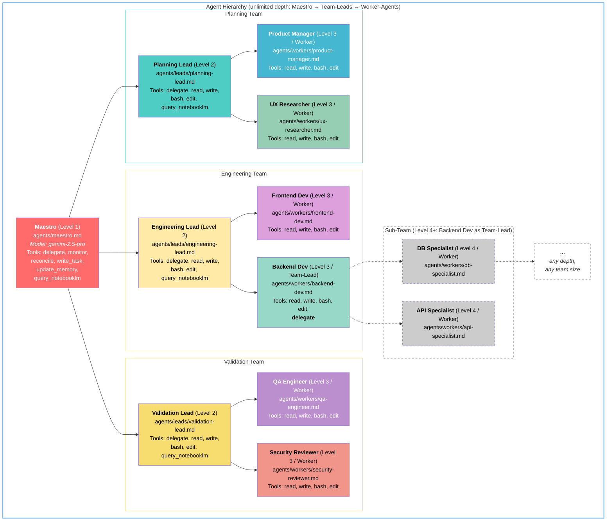
```mermaid
graph TB
    subgraph Hierarchy ["Agent Hierarchy (unlimited depth: Maestro → Team-Leads → Worker-Agents)"]
        Orch["<b>Maestro</b> (Level 1)<br/>agents/maestro.md<br/><i>Model: gemini-2.5-pro</i><br/>Tools: delegate, monitor,<br/>reconcile, write_task,<br/>update_memory,<br/>query_notebooklm"]

        subgraph PlanningTeam ["Planning Team"]
            PL["<b>Planning Lead</b> (Level 2)<br/>agents/leads/planning-lead.md<br/>Tools: delegate, read, write,<br/>bash, edit, query_notebooklm"]
            PM["<b>Product Manager</b> (Level 3 / Worker)<br/>agents/workers/product-manager.md<br/>Tools: read, write, bash, edit"]
            UX["<b>UX Researcher</b> (Level 3 / Worker)<br/>agents/workers/ux-researcher.md<br/>Tools: read, write, bash, edit"]
        end

        subgraph EngineeringTeam ["Engineering Team"]
            EL["<b>Engineering Lead</b> (Level 2)<br/>agents/leads/engineering-lead.md<br/>Tools: delegate, read, write,<br/>bash, edit, query_notebooklm"]
            FE["<b>Frontend Dev</b> (Level 3 / Worker)<br/>agents/workers/frontend-dev.md<br/>Tools: read, write, bash, edit"]
            BE["<b>Backend Dev</b> (Level 3 / Team-Lead)<br/>agents/workers/backend-dev.md<br/>Tools: read, write, bash, edit,<br/><b>delegate</b>"]
        end

        subgraph ValidationTeam ["Validation Team"]
            VL["<b>Validation Lead</b> (Level 2)<br/>agents/leads/validation-lead.md<br/>Tools: delegate, read, write,<br/>bash, edit, query_notebooklm"]
            QA["<b>QA Engineer</b> (Level 3 / Worker)<br/>agents/workers/qa-engineer.md<br/>Tools: read, write, bash, edit"]
            SR["<b>Security Reviewer</b> (Level 3 / Worker)<br/>agents/workers/security-reviewer.md<br/>Tools: read, write, bash, edit"]
        end

        subgraph SubTeam ["Sub-Team (Level 4+: Backend Dev as Team-Lead)"]
            DBSpec["<b>DB Specialist</b> (Level 4 / Worker)<br/>agents/workers/db-specialist.md"]
            APISpec["<b>API Specialist</b> (Level 4 / Worker)<br/>agents/workers/api-specialist.md"]
        end

        MoreAgents["<b>...</b><br/><i>any depth,<br/>any team size</i>"]
    end

    Orch --> PL
    Orch --> EL
    Orch --> VL
    PL --> PM
    PL --> UX
    EL --> FE
    EL --> BE
    VL --> QA
    VL --> SR
    BE -.-> DBSpec
    BE -.-> APISpec
    DBSpec -.-> MoreAgents

    style Hierarchy fill:none,stroke:#438DD5,stroke-width:2px
    style Orch fill:#FF6B6B,color:#fff
    style PlanningTeam fill:none,stroke:#4ECDC4,stroke-width:1px
    style EngineeringTeam fill:none,stroke:#FFEAA7,stroke-width:1px
    style ValidationTeam fill:none,stroke:#F7DC6F,stroke-width:1px
    style SubTeam fill:none,stroke:#999,stroke-width:1px,stroke-dasharray: 5 5
    style PL fill:#4ECDC4,color:#000
    style PM fill:#45B7D1,color:#fff
    style UX fill:#96CEB4,color:#000
    style EL fill:#FFEAA7,color:#000
    style FE fill:#DDA0DD,color:#000
    style BE fill:#98D8C8,color:#000
    style VL fill:#F7DC6F,color:#000
    style QA fill:#BB8FCE,color:#fff
    style SR fill:#F1948A,color:#000
    style DBSpec fill:#ccc,color:#000,stroke-dasharray: 5 5
    style APISpec fill:#ccc,color:#000,stroke-dasharray: 5 5
    style MoreAgents fill:none,stroke:#999,stroke-dasharray: 5 5
```

**How to extend the tree:**

| Action | How |
|--------|-----|
| Add a new Worker-Agent (level n) | Create an agent `.md` file with YAML frontmatter. No `delegate` tool needed. |
| Add a new Team-Lead (level 2..n-1) | Create an agent `.md` file with `delegate: true` in `tools`. The agent becomes an intermediate node managing its own sub-agents. |
| Add a new team | Add a team entry in `multi-team-config.yaml` with a lead and workers. |
| Deepen the hierarchy | Grant the `delegate` tool to any existing Worker-Agent, promoting it to Team-Lead. Provide sub-agent definitions for it to delegate to. |
| Grow a team | Add more worker entries under any team in the config YAML. No code changes needed. |

#### 5.2.5 Target Plugin Architecture *[target]*

Each plugin slot defines a stable interface with swappable implementations.

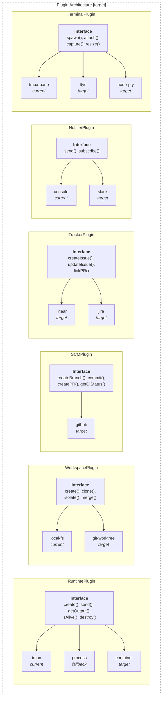
```mermaid
graph TB
    subgraph PluginArch ["Plugin Architecture [target]"]
        subgraph RuntimeSlot ["RuntimePlugin"]
            RTI["<b>Interface</b><br/>create(), send(), getOutput(),<br/>isAlive(), destroy()"]
            RT1["tmux<br/><i>current</i>"]
            RT2["process<br/><i>fallback</i>"]
            RT3["container<br/><i>target</i>"]
        end

        subgraph WorkspaceSlot ["WorkspacePlugin"]
            WSI["<b>Interface</b><br/>create(), clone(),<br/>isolate(), merge()"]
            WS1["local-fs<br/><i>current</i>"]
            WS2["git-worktree<br/><i>target</i>"]
        end

        subgraph SCMSlot ["SCMPlugin"]
            SCMI["<b>Interface</b><br/>createBranch(), commit(),<br/>createPR(), getCIStatus()"]
            SCM1["github<br/><i>target</i>"]
        end

        subgraph TrackerSlot ["TrackerPlugin"]
            TRI["<b>Interface</b><br/>createIssue(), updateIssue(),<br/>linkPR()"]
            TR1["linear<br/><i>target</i>"]
            TR2["jira<br/><i>target</i>"]
        end

        subgraph NotifierSlot ["NotifierPlugin"]
            NI["<b>Interface</b><br/>send(), subscribe()"]
            N1["console<br/><i>current</i>"]
            N2["slack<br/><i>target</i>"]
        end

        subgraph TerminalSlot ["TerminalPlugin"]
            TEI["<b>Interface</b><br/>spawn(), attach(),<br/>capture(), resize()"]
            TE1["tmux-pane<br/><i>current</i>"]
            TE2["ttyd<br/><i>target</i>"]
            TE3["node-pty<br/><i>target</i>"]
        end
    end

    RTI --> RT1
    RTI --> RT2
    RTI --> RT3
    WSI --> WS1
    WSI --> WS2
    SCMI --> SCM1
    TRI --> TR1
    TRI --> TR2
    NI --> N1
    NI --> N2
    TEI --> TE1
    TEI --> TE2
    TEI --> TE3

    style PluginArch fill:none,stroke:#666,stroke-width:2px,stroke-dasharray: 5 5
```

### 5.3 Level 3 -- Code Level (C4 Level 4)

Key types and interfaces with their source locations.

#### Core Types (logical Maestro control-plane boundary)

| Type | Location | Purpose |
|------|----------|---------|
| `SystemConfig` | `maestro.ts` | Team structure, paths, model tier policy, memory config -- parsed from `multi-team-config.yaml` via Zod |
| `AgentFrontmatter` | `maestro.ts` | Per-agent: name, model, model_tier, expertise path, skills, tool permissions, memory permissions, domain restrictions |
| `ActiveWorker` | `maestro.ts` | Runtime tracking: agent name, runtime ID (pane/container), task ID, role, hierarchy level, start timestamp |
| `AgentRuntime` | `runtime/` | Runtime abstraction implemented by `PiRuntime` (default), container-backed worker launchers, and plain-process fallback |
| `RuntimeHandle` | `runtime/` | Opaque runtime reference used for liveness checks, output capture, interrupt/resume, and teardown |
| `AgentRef` | `maestro.ts` | Lightweight agent reference: name, file path, UI color, hierarchy level |
| `TaskPlan` | `maestro.ts` | Structured decomposition result: tasks, dependencies, `plan_first`, validation commands, and task metadata before wave computation |
| `TaskStatus` | `maestro.ts` | Canonical task states: `pending`, `in_progress`, `plan_ready`, `plan_revision_needed`, `plan_approved`, `complete`, `failed`, `stalled` |
| `TaskPhase` | `maestro.ts` | Runtime phase marker: `phase_1_plan` or `phase_2_execute` |
| `HandoffReport` | `maestro.ts` | Structured task output contract with four mandatory sections plus semantic validation requirements |
| `ProviderConfig` | `maestro.ts` | Provider credentials, retry/failover policy, and model routing for a tier or explicit model ID |
| `ContainerPolicy` | `runtime/` | Worker container defaults: image, mounts, network posture, CPU/memory/disk limits |
| `TeamConfig` | `maestro.ts` | Team definition: name, lead AgentRef, workers AgentRef[] |
| `MemoryConfig` | `memory/` | Per-level configuration: retention policies, token budgets, compaction schedule |

#### Web Server Types (`web/server/`)

| Type | Location | Purpose |
|------|----------|---------|
| `FileChangeEvent` | `services/file-watcher.ts` | Typed file change: path, type (goal/plan/status/log/task/config/agent/mental-model/skill), content |
| `ParsedTask` | `services/task-parser.ts` | Structured task: id, title, description, assignedTo, status, phase, dependencies, wave, task type, output sections |
| `LogEntry` | `services/markdown-table.ts` | Parsed log row: timestamp, level, taskId, correlationId, agent, message |
| `LogEvent` | `logging/` | Machine-readable event companion to Markdown logs for audit, health checks, and future structured event sinks |

#### Agent Prompt Structure

Each agent `.md` file follows this frontmatter schema:

```yaml
---
schema_version: 1
name: string            # Display name (e.g., "Backend Dev")
model: string           # LLM model ID (e.g., "google/gemini-2.5-pro")
model_tier: string      # One of: curator | lead | worker (see Section 8.15)
expertise: string       # Path to memory directory (memory/agents/{name}/)
skills:                 # List of skill document paths
  - skills/api-design.md
  - skills/code-review.md
tools:                  # Tool permissions (map, not list)
  read: true
  write: true
  bash: true
  edit: true
  delegate: false       # Only Maestro and Team-Leads get delegate
  update_memory: false  # Memory write access (L3); see MemoryAccessControl
memory:                 # Memory access permissions
  write_levels: [1, 2]  # Which memory levels this agent can write to
  domain_lock: null     # Domain for EXPERT.md write access (null = no domain lock)
domain:                 # File access restrictions
  read: ["**/*"]
  upsert: ["workspace/**", "src/**"]
  delete: []
---
[System prompt body in Markdown]
```

#### Memory Level 3 Structure (`memory/agents/{name}/`)

Each agent has two Level 3 files managed by the **ExpertiseStore** component (Section 5.2.2):

**`MEMORY.md`** — Per-agent learnings (append-only, confidence-scored):

```markdown
---
agent: backend-dev
updated: 2026-04-05
schema_version: 1
---

PREFERENCES
- Prefers explicit error handling over catch-all

PATTERNS LEARNED
- **API design for auth endpoints** (confidence: 0.85)
  Always validate token expiry before processing.
  _Source: task-003, 2026-04-04_

STRENGTHS
- RESTful API design
- Database schema optimization

MISTAKES TO AVOID
- Do not modify shared config files without checking status.md first

COLLABORATIONS
- **Frontend Dev**: Coordinate on API contract changes via plan.md
```

**`EXPERT.md`** — Domain expertise (domain-locked, only the designated Team-Lead writes):

```markdown
---
domain: backend
owner: engineering-lead
updated: 2026-04-05
schema_version: 1
---

CODING STANDARDS
- All API endpoints must return structured error objects (code, message, details)
- Database migrations use sequential numbered files in `migrations/`

ARCHITECTURE PATTERNS
- Repository pattern for all data access
- Event-driven communication between bounded contexts

PROVEN HEURISTICS
- **Auth token flow** (confidence: 0.95): validate exp → check revocation list → extract claims
  _Source: task-003 reconciliation pass, 2026-04-04_
```

---

## 6. Runtime View

> **Implementation status note:** The current repository already performs planning, delegation, monitoring, reconciliation, and resume-oriented orchestration, but its execution remains more centrally mediated than several target flows below. This section defines the future runtime behavior, review gates, and recovery semantics that later implementation phases should achieve.

The runtime view is planning-critical because it specifies who can delegate, where verification gates run, what evidence causes retry/fix loops, and how execution interacts with memory promotion and observability.

> **Open option — recursive delegation boundary:** allow direct agent-side recursive spawning at every delegated level, or keep sub-delegation proposals centrally materialized by the Maestro while preserving the same hierarchy model. **Tradeoffs:** direct spawning maximizes autonomy and local adaptation; Maestro mediation gives stronger auditability, budget control, and replay semantics. **Decision trigger:** resolve before implementing unlimited-depth delegation as a production feature.

### 6.1 Full Delegation Flow

The core workflow: from goal to task completion through the agent hierarchy (shown here with a 3-level configuration: Maestro -> Team-Lead -> Worker-Agent, but the delegation mechanism is recursive -- any agent with the `delegate` tool can spawn further sub-agents to arbitrary depth). The Maestro is a **deterministic TypeScript controller**: it first checks whether `workspace/plan.md` already exists, otherwise it requests a structured `TaskPlan` from the LLM, validates dependencies, and computes waves by stable topological sort before delegating through `AgentRuntime` (`PiRuntime` by default).

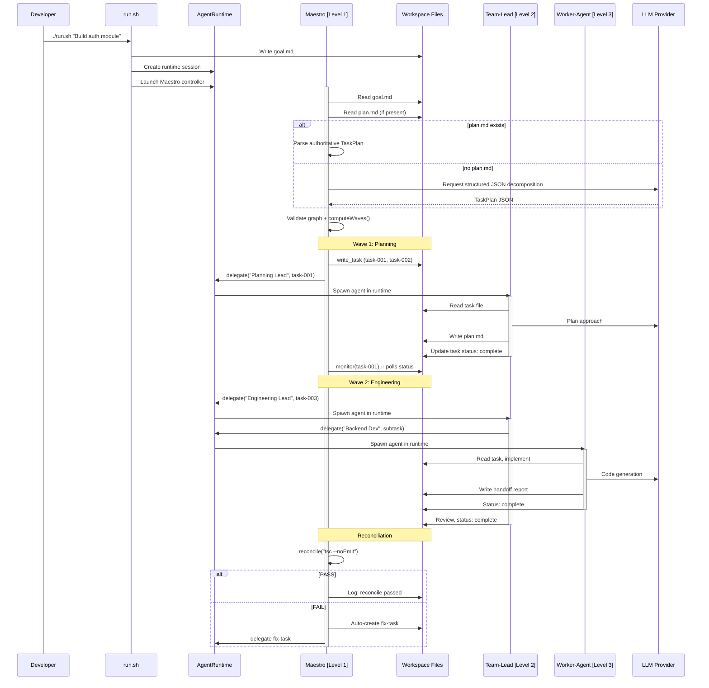
```mermaid
sequenceDiagram
    participant Dev as Developer
    participant RS as run.sh
    participant Runtime as AgentRuntime
    participant Maestro as Maestro [Level 1]
    participant WS as Workspace Files
    participant Lead as Team-Lead [Level 2]
    participant Worker as Worker-Agent [Level 3]
    participant LLM as LLM Provider

    Dev->>RS: ./run.sh "Build auth module"
    RS->>WS: Write goal.md
    RS->>Runtime: Create runtime session
    RS->>Runtime: Launch Maestro controller

    activate Maestro
    Maestro->>WS: Read goal.md
    Maestro->>WS: Read plan.md (if present)
    alt plan.md exists
        Maestro->>Maestro: Parse authoritative TaskPlan
    else no plan.md
        Maestro->>LLM: Request structured JSON decomposition
        LLM-->>Maestro: TaskPlan JSON
    end
    Maestro->>Maestro: Validate graph + computeWaves()

    Note over Maestro,WS: Wave 1: Planning
    Maestro->>WS: write_task (task-001, task-002)
    Maestro->>Runtime: delegate("Planning Lead", task-001)
    Runtime->>Lead: Spawn agent in runtime
    activate Lead
    Lead->>WS: Read task file
    Lead->>LLM: Plan approach
    Lead->>WS: Write plan.md
    Lead->>WS: Update task status: complete
    deactivate Lead

    Maestro->>WS: monitor(task-001) -- polls status

    Note over Maestro,WS: Wave 2: Engineering
    Maestro->>Runtime: delegate("Engineering Lead", task-003)
    Runtime->>Lead: Spawn agent in runtime
    activate Lead
    Lead->>Runtime: delegate("Backend Dev", subtask)
    Runtime->>Worker: Spawn agent in runtime
    activate Worker
    Worker->>WS: Read task, implement
    Worker->>LLM: Code generation
    Worker->>WS: Write handoff report
    Worker->>WS: Status: complete
    deactivate Worker
    Lead->>WS: Review, status: complete
    deactivate Lead

    Note over Maestro,WS: Reconciliation
    Maestro->>Maestro: reconcile("tsc --noEmit")
    alt PASS
        Maestro->>WS: Log: reconcile passed
    else FAIL
        Maestro->>WS: Auto-create fix-task
        Maestro->>Runtime: delegate fix-task
    end
    deactivate Maestro
```

### 6.2 Plan-Approval Gate (Two-Phase Protocol)

Quality gate ensuring workers plan before implementing. This gate is **runtime-enforced**, not prompt-enforced: the phase-1 worker run ends after planning, and the Monitor/Delegation engines resume phase 2 only after approval.

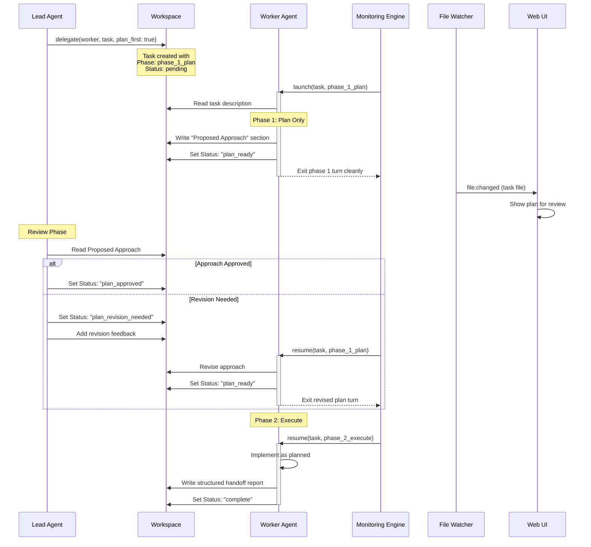
```mermaid
sequenceDiagram
    participant Lead as Lead Agent
    participant WS as Workspace
    participant Worker as Worker Agent
    participant Monitor as Monitoring Engine
    participant FW as File Watcher
    participant UI as Web UI

    Lead->>WS: delegate(worker, task, plan_first: true)
    Note over WS: Task created with<br/>Phase: phase_1_plan<br/>Status: pending

    Monitor->>Worker: launch(task, phase_1_plan)
    activate Worker
    Worker->>WS: Read task description

    Note over Worker: Phase 1: Plan Only
    Worker->>WS: Write "Proposed Approach" section
    Worker->>WS: Set Status: "plan_ready"
    Worker-->>Monitor: Exit phase 1 turn cleanly
    deactivate Worker

    FW->>UI: file:changed (task file)
    UI->>UI: Show plan for review

    Note over Lead: Review Phase
    Lead->>WS: Read Proposed Approach
    alt Approach Approved
        Lead->>WS: Set Status: "plan_approved"
    else Revision Needed
        Lead->>WS: Set Status: "plan_revision_needed"
        Lead->>WS: Add revision feedback
        Monitor->>Worker: resume(task, phase_1_plan)
        activate Worker
        Worker->>WS: Revise approach
        Worker->>WS: Set Status: "plan_ready"
        Worker-->>Monitor: Exit revised plan turn
        deactivate Worker
    end

    Note over Worker: Phase 2: Execute
    Monitor->>Worker: resume(task, phase_2_execute)
    activate Worker
    Worker->>Worker: Implement as planned
    Worker->>WS: Write structured handoff report
    Worker->>WS: Set Status: "complete"
    deactivate Worker
```

**Authoritative semantics:**
- `plan_ready` means the current runtime turn has ended without execution work.
- `plan_approved` is consumed by the orchestrator, not self-detected by the worker.
- `plan_revision_needed` creates a new plan-only turn with explicit feedback.
- No worker may cross from planning to execution inside one uninterrupted runtime turn when `plan_first: true`.

### 6.3 Reconciliation Loop

Automated validation and fix-task generation.

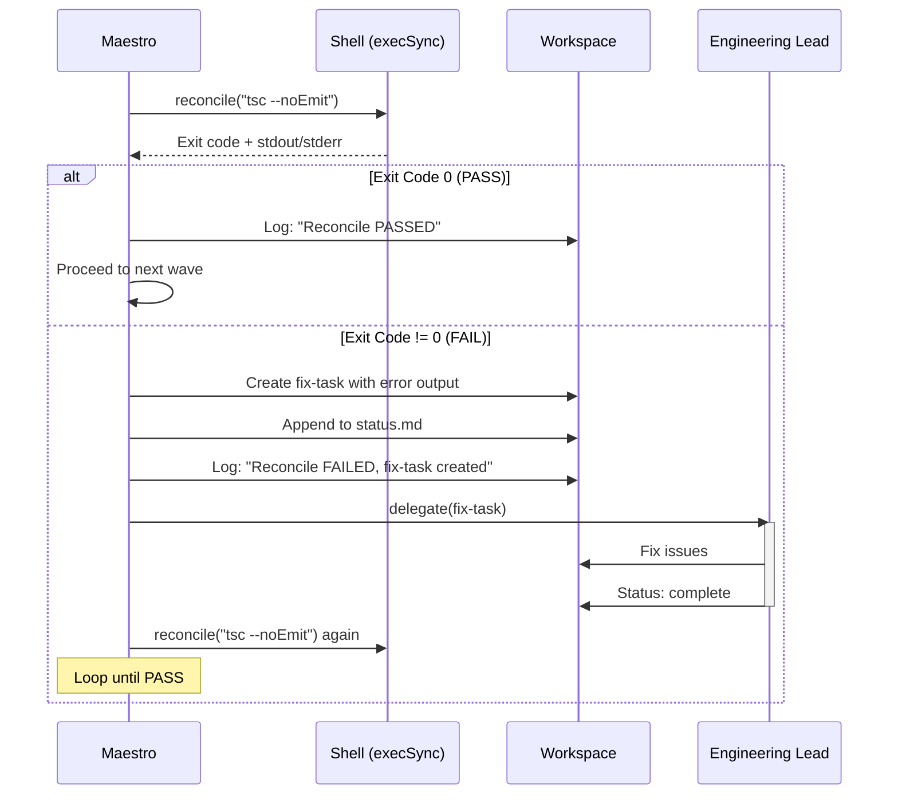
```mermaid
sequenceDiagram
    participant Maestro as Maestro
    participant Shell as Shell (execSync)
    participant WS as Workspace
    participant Lead as Engineering Lead

    Maestro->>Shell: reconcile("tsc --noEmit")
    Shell-->>Maestro: Exit code + stdout/stderr

    alt Exit Code 0 (PASS)
        Maestro->>WS: Log: "Reconcile PASSED"
        Maestro->>Maestro: Proceed to next wave
    else Exit Code != 0 (FAIL)
        Maestro->>WS: Create fix-task with error output
        Maestro->>WS: Append to status.md
        Maestro->>WS: Log: "Reconcile FAILED, fix-task created"
        Maestro->>Lead: delegate(fix-task)
        activate Lead
        Lead->>WS: Fix issues
        Lead->>WS: Status: complete
        deactivate Lead
        Maestro->>Shell: reconcile("tsc --noEmit") again
        Note over Maestro: Loop until PASS
    end
```

### 6.4 Real-time UI Update Flow and Chat-like Delegation View

The communication and delegation between agents is visualized to the user as a **chat-like interface**. Each delegation, status update, handoff report, and monitoring event appears as a message in a conversation thread -- making the multi-agent workflow as intuitive as reading a group chat. The developer sees the orchestrator's reasoning, lead reviews, worker progress updates, and reconciliation results as a continuous, chronological message stream with agent avatars, role badges, and color-coded team indicators.

This chat paradigm transforms the underlying file-based coordination (workspace/log.md, task files, status updates) into a familiar conversational UX:
- **Delegation messages** appear when the Maestro or a Team-Lead spawns a new agent ("Maestro delegated task-003 to Engineering Lead")
- **Status updates** surface when agents change task status (pending -> in_progress -> plan_ready -> plan_approved -> complete)
- **Handoff reports** render inline as structured message cards (Changes Made, Patterns Followed, Unresolved Concerns, Suggested Follow-ups)
- **Reconciliation results** show as pass/fail notifications with expandable error details
- **Plan-approval gates** present the worker's proposed approach as a reviewable message with approve/revise action buttons

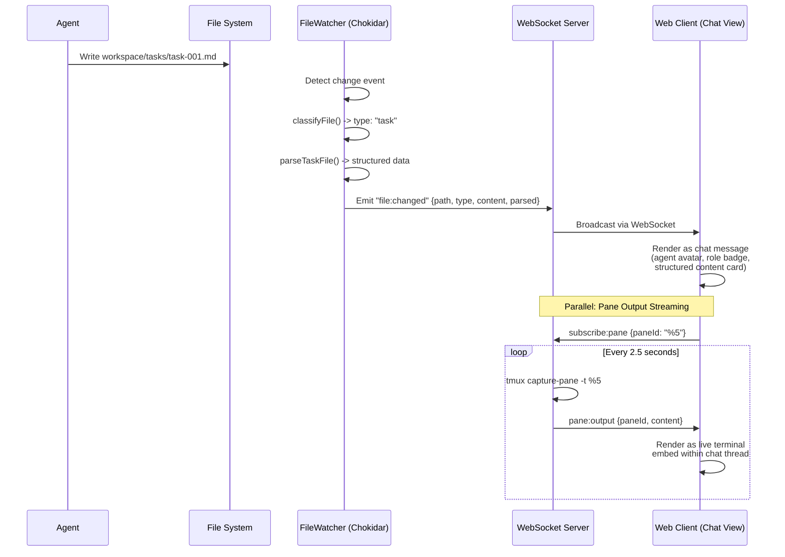
```mermaid
sequenceDiagram
    participant Agent as Agent
    participant FS as File System
    participant FW as FileWatcher (Chokidar)
    participant WS as WebSocket Server
    participant Client as Web Client (Chat View)

    Agent->>FS: Write workspace/tasks/task-001.md

    FW->>FW: Detect change event
    FW->>FW: classifyFile() -> type: "task"
    FW->>FW: parseTaskFile() -> structured data

    FW->>WS: Emit "file:changed" {path, type, content, parsed}
    WS->>Client: Broadcast via WebSocket

    Client->>Client: Render as chat message<br/>(agent avatar, role badge,<br/>structured content card)

    Note over Client,WS: Parallel: Pane Output Streaming
    Client->>WS: subscribe:pane {paneId: "%5"}
    loop Every 2.5 seconds
        WS->>WS: tmux capture-pane -t %5
        WS->>Client: pane:output {paneId, content}
        Client->>Client: Render as live terminal<br/>embed within chat thread
    end
```

The chat view aggregates events from multiple sources (log.md entries, task file changes, status.md updates) into a unified conversation timeline, giving the developer a single pane of glass into the entire multi-agent workflow.

### 6.5 Training Pipeline Flow *[target]*

Reflection-based agent improvement after task completion.

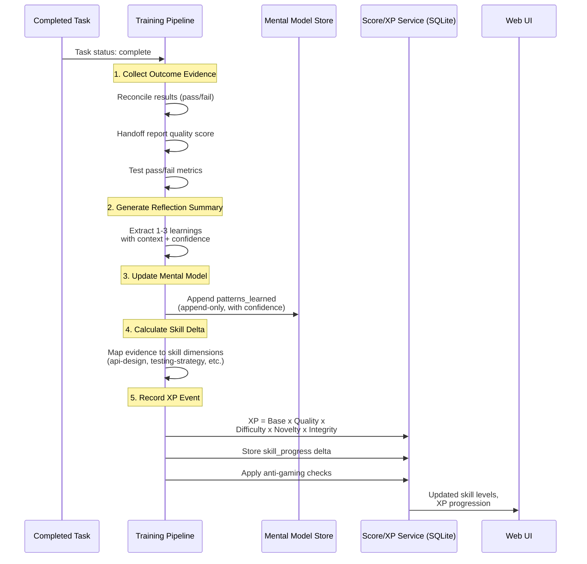
```mermaid
sequenceDiagram
    participant Task as Completed Task
    participant TP as Training Pipeline
    participant MM as Mental Model Store
    participant XP as Score/XP Service (SQLite)
    participant UI as Web UI

    Task->>TP: Task status: complete

    Note over TP: 1. Collect Outcome Evidence
    TP->>TP: Reconcile results (pass/fail)
    TP->>TP: Handoff report quality score
    TP->>TP: Test pass/fail metrics

    Note over TP: 2. Generate Reflection Summary
    TP->>TP: Extract 1-3 learnings<br/>with context + confidence

    Note over TP: 3. Update Mental Model
    TP->>MM: Append patterns_learned<br/>(append-only, with confidence)

    Note over TP: 4. Calculate Skill Delta
    TP->>TP: Map evidence to skill dimensions<br/>(api-design, testing-strategy, etc.)

    Note over TP: 5. Record XP Event
    TP->>XP: XP = Base x Quality x<br/>Difficulty x Novelty x Integrity
    TP->>XP: Store skill_progress delta
    TP->>XP: Apply anti-gaming checks

    XP->>UI: Updated skill levels,<br/>XP progression
```

### 6.6 Wave-Based Parallel Execution

How the orchestrator schedules tasks in dependency waves.

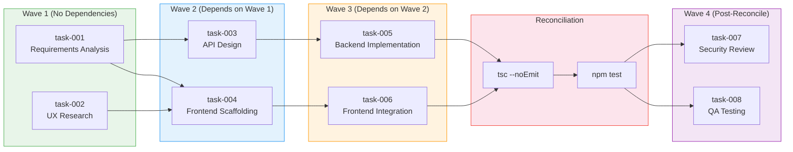
```mermaid
graph LR
    subgraph Wave1 ["Wave 1 (No Dependencies)"]
        T1["task-001<br/>Requirements Analysis"]
        T2["task-002<br/>UX Research"]
    end

    subgraph Wave2 ["Wave 2 (Depends on Wave 1)"]
        T3["task-003<br/>API Design"]
        T4["task-004<br/>Frontend Scaffolding"]
    end

    subgraph Wave3 ["Wave 3 (Depends on Wave 2)"]
        T5["task-005<br/>Backend Implementation"]
        T6["task-006<br/>Frontend Integration"]
    end

    subgraph Reconcile ["Reconciliation"]
        R1["tsc --noEmit"]
        R2["npm test"]
    end

    subgraph Wave4 ["Wave 4 (Post-Reconcile)"]
        T7["task-007<br/>Security Review"]
        T8["task-008<br/>QA Testing"]
    end

    T1 --> T3
    T1 --> T4
    T2 --> T4
    T3 --> T5
    T4 --> T6
    T5 --> R1
    T6 --> R1
    R1 --> R2
    R2 --> T7
    R2 --> T8

    style Wave1 fill:#E8F5E9,stroke:#4CAF50
    style Wave2 fill:#E3F2FD,stroke:#2196F3
    style Wave3 fill:#FFF3E0,stroke:#FF9800
    style Reconcile fill:#FCE4EC,stroke:#F44336
    style Wave4 fill:#F3E5F5,stroke:#9C27B0
```

**Wave computation policy:**
- Developers or LLMs specify tasks plus dependency edges; they do not authoritatively assign wave numbers.
- The Maestro computes `wave_number` by stable topological sort over the dependency graph.
- Cycles are a hard validation error. The system reports the involved task IDs and refuses execution until the plan is corrected.
- Tasks with equal dependency rank are ordered deterministically (task creation order, then task ID) so reruns are reproducible.

### 6.7 Session DAG Branching and Rewind (Level 1 Memory)

When a tool call fails or an agent reaches a dead end, the **SessionDAGManager** (Section 5.2.2) enables branching back to a stable checkpoint without polluting the main reasoning chain. This is a concrete runtime mechanism, not a future target.

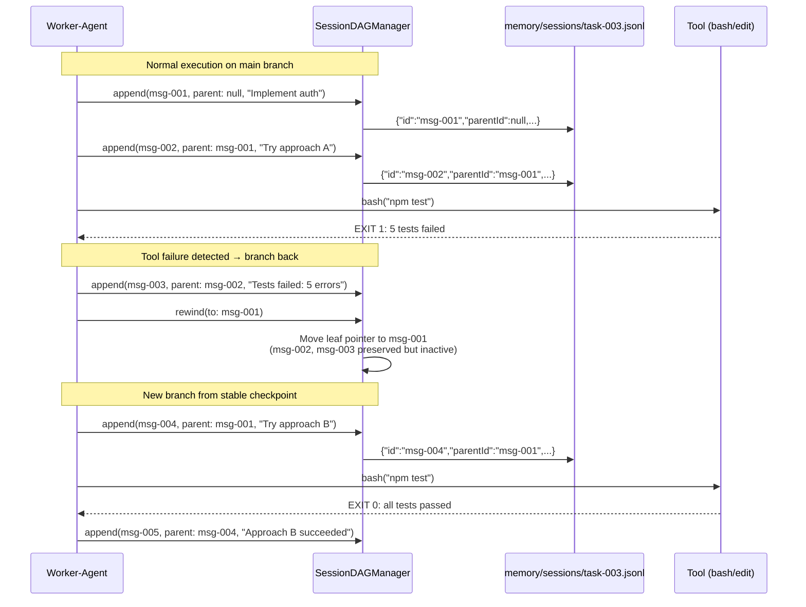
```mermaid
sequenceDiagram
    participant Agent as Worker-Agent
    participant DAG as SessionDAGManager
    participant FS as memory/sessions/task-003.jsonl
    participant Tool as Tool (bash/edit)

    Note over Agent,DAG: Normal execution on main branch
    Agent->>DAG: append(msg-001, parent: null, "Implement auth")
    DAG->>FS: {"id":"msg-001","parentId":null,...}
    Agent->>DAG: append(msg-002, parent: msg-001, "Try approach A")
    DAG->>FS: {"id":"msg-002","parentId":"msg-001",...}
    Agent->>Tool: bash("npm test")
    Tool-->>Agent: EXIT 1: 5 tests failed

    Note over Agent,DAG: Tool failure detected → branch back
    Agent->>DAG: append(msg-003, parent: msg-002, "Tests failed: 5 errors")
    Agent->>DAG: rewind(to: msg-001)
    DAG->>DAG: Move leaf pointer to msg-001<br/>(msg-002, msg-003 preserved but inactive)

    Note over Agent,DAG: New branch from stable checkpoint
    Agent->>DAG: append(msg-004, parent: msg-001, "Try approach B")
    DAG->>FS: {"id":"msg-004","parentId":"msg-001",...}
    Agent->>Tool: bash("npm test")
    Tool-->>Agent: EXIT 0: all tests passed
    Agent->>DAG: append(msg-005, parent: msg-004, "Approach B succeeded")
```

**Key properties:**
- The DAG is append-only JSONL — failed branches are preserved for debugging/audit, never deleted
- Branch-back moves a pointer, it does not rewrite history
- Each agent instance has exactly one session DAG file: `memory/sessions/{task-id}.jsonl`
- On agent completion, the DAG is optionally archived or discarded based on retention policy

### 6.8 Silent Memory Flush (Pre-Compaction)

When an agent's context window approaches its token limit, the system triggers a **Silent Memory Flush** before compaction proceeds. This is a concrete lifecycle hook managed by the **DailyProtocolFlusher** (Section 5.2.2), tied to the `pre_compaction` event in the agent lifecycle state machine (Section 8.7).

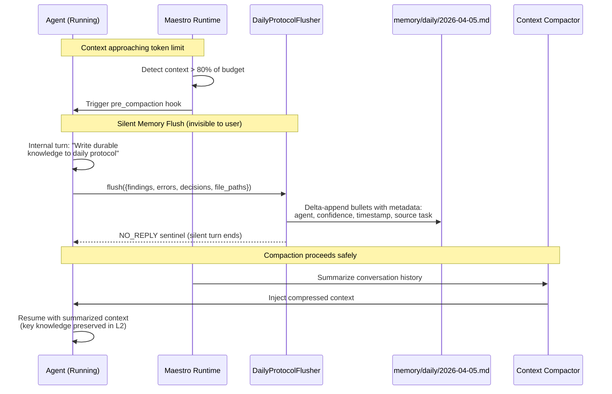
```mermaid
sequenceDiagram
    participant Agent as Agent (Running)
    participant RT as Maestro Runtime
    participant Flusher as DailyProtocolFlusher
    participant FS as memory/daily/2026-04-05.md
    participant Compactor as Context Compactor

    Note over Agent,RT: Context approaching token limit
    RT->>RT: Detect context > 80% of budget
    RT->>Agent: Trigger pre_compaction hook

    Note over Agent,Flusher: Silent Memory Flush (invisible to user)
    Agent->>Agent: Internal turn: "Write durable<br/>knowledge to daily protocol"
    Agent->>Flusher: flush({findings, errors, decisions, file_paths})
    Flusher->>FS: Delta-append bullets with metadata:<br/>agent, confidence, timestamp, source task
    Flusher-->>Agent: NO_REPLY sentinel (silent turn ends)

    Note over Agent,Compactor: Compaction proceeds safely
    RT->>Compactor: Summarize conversation history
    Compactor->>Agent: Inject compressed context
    Agent->>Agent: Resume with summarized context<br/>(key knowledge preserved in L2)
```

**Lifecycle integration:** The `pre_compaction` hook is a mandatory step in the agent lifecycle. It fires between `Running` and the context compaction event. If the flush fails, compaction is deferred (retry on next monitoring cycle) rather than proceeding with potential knowledge loss.

---

## 7. Deployment View

The entire system runs on a single developer machine. Worker-Agents run in containers for security isolation; Team-Leads and Maestro use tmux panes for debuggability.

> **Implementation status note:** The current repository already has hybrid runtime support, but the image lifecycle, plain-process fallback, host hardening, and resource/network guarantees are not yet fully aligned with this target deployment contract. Treat this section as the deployment posture implementation should work toward.

> **Open option — worker sandbox backend:** default to local rootless Docker/Podman workers only, or preserve a compatible sandbox-provider seam for future remote or ephemeral backends. **Tradeoffs:** local containers align with the local-first goal and simplify debugging; a provider seam improves CI portability and future hosted/Windows-compatible execution. **Decision trigger:** decide before adding non-local execution targets or formal Windows support.

For the first real runtime, the worker container policy is fixed: a **prebuilt rootless image** with Pi installed, default limits of **4 CPU / 8 GB RAM / bounded disk**, a **read-write mount of the assigned workspace root** (typically the worker's feature branch or isolated work area), **read-only mounts for shared agent and skill definitions**, and **outbound HTTPS enabled** for LLM API access. If `tmux` is unavailable, the Maestro falls back to a `child_process.spawn`-backed plain-process runtime behind the same `AgentRuntime` contract; orchestration semantics remain unchanged, but attach/debug ergonomics are reduced.

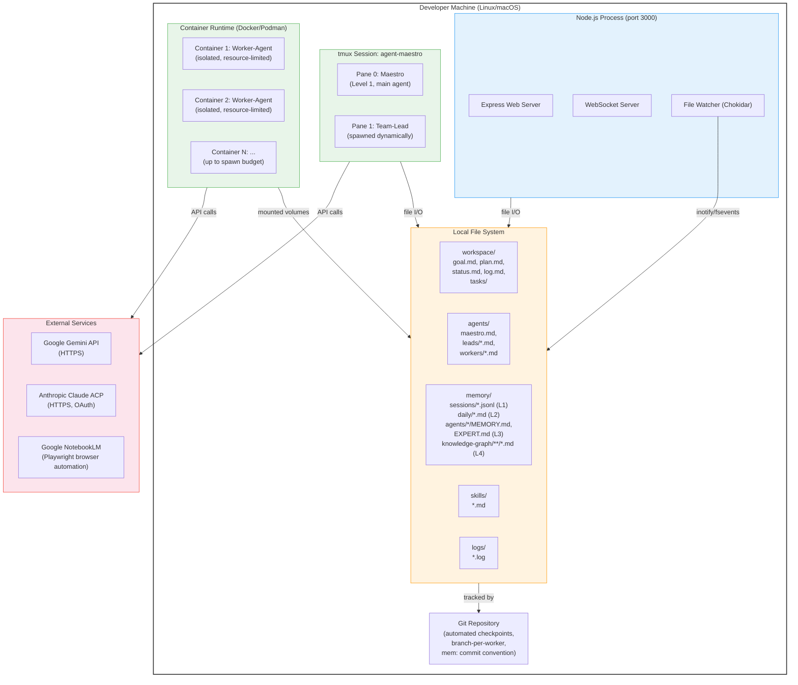
```mermaid
graph TB
    subgraph Machine ["Developer Machine (Linux/macOS)"]
        subgraph NodeProcess ["Node.js Process (port 3000)"]
            Express["Express Web Server"]
            WSS["WebSocket Server"]
            Chokidar["File Watcher (Chokidar)"]
        end

        subgraph TmuxSession ["tmux Session: agent-maestro"]
            Pane0["Pane 0: Maestro<br/>(Level 1, main agent)"]
            Pane1["Pane 1: Team-Lead<br/>(spawned dynamically)"]
        end

        subgraph ContainerRuntime ["Container Runtime (Docker/Podman)"]
            Container1["Container 1: Worker-Agent<br/>(isolated, resource-limited)"]
            Container2["Container 2: Worker-Agent<br/>(isolated, resource-limited)"]
            ContainerN["Container N: ...<br/>(up to spawn budget)"]
        end

        subgraph FileSystem ["Local File System"]
            WDir["workspace/<br/>goal.md, plan.md,<br/>status.md, log.md,<br/>tasks/"]
            ADir["agents/<br/>maestro.md,<br/>leads/*.md,<br/>workers/*.md"]
            MemDir["memory/<br/>sessions/*.jsonl (L1)<br/>daily/*.md (L2)<br/>agents/*/MEMORY.md,<br/>EXPERT.md (L3)<br/>knowledge-graph/**/*.md (L4)"]
            SDir["skills/<br/>*.md"]
            LogDir["logs/<br/>*.log"]
        end

        GitRepo["Git Repository<br/>(automated checkpoints,<br/>branch-per-worker,<br/>mem: commit convention)"]
    end

    subgraph External ["External Services"]
        GeminiAPI["Google Gemini API<br/>(HTTPS)"]
        ClaudeAPI["Anthropic Claude ACP<br/>(HTTPS, OAuth)"]
        NotebookLM["Google NotebookLM<br/>(Playwright browser automation)"]
    end

    NodeProcess -- "file I/O" --> FileSystem
    TmuxSession -- "file I/O" --> FileSystem
    TmuxSession -- "API calls" --> External
    ContainerRuntime -- "mounted volumes" --> FileSystem
    ContainerRuntime -- "API calls" --> External
    FileSystem -- "tracked by" --> GitRepo
    Chokidar -- "inotify/fsevents" --> FileSystem

    style Machine fill:none,stroke:#333,stroke-width:2px
    style NodeProcess fill:#E3F2FD,stroke:#2196F3
    style TmuxSession fill:#E8F5E9,stroke:#4CAF50
    style ContainerRuntime fill:#E8F5E9,stroke:#4CAF50
    style FileSystem fill:#FFF3E0,stroke:#FF9800
    style External fill:#FCE4EC,stroke:#F44336
```

### Infrastructure Decisions

| Aspect | Choice | Rationale |
|--------|--------|-----------|
| Hosting | Local developer machine | Privacy, latency, no cloud costs |
| Maestro/Lead isolation | tmux panes | Lightweight, attachable, debuggable; trusted agents on host |
| Worker isolation | Docker/Podman containers | Prebuilt rootless image with Pi installed; default 4 CPU / 8 GB RAM / bounded disk; read-write assigned workspace, read-only shared definitions, outbound HTTPS allowed |
| Web server | Express 4.21.x on port 3000 | Stable baseline for v1; Express 5 is deferred until route/error-handling compatibility is validated |
| Real-time updates | WebSocket (ws library) | Full-duplex, low-latency file change notifications |
| File watching | Chokidar | Cross-platform, efficient (inotify on Linux, fsevents on macOS) |
| Agent runtime | `AgentRuntime` with `PiRuntime` default | Keeps orchestration deterministic while allowing tmux, container, and plain-process execution backends behind one contract |
| Memory persistence | File system (memory/ directory) | 4-level memory as Markdown/JSONL, git-trackable, human-readable |
| Memory versioning | Git (automated checkpoints) | `mem:` commit convention; branch-per-worker; merge-on-completion |
| Target: DB | SQLite | For XP/score/training history alongside file-based artifacts *[target]* |

---

## 8. Cross-cutting Concepts

This section defines the policies and cross-cutting mechanics that make the target architecture implementable rather than merely diagrammatic.

> **Implementation status note:** Several concepts below already exist partially in the repository, but this section is written as the target behavior contract. Where current behavior is narrower, the goal of the note is to change planning expectations without replacing the target design.

> **Open option — observability backbone:** keep file-native logging plus WebSocket push as the primary visibility plane, or add OTEL-style structured tracing as a parallel backbone for cross-agent causality analysis. **Tradeoffs:** file/native logs are simple and inspectable; structured tracing improves analytics and future tooling integration. **Decision trigger:** decide before implementing cross-session analytics or external observability exports.

### 8.1 File-based Coordination Protocol

All orchestration state flows through Markdown/YAML files in `workspace/`. This is the system's "message bus."

| File | Purpose | Writer | Reader |
|------|---------|--------|--------|
| `workspace/goal.md` | Session objective | Developer / run.sh | Maestro, all agents (via shared context) |
| `workspace/plan.md` | Execution strategy with phases; authoritative plan when present | Developer or Planning Lead | Maestro, all agents |
| `workspace/status.md` | Task status table | Maestro / Monitoring Engine | All agents, Web UI |
| `workspace/log.md` | Activity log (markdown table) | Logger component | All agents, Web UI |
| `workspace/tasks/task-NNN.md` | Individual task with handoff report | Worker-Agents (output), Maestro (creation) | Team-Leads (review), Web UI |

**Advantages:** Human-readable, git-trackable, crash-recoverable, no database needed.  
**Disadvantages:** No database transactions and no native query capability. Concurrency is controlled by single-writer conventions, task ownership, and mandatory atomic writes for shared coordination files.

### 8.2 Agent Identity and Prompt Assembly

At delegation time, the Maestro (or any delegating Team-Lead) assembles a full system prompt by invoking the **PromptAssembler** component (Section 5.2.1), which orchestrates the **Memory Subsystem** (Section 5.2.2) to load the appropriate memory context. The pipeline is:

```
1. Agent body (agents/*.md -- system prompt without frontmatter)
2. Agent expertise -- Level 3 memory (memory/agents/{name}/MEMORY.md + EXPERT.md)
   Loaded by: ExpertiseStore (Section 5.2.2)
3. Knowledge graph branches -- Level 4 memory (memory/knowledge-graph/**/*.md)
   Loaded by: KnowledgeGraphLoader (Section 5.2.2)
   Selection: task domain tags matched against graph index; token-budgeted
4. Skills (skills/*.md -- concatenated with --- separators)
5. Shared context (shared-context/README.md + workspace state files)
6. Task description (from delegation parameters)
7. Plan-gate instructions (if plan_first: true)
8. Working directory path
9. Model tier assignment (from agent frontmatter model_tier policy, see Section 8.15)
```

**Knowledge graph branch selection:** The KnowledgeGraphLoader reads `memory/knowledge-graph/index.md`, matches the task's domain tags against graph node metadata, and returns only the relevant branches — keeping the injected context within the configured token budget (default: 2000 tokens for L4 content). This selective loading reduces prompt token waste by up to 67% compared to injecting the full knowledge base.

**Prompt trust boundary:** Steps 1-4 are system-authored policy/context. Workspace-derived content (shared context, task files, developer notes, existing source snippets) is treated as **untrusted user content**: it is structurally delimited, sanitized before shell/tool use, and cannot widen tool permissions or file access beyond the agent's static frontmatter.

The assembled prompt is written to `memory/sessions/prompt-task-NNN.md` for auditability.

Logical target prompt-assembly boundary: Maestro prompt assembly function. **Implementation status note:** current prompt assembly lives across `src/prompt-assembler.ts`, memory helpers, and orchestration entrypoints rather than a single `src/maestro.ts` function.

### 8.3 Skill Injection (Progressive Disclosure)

Skills are standalone Markdown documents in `skills/`. They are referenced by path in agent frontmatter and loaded at delegation time.

| Skill | File | Used By |
|-------|------|---------|
| API Design | `skills/api-design.md` | Backend Dev, Engineering Lead |
| Code Review | `skills/code-review.md` | Engineering Lead, Backend Dev, Frontend Dev |
| Security Audit | `skills/security-audit.md` | Security Reviewer, Validation Lead |
| Task Decomposition | `skills/task-decomposition.md` | Maestro |
| Testing Strategy | `skills/testing-strategy.md` | QA Engineer, Validation Lead |
| User Research | `skills/user-research.md` | UX Researcher |
| NotebookLM | `skills/notebooklm.md` | Maestro, all Team-Leads |

### 8.4 4-Level Agent Memory System

The memory system implements a **4-level architecture** inspired by human cognitive models and best practices from frameworks like OpenClaw, Pi, and the ACE-Framework. Each level serves a different temporal scope and access pattern, with **memory write permissions governed by the agent hierarchy** (Section 5.2.3).

**Memory Write Permissions by Hierarchy Level:**

| Level | Role | Memory Write Scope |
|-------|------|--------------------|
| Level 1 (Maestro) | Strategic overview, central project memory | Writes to all 4 memory levels; manages the central knowledge graph (Level 4); curates cross-team learnings |
| Level 2..n-1 (Team-Leads) | Domain strategy, expertise management | Write to Levels 1-3; manage domain-specific expertise files (`EXPERT.md`); read-only on other domains' expertise |
| Level n (Worker-Agents) | Atomic task execution | Write to Level 1 (own session context) and Level 2 (daily protocol contributions); deliver structured handoffs; no direct write access to Level 3/4 (learnings promoted by leads) |

#### Level 1: Active Session Context (Short-term / Ephemeral)

*   **Scope:** Single agent conversation / task execution
*   **Technique:** **JSONL-based DAG (Directed Acyclic Graph)**
*   **Details:** Each message receives an `id` and a `parentId`, enabling **in-place branching**. When a tool call fails, the agent can rewind to a stable checkpoint ("branch back") without polluting the main context with error noise. The DAG structure tracks the reasoning tree, not just a flat transcript.
*   **Format:** Serialized append-only JSONL for crash safety -- no data loss on process termination.
*   **Lifecycle:** Created at agent spawn, discarded (or archived to Level 2) at agent completion.

```jsonl
{"id":"msg-001","parentId":null,"role":"system","content":"...","ts":"2026-04-05T10:00:00Z"}
{"id":"msg-002","parentId":"msg-001","role":"assistant","content":"...","ts":"2026-04-05T10:00:05Z"}
{"id":"msg-003","parentId":"msg-002","role":"tool","tool":"bash","content":"...","ts":"2026-04-05T10:00:10Z"}
{"id":"msg-004","parentId":"msg-002","role":"assistant","content":"...branch: retry","ts":"2026-04-05T10:00:15Z"}
```

#### Level 2: Daily Protocols & Scratchpad (Episodic / Mid-term)

*   **Scope:** Cross-session within a single day / sprint
*   **Technique:** Automated Markdown protocols (`YYYY-MM-DD.md`) in `memory/daily/`
*   **Details:** Before every **context compaction** (summarization of the chat history), each agent performs a **"Silent Memory Flush"**: important findings, file paths, error patterns, and key decisions are written to the daily protocol *before* the detailed conversation history is truncated.
*   **Update strategy:** **Incremental delta updates** only. Instead of rewriting the protocol, new bullets are appended with metadata (usefulness counter, source agent, confidence). This prevents context collapse from monolithic overwrites.
*   **Lifecycle:** Created per day, retained for configurable duration (default: 30 days), then archived or pruned.

```markdown
# Daily Protocol: 2026-04-05

FINDINGS
- [10:15] (backend-dev, confidence: 0.9) Auth token validation must check `exp` field before processing -- discovered during task-003
- [11:30] (engineering-lead, confidence: 0.85) API rate limiter config lives in `src/middleware/rate-limit.ts`, not in env vars

ERROR PATTERNS
- [10:45] (backend-dev) `tsc --noEmit` fails on circular import: auth.ts <-> user.ts -- resolved by extracting shared types to types/auth.ts

DECISIONS
- [12:00] (maestro) Wave 3 postponed until rate limiter fix confirmed via reconciliation
```

#### Level 3: Long-term Memory & Expertise (Semantic / Instructional)

*   **Scope:** Persistent across all sessions -- curated knowledge
*   **Technique:** Role-specific Markdown files: `MEMORY.md` (per-agent learnings) and `EXPERT.md` (domain expertise)
*   **Details:** Contains curated decisions, coding standards, architecture patterns, and proven heuristics. Stored as structured Markdown with YAML frontmatter and `schema_version` for migration safety. Two files per agent: `MEMORY.md` (per-agent learnings) and `EXPERT.md` (domain expertise).
*   **Domain Locking (enforced by MemoryAccessControl):** Only the designated domain expert (e.g., the DevOps Team-Lead) has write access to their `EXPERT.md`. Other agents read these files but cannot modify them. The **MemoryAccessControl** component (Section 5.2.2) denies unauthorized writes at runtime. This prevents **knowledge drift** from less capable Worker-Agent models overwriting curated expertise.
*   **Append-only with confidence:** Entries carry confidence scores (0.0-1.0) and are never deleted in-place. Low-confidence entries (< 0.3) are archived by the **ExpertiseStore** component during periodic compaction (configurable interval, default: weekly).
*   **Structured categories:** `Preferences`, `Patterns Learned`, `Strengths`, `Mistakes to Avoid`, `Collaborations`.

Updated via the Maestro memory-update toolchain, which delegates to the **ExpertiseStore** component. **Implementation status note:** the current repository has supporting memory components, but the full promotion/update loop is still narrower than this target description.

#### Level 4: Structured Knowledge Graph / Deep DAG (Persistent Knowledge)

*   **Scope:** Project-wide, cross-agent -- the organizational memory
*   **Technique:** **Hierarchical knowledge graph in Markdown** -- a structured mind-map replacing classical RAG
*   **Details:** Instead of searching through billions of tokens blindly, the system maintains a hierarchical graph of project states, architectural decisions, and cross-cutting patterns. The Maestro is the primary curator of this knowledge graph. Only relevant "branches" of the graph are loaded into an agent's context at delegation time -- reducing token waste by up to 67% compared to flat context injection.
*   **Structure:** The graph is organized as a tree of interconnected Markdown files in `memory/knowledge-graph/`, with a root `index.md` that links to domain subtrees (backend, frontend, devops, security, etc.).
*   **Write access:** Maestro has full write access. Team-Leads can propose additions via structured handoffs. Worker-Agents contribute indirectly through their handoff reports, which leads and the Maestro distill into graph updates.

```markdown
# Knowledge Graph: Agent Maestro Project

ARCHITECTURE
- [API Design](api-design.md) -- REST conventions, versioning strategy
- [Auth System](auth-system.md) -- Token flow, session management
- [Database](database.md) -- Schema patterns, migration strategy

PATTERNS
- [Error Handling](error-handling.md) -- Cross-cutting error conventions
- [Testing Strategy](testing-strategy.md) -- Unit/integration/e2e approach

DECISIONS
- [ADR Index](decisions/index.md) -- Architecture decision records with context
```

#### Memory Level Summary

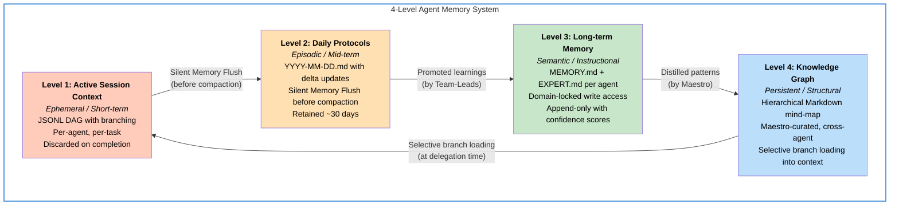
```mermaid
graph TB
    subgraph MemorySystem ["4-Level Agent Memory System"]
        L1["<b>Level 1: Active Session Context</b><br/><i>Ephemeral / Short-term</i><br/>JSONL DAG with branching<br/>Per-agent, per-task<br/>Discarded on completion"]

        L2["<b>Level 2: Daily Protocols</b><br/><i>Episodic / Mid-term</i><br/>YYYY-MM-DD.md with delta updates<br/>Silent Memory Flush before compaction<br/>Retained ~30 days"]

        L3["<b>Level 3: Long-term Memory</b><br/><i>Semantic / Instructional</i><br/>MEMORY.md + EXPERT.md per agent<br/>Domain-locked write access<br/>Append-only with confidence scores"]

        L4["<b>Level 4: Knowledge Graph</b><br/><i>Persistent / Structural</i><br/>Hierarchical Markdown mind-map<br/>Maestro-curated, cross-agent<br/>Selective branch loading into context"]
    end

    L1 -- "Silent Memory Flush<br/>(before compaction)" --> L2
    L2 -- "Promoted learnings<br/>(by Team-Leads)" --> L3
    L3 -- "Distilled patterns<br/>(by Maestro)" --> L4
    L4 -- "Selective branch loading<br/>(at delegation time)" --> L1

    style MemorySystem fill:none,stroke:#438DD5,stroke-width:2px
    style L1 fill:#FFCCBC,color:#000
    style L2 fill:#FFE0B2,color:#000
    style L3 fill:#C8E6C9,color:#000
    style L4 fill:#BBDEFB,color:#000
```

### 8.5 Security, Isolation, and Input Sanitization

Security isolation follows a **tiered model** aligned with the agent hierarchy:

| Agent Level | Runtime Isolation | File System Access | Memory Access | Rationale |
|-------------|-------------------|-------------------|---------------|-----------|
| **Maestro (L1)** | tmux pane on host | Full workspace + memory (all levels) | Read/write all 4 levels | Trusted root agent; needs full visibility for orchestration |
| **Team-Leads (L2..n-1)** | tmux pane on host | Workspace + own domain files + memory (L1-L3) | Write L1-L2; write own domain L3; read-only other L3/L4 | Trusted for domain; debuggable via tmux attach |
| **Worker-Agents (Ln)** | **Container (Docker/Podman)** with cgroup resource limits (CPU, memory, disk) | Mounted volume: assigned workspace root / feature branch (read-write) + shared agent and skill definitions (read-only) | Write L1-L2 only; no L3/L4 write access | Least-privilege; untrusted code execution; resource-limited to prevent runaway consumption |

**Security controls:**

| Concern | Mechanism | Details |
|---------|-----------|---------|
| **Process isolation** | Container runtime for Workers; tmux for Leads/Maestro | Workers run in a prebuilt rootless Podman/Docker image with default limits of 4 CPU / 8 GB RAM / bounded disk. The **RuntimeManager** (Section 5.1) selects the runtime based on agent hierarchy level. Dev-mode fallback: all agents in tmux. |
| **File access control** | Domain whitelist in agent frontmatter + runtime enforcement | The `domain` field in frontmatter defines allowed read/upsert/delete path patterns. Enforced by intercepting file operations at the tool-call layer (pre-execution hook). Deny-by-default. |
| **Memory access control** | MemoryAccessControl component (Section 5.2.2) | Enforces write permissions by hierarchy level. Workers blocked from writing L3/L4. Team-Leads blocked from writing other domains' EXPERT.md. All denials logged. |
| **Shell injection** | Control character stripping + session ID validation | All shell-bound input is sanitized before execution. tmux session IDs validated against allowlist. Sanitization happens before shell invocation, not only before UI display. |
| **Secret protection** | Shared AuthStorage + secret-aware logging | Provider credentials are resolved from shared auth storage (environment variables, auth file, or OS keychain) and never written to workspace files. Logger redacts known secret patterns before persisting `log.md`, `logs/*.log`, prompt snapshots, and stored tool output. |
| **Web server auth** | Bind to localhost + session-bound tokens | Express server binds to 127.0.0.1 only. Session-based authentication tokens with configurable lifetime. Rate limiting on API endpoints. |
| **Prompt injection** | System/user content separation + sanitization | System prompt sections (policy/rules) are separated from user/workspace content by structural delimiters. Retrieved workspace content is treated as hostile input, sanitized before prompt inclusion or shell execution, and cannot expand tool authority. |
| **High-risk operations** | Static tool permissions + runtime approval boundaries | High-risk capabilities remain governed by agent frontmatter and runtime policy. Retrieved content cannot grant new tools, widen domain access, or bypass approval rules. |

**Always / Ask / Never policy:**

| Policy | Rule |
|--------|------|
| **Always** | Redact secrets before persistence, sanitize workspace-derived input before prompt/shell use, enforce domain and tool boundaries at runtime, and log denials for review |
| **Ask** | Require explicit user or parent-agent approval when an operation exceeds static authority, crosses trust boundaries, or would weaken isolation or secret-handling guarantees |
| **Never** | Never let workspace content override system policy, widen tool permissions, bypass domain restrictions, or persist raw secrets or unredacted credential material to disk |

### 8.6 Observability

| Layer | Current Architecture | Target |
|-------|----------------------|--------|
| Activity logging | `workspace/log.md` markdown table with `timestamp`, `level`, `taskId`, `correlationId`, `agent`, `message` | Rich UI filtering and delegation-chain drill-down |
| Structured events | Machine-readable `LogEvent` stream for monitor/recovery/audit use | SQLite `events` table with retention and query support *[target]* |
| Per-agent logs | `logs/{agent-slug}.log` redacted stdout/stderr plus runtime observations | Structured JSON logs with provider/API observations |
| Real-time monitoring | WebSocket broadcast of file changes | SSE endpoint with heartbeat (polling-first, push later) |
| Pane output streaming | `tmux capture-pane` polled every 2.5s via WebSocket; plain-process runtime exposes equivalent output buffer | Direct terminal WebSocket (ttyd or node-pty) |
| Task tracking | `workspace/status.md` table + individual task files | Dashboard with filters, search, completion metrics |
| Training/XP tracking | Not implemented | XP event ledger with evidence links (SQLite) *[target]* |

### 8.7 Agent Lifecycle State Machine

Every agent instance follows a well-defined lifecycle. Understanding this state machine is essential for monitoring, debugging, and implementing proper cleanup.

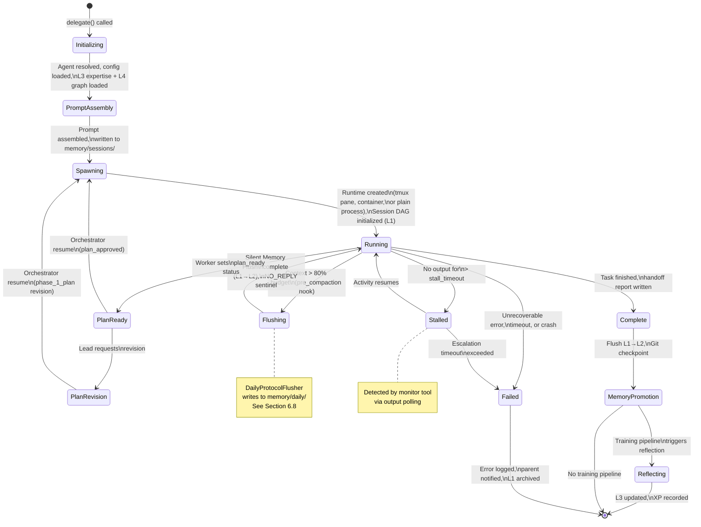
```mermaid
stateDiagram-v2
    [*] --> Initializing: delegate() called
    Initializing --> PromptAssembly: Agent resolved, config loaded,\nL3 expertise + L4 graph loaded
    PromptAssembly --> Spawning: Prompt assembled,\nwritten to memory/sessions/
    Spawning --> Running: Runtime created\n(tmux pane, container,\nor plain process),\nSession DAG initialized (L1)
    Running --> Flushing: Context > 80% budget\n(pre_compaction hook)
    Flushing --> Running: Silent Memory Flush\ncomplete (L1→L2),\nNO_REPLY sentinel
    Running --> PlanReady: Worker sets\nplan_ready status
    PlanReady --> Spawning: Orchestrator resume\n(plan_approved)
    PlanReady --> PlanRevision: Lead requests\nrevision
    PlanRevision --> Spawning: Orchestrator resume\n(phase_1_plan revision)
    Running --> Complete: Task finished,\nhandoff report written
    Running --> Failed: Unrecoverable error,\ntimeout, or crash
    Running --> Stalled: No output for\n> stall_timeout
    Stalled --> Running: Activity resumes
    Stalled --> Failed: Escalation timeout\nexceeded
    Complete --> MemoryPromotion: Flush L1→L2,\nGit checkpoint
    MemoryPromotion --> Reflecting: Training pipeline\ntriggers reflection
    Reflecting --> [*]: L3 updated,\nXP recorded
    MemoryPromotion --> [*]: No training pipeline
    Failed --> [*]: Error logged,\nparent notified,\nL1 archived

    note right of Flushing
        DailyProtocolFlusher
        writes to memory/daily/
        See Section 6.8
    end note

    note right of Stalled
        Detected by monitor tool
        via output polling
    end note
```

**Lifecycle invariants:**
- Every agent that reaches `Spawning` must eventually reach either `Complete` or `Failed` -- no silent disappearance
- **`Flushing`** is a mandatory transition triggered by the `pre_compaction` hook when context exceeds 80% of token budget. The **DailyProtocolFlusher** writes to Level 2; if flush fails, compaction is deferred
- **`PlanReady`** is terminal for the current planning turn. Resuming work requires the orchestrator to call `resume()` with either `phase_1_plan` (revision) or `phase_2_execute` (approval)
- **`MemoryPromotion`** is a mandatory transition on `Complete`: Level 1 session is flushed to Level 2, and the **GitCheckpointEngine** creates a `mem:` commit
- The `monitor` tool is responsible for detecting `Stalled` agents (no new output within configurable `stall_timeout`, default: 120 seconds)
- On `Failed`, the parent agent receives the error context and can decide to retry, reassign, or escalate
- Runtime cleanup (tmux pane, container, or process teardown) happens on terminal states (`[*]`)

**Status determination priority cascade:** When the `monitor` tool checks an agent, it evaluates conditions in strict priority order -- each step falls through gracefully on failure, preserving the current status rather than corrupting state:

1. Runtime alive check (runtime handle valid; tmux pane/container/process still alive)
2. Agent activity detection (new output since last poll)
3. Task status file check (status field in task markdown)
4. Stall detection (no activity within `stall_timeout`)

**Target: Session recovery classification** *[target]*: Classify sessions as `live` (running normally), `dead` (pane gone, workspace intact -- recoverable), `partial` (workspace damaged -- escalate), or `unrecoverable` (both gone -- cleanup only). Each classification maps to an action: recover, cleanup, escalate, or skip.

### 8.8 Timeout, Deadlock Detection, and Stall Recovery

Multi-agent systems are susceptible to hangs, deadlocks, and silent failures. The system implements layered detection:

| Layer | Mechanism | Default | Action |
|-------|-----------|---------|--------|
| **Agent stall detection** | `monitor` tool polls runtime output; no new output within `stall_timeout` | 120s | Log warning, send nudge message to agent |
| **Task timeout** | Per-task `time_budget` in delegation parameters | 600s | Parent receives timeout notification; can kill and reassign |
| **Wave timeout** | Maximum wall-clock time for all tasks in a wave to complete | 1800s | Maestro kills remaining agents, creates summary of partial results, decides whether to proceed or abort |
| **Process health check** | Runtime liveness + recent output inspection for fatal errors | 10s interval | Detect crashed agents or dead shells; mark as `Failed`, notify parent |
| **Recursive depth guard** | Configurable `max_delegation_depth` in system config | 5 levels | Agents at max depth cannot use `delegate` tool; prevents runaway recursion |
| **Spawn budget** | Maximum concurrent runtime slots per session | 10 | New delegation requests queued until a runtime slot becomes available |

**Bounded retry with escalation:** When an agent encounters a transient failure (e.g., LLM timeout, tool error), the system tracks retry attempts per `(taskId, errorType)`. Escalation triggers when `attempts > maxRetries` (default: 3) or elapsed time exceeds `escalateAfter` duration (default: 300s). Escalation actions are ordered: **nudge -> interrupt/abort current runtime turn -> reassign or fail task**. Failed retries allow another attempt on the next monitoring cycle without immediate escalation.

**Deadlock prevention:**
- Wave-based scheduling inherently prevents circular dependencies (all wave N tasks are independent)
- Within a wave, agents do not wait on each other -- they write to separate task files and the orchestrator monitors completion
- Cross-wave dependencies are explicit in the task graph and resolved by wave ordering

### 8.9 Resource Management and Backpressure

Running many concurrent LLM-powered agents can exhaust system resources (CPU, memory, API rate limits, runtime slots). The system implements backpressure at multiple levels:

| Resource | Limit | Backpressure Strategy |
|----------|-------|-----------------------|
| **Runtime slots** | Configurable max (default: 10) | Queue pending delegations; start next when a runtime slot frees up |
| **LLM API calls** | Provider rate limits | Per-provider token bucket with exponential backoff; failover to alternate provider |
| **File system I/O** | Local disk throughput | Wave-based scheduling naturally batches I/O; no additional throttling needed |
| **Memory (agent prompts)** | ~50-200K tokens per agent context | Context window management (see 8.10); mental model size monitoring |
| **Disk (workspace artifacts)** | Local disk space | Log rotation for `logs/*.log`; configurable artifact retention policy *[target]* |

**Spawn queuing:** When the active runtime slot count reaches the configured maximum, new `delegate()` calls enter a FIFO queue. The Maestro processes the queue as agents complete, prioritizing by wave order then task priority. This prevents resource exhaustion while maintaining fairness.

### 8.10 Context Window Management

LLM context windows are a finite and expensive resource. As agent hierarchies deepen and mental models grow, managing token budgets becomes critical to maintaining reasoning quality.

**Token budget allocation:**

| Prompt Component | Typical Size | Priority | Management Strategy |
|-----------------|-------------|----------|---------------------|
| Agent system prompt body | 500-2000 tokens | Fixed | Static, authored by developer |
| Mental model | 200-5000 tokens (grows) | High | Confidence-based pruning when exceeding budget *[target]* |
| Skills (injected) | 500-3000 tokens per skill | Medium | Progressive disclosure -- only load skills relevant to current task |
| Shared context (goal, plan, status) | 500-2000 tokens | High | Always included; summarized if oversized |
| Task description | 200-1000 tokens | Critical | Always included in full |
| Plan-gate instructions | 100-300 tokens | Conditional | Only when `plan_first: true` |
| **Total target** | **< 8000 tokens** | | Leaves maximum room for LLM reasoning and tool calls |

**Strategies for controlling context growth:**
1. **Expertise pruning**: When an agent's `MEMORY.md` or `EXPERT.md` exceeds a configurable token budget (default: 3000 tokens), the **ExpertiseStore** component archives entries with the lowest confidence scores to `memory/agents/{name}/archive/` rather than deleting them.
2. **Skill progressive disclosure**: Only skills listed in the agent's frontmatter are loaded. Within those, only the subset relevant to the current task type is injected (matched by skill metadata tags).
3. **Shared context summarization**: If `workspace/plan.md` or `workspace/status.md` exceed 2000 tokens, a summarized version is injected with a pointer to the full file.
4. **Sub-agent context isolation**: Each sub-agent receives a fresh context window with only the information relevant to its specific task. Parent context is not inherited wholesale -- only the task description and relevant shared context are passed down. This prevents "context rot" where deep hierarchies accumulate irrelevant information.

**Counting policy:** Token budgeting uses provider-aware counting where available; character-count heuristics are acceptable only as a fallback warning mechanism and are never the authoritative budget gate.

### 8.11 Concurrent File Access and Conflict Resolution

Multiple agents writing to shared workspace files (especially `status.md` and `log.md`) is a known risk (see Risk #4). The system uses a layered conflict prevention strategy:

| Strategy | Scope | Mechanism |
|----------|-------|-----------|
| **Single-writer convention** | `goal.md`, `plan.md` | Only one designated owner writes each file at a time (goal: developer/run.sh; plan: developer or Planning Lead, never both concurrently) |
| **Append-only protocol** | `log.md`, mental models | Logger is the sole writer for `log.md`; memory stores append structured entries. Agents never perform ad-hoc read-modify-write cycles on shared coordination files |
| **Task file ownership** | `tasks/task-NNN.md` | Each task file has exactly one assigned agent as writer; the lead reads for review |
| **Status table locking** | `status.md` | The Maestro is the sole writer of the status table. Agents update their own task files; the Maestro reflects status changes into `status.md` during monitoring sweeps |
| **Domain path restrictions** | Agent frontmatter | `domain.upsert` patterns restrict which file paths each agent can write to, preventing accidental cross-agent file conflicts |
| **Wave isolation** | Cross-wave artifacts | Agents in different waves operate on different artifacts by design (wave ordering ensures predecessors complete before dependents start) |

**Atomic file writes:** For critical state files (`status.md`, `log.md`, `plan.md`), use the write-temp-then-rename pattern: write to a temporary file in the same directory, then atomically rename to the target path. This prevents partial writes from corrupting state if a process crashes mid-write.

**Target enhancement** *[target]*: File-level advisory locking using `flock()` or a lightweight lock manager for the remaining edge cases (e.g., two agents in the same wave writing to an overlapping path). Symbol-level locking (AST-aware, as in the Wit protocol) for shared source code files.

### 8.12 Error Recovery and Resilience

The system implements defense-in-depth for fault tolerance:

| Scenario | Recovery Mechanism | Details |
|----------|-------------------|---------|
| **Maestro crash** | tmux sessions and containers survive; plain-process fallback is best-effort | Agents write their results to workspace files regardless of Maestro state. On restart, Maestro reads current state from files. |
| **Maestro session resume** | `run.sh --resume` re-attaches to existing tmux session | Reads `status.md` + task files to reconstruct `ActiveWorkers` map; resumes monitoring from current wave state |
| **Agent crash (mid-task)** | Health check detects missing pane; parent notified | Parent agent can retry (re-delegate same task), reassign (delegate to different agent), or escalate (mark task as failed, create summary of partial progress) |
| **LLM provider failure** | Failover chain with exponential backoff | Primary model -> secondary model -> tertiary model. Per ADR-007. Retry with backoff before failover. If all providers fail, task enters `Failed` state with clear error context. |
| **Runtime unavailable** | Fallback to `child_process.spawn`-backed plain-process runtime behind `AgentRuntime`; container launch may fall back to tmux in dev-mode | Loses attach ergonomics or isolation guarantees, but maintains orchestration semantics and log capture. Agent logs remain piped to `logs/` directory. |
| **Agent spawn failure** | Error returned to Maestro/Team-Lead; can retry or reassign | Common causes: runtime slot limit reached (queue and retry), agent definition not found (fail fast with clear error), LLM auth failure (prompt user) |
| **Reconcile failure** | Auto-creates fix-task; loops until validation passes | Maximum retry count (default: 3) prevents infinite loops. After max retries, escalates to user with full error context. |
| **File corruption** | Workspace files are git-trackable; recovery via git checkout | `workspace/` should be committed at wave boundaries for checkpoint/restore capability |
| **Stalled agent** | Timeout detection escalation: nudge -> interrupt/abort -> reassign | See Section 8.8 for timeout ladder |
| **Target: Session restore** *[target]* | Differentiate "not restorable" (409) vs "workspace missing" (422) | Explicit error classification enables appropriate UI responses |
| **Target: Write-ahead queue** *[target]* | Task queue persisted to disk before execution | Enables checkpoint/restart: on crash, replay queue from last completed task rather than restarting entire session |

### 8.13 Chat-like Visualization of Agent Communication

The multi-agent orchestration process -- delegations, status transitions, handoff reports, plan approvals, and reconciliation results -- is presented to the user as a **chat-like interface**. Rather than requiring the developer to inspect raw workspace files, log tables, or tmux panes individually, the Web Client aggregates all agent activity into a unified, chronological conversation thread.

**Design rationale:** A chat paradigm is the natural metaphor for a hierarchical tree of agents communicating through structured messages. It maps directly to how the system works: parent agents "talk to" their sub-agents at any depth, and each response is a structured artifact (task assignment, proposed approach, handoff report, reconcile result). Visualizing this as a threaded conversation tree makes the underlying coordination immediately legible, regardless of how many levels deep the hierarchy goes.

**Message types in the chat view:**

| Event | Rendered As | Source |
|-------|------------|--------|
| Delegation | "Maestro delegated task-003 to Engineering Lead" with task card | `workspace/log.md` entry + task file creation |
| Status change | Status badge update (pending -> in_progress -> complete) | `workspace/status.md` change |
| Plan-approval gate | Proposed approach card with approve/revise buttons | Task file `plan_ready` status |
| Handoff report | Structured card (Changes / Patterns / Concerns / Follow-ups) | Task file `## Output` section |
| Reconciliation | Pass/fail notification with expandable error output | `reconcile` tool result |
| Memory update | Learning summary with confidence indicator | `update_memory` tool result |
| Monitoring check-in | Agent activity snapshot with runtime output excerpt | `monitor` tool result |

Each message carries the agent's **avatar**, **role badge** (Maestro / Team-Lead / Worker-Agent), and **team color** (from `multi-team-config.yaml`), making it immediately clear who is communicating with whom and at which hierarchy level.

### 8.14 Domain Model

The following entity-relationship diagram captures the core domain concepts and their relationships. This model underpins all coordination, training, and gamification features.

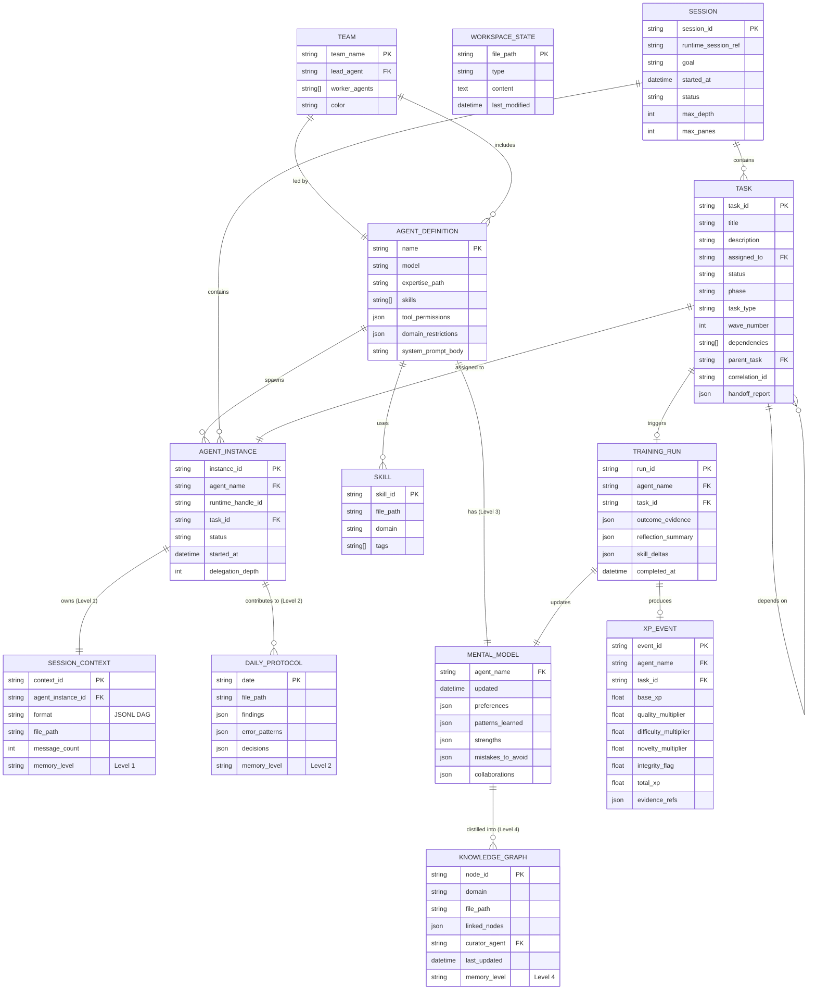
```mermaid
erDiagram
    AGENT_DEFINITION {
        string name PK
        string model
        string expertise_path
        string[] skills
        json tool_permissions
        json domain_restrictions
        string system_prompt_body
    }

    AGENT_INSTANCE {
        string instance_id PK
        string agent_name FK
        string runtime_handle_id
        string task_id FK
        string status
        datetime started_at
        int delegation_depth
    }

    SESSION_CONTEXT {
        string context_id PK
        string agent_instance_id FK
        string format "JSONL DAG"
        string file_path
        int message_count
        string memory_level "Level 1"
    }

    DAILY_PROTOCOL {
        string date PK
        string file_path
        json findings
        json error_patterns
        json decisions
        string memory_level "Level 2"
    }

    MENTAL_MODEL {
        string agent_name FK
        datetime updated
        json preferences
        json patterns_learned
        json strengths
        json mistakes_to_avoid
        json collaborations
    }

    SKILL {
        string skill_id PK
        string file_path
        string domain
        string[] tags
    }

    TEAM {
        string team_name PK
        string lead_agent FK
        string[] worker_agents
        string color
    }

    TASK {
        string task_id PK
        string title
        string description
        string assigned_to FK
        string status
        string phase
        string task_type
        int wave_number
        string[] dependencies
        string parent_task FK
        string correlation_id
        json handoff_report
    }

    WORKSPACE_STATE {
        string file_path PK
        string type
        text content
        datetime last_modified
    }

    SESSION {
        string session_id PK
        string runtime_session_ref
        string goal
        datetime started_at
        string status
        int max_depth
        int max_panes
    }

    TRAINING_RUN {
        string run_id PK
        string agent_name FK
        string task_id FK
        json outcome_evidence
        json reflection_summary
        json skill_deltas
        datetime completed_at
    }

    XP_EVENT {
        string event_id PK
        string agent_name FK
        string task_id FK
        float base_xp
        float quality_multiplier
        float difficulty_multiplier
        float novelty_multiplier
        float integrity_flag
        float total_xp
        json evidence_refs
    }

    KNOWLEDGE_GRAPH {
        string node_id PK
        string domain
        string file_path
        json linked_nodes
        string curator_agent FK
        datetime last_updated
        string memory_level "Level 4"
    }

    AGENT_DEFINITION ||--o{ AGENT_INSTANCE : "spawns"
    AGENT_DEFINITION ||--|| MENTAL_MODEL : "has (Level 3)"
    AGENT_DEFINITION ||--o{ SKILL : "uses"
    AGENT_INSTANCE ||--|| SESSION_CONTEXT : "owns (Level 1)"
    AGENT_INSTANCE ||--o{ DAILY_PROTOCOL : "contributes to (Level 2)"
    MENTAL_MODEL ||--o{ KNOWLEDGE_GRAPH : "distilled into (Level 4)"
    TEAM ||--|| AGENT_DEFINITION : "led by"
    TEAM ||--o{ AGENT_DEFINITION : "includes"
    SESSION ||--o{ AGENT_INSTANCE : "contains"
    SESSION ||--o{ TASK : "contains"
    TASK ||--o{ TASK : "depends on"
    TASK ||--|| AGENT_INSTANCE : "assigned to"
    TASK ||--o| TRAINING_RUN : "triggers"
    TRAINING_RUN ||--o| XP_EVENT : "produces"
    TRAINING_RUN ||--|| MENTAL_MODEL : "updates"
```

**Key domain invariants:**
- An `AGENT_DEFINITION` is static configuration; an `AGENT_INSTANCE` is a running process
- A `TASK` belongs to exactly one wave, has at most one assigned agent instance, and its `wave_number` is computed by the Maestro from `dependencies[]`
- `TASK.phase` may only move `phase_1_plan -> phase_2_execute`; approval or revision always happens between runtime turns, never mid-turn
- `TASK.status` is authoritative in workspace state; runtime exit codes are secondary evidence, not the canonical task result
- `MENTAL_MODEL` (Level 3) is append-only -- updates add entries, never remove
- `SESSION_CONTEXT` (Level 1) is ephemeral -- discarded or archived to `DAILY_PROTOCOL` (Level 2) on agent completion
- `KNOWLEDGE_GRAPH` (Level 4) nodes are write-accessible only by the Maestro; Team-Leads propose additions via handoffs
- `DAILY_PROTOCOL` (Level 2) entries are append-only with delta updates -- no monolithic rewrites
- `HandoffReport` must contain all four required sections and pass lead-level semantic validation before a task can be accepted as complete
- `XP_EVENT` requires non-null `evidence_refs` (evidence-gating invariant)
- `SESSION` has configurable `max_depth` and `max_panes` limits enforced at delegation time

### 8.15 Configuration Management and Model Tiering

System configuration follows a layered model with clear precedence:

| Layer | File | Scope | Override Precedence |
|-------|------|-------|---------------------|
| **System defaults** | Hardcoded in current control-plane modules | Timeouts, max panes, wave limits, model tier defaults | Lowest |
| **Project config** | `multi-team-config.yaml` | Team structure, agent assignments, paths, model tier policy | Medium |
| **Agent config** | `agents/*.md` frontmatter | Per-agent model, model_tier, skills, tools, memory permissions, domain | High |
| **Session config** | CLI args to `run.sh` | Goal, resume flag, overrides | Highest |

**Configuration validation:** At startup, `loadConfig()` validates via Zod schemas:
- All referenced agent files exist and have valid frontmatter (including `schema_version`)
- All referenced skill files exist
- Team-Leads have the `delegate` tool enabled
- No circular team references
- Model identifiers are recognized provider/model pairs
- Memory `write_levels` are consistent with hierarchy level (Workers cannot have L3/L4 write access)
- `model_tier` is valid and consistent with agent role
- Cross-field constraint: if `delegate: true`, agent must reference at least one potential sub-agent

**Planning precedence and task graph validation:**
- If `workspace/plan.md` exists, it is parsed as the authoritative plan input for the session
- If `workspace/plan.md` is absent, the Maestro may request a structured `TaskPlan` from the configured provider stack
- In both cases, the Maestro validates task schema, dependency references, cycle absence, and plan-gate flags before any delegation begins
- `wave_number` values are derived by computation, not trusted from external input

**Provider and credential policy:**
- Provider credentials are resolved from shared auth storage for the whole session; per-agent credential isolation is not part of v1
- Failover chains are configured centrally and may be referenced by `model_tier_policy` or explicit model IDs
- Retry and failover thresholds are configuration, but their orchestration semantics are fixed by ADR-007

**Model Tiering Policy:**

Model tiering ensures that expensive, high-reasoning models are used for memory curation and strategic decisions, while cost-effective models handle atomic task execution. This is enforced via the `model_tier` field in agent frontmatter:

| Tier | Purpose | Default Model | Used By | Rationale |
|------|---------|---------------|---------|-----------|
| **curator** | Memory curation (L3/L4), knowledge graph maintenance, reflection | Opus 4.6 / Gemini 2.5 Pro | Maestro, Training Pipeline | Curating knowledge requires highest reasoning quality; errors propagate across all agents |
| **lead** | Domain strategy, plan review, quality gates, L2→L3 promotion | Opus 4.6 / Gemini 2.5 Pro | Team-Leads | Reviewing and synthesizing requires strong reasoning; cheaper than curator for focused domains |
| **worker** | Atomic task execution, code generation, testing | Sonnet 4.6 / Haiku 4.5 / Gemini 2.5 Flash | Worker-Agents | Well-defined tasks with clear instructions; high throughput more important than peak reasoning |

**Tier selection at runtime:** The **PromptAssembler** (Section 5.2.1) reads the agent's `model_tier` from frontmatter and resolves it to a concrete model ID via the project config's `model_tier_policy` section:

```yaml
# In multi-team-config.yaml
model_tier_policy:
  curator:
    primary: "anthropic/claude-opus-4-6"
    fallback: "google/gemini-2.5-pro"
  lead:
    primary: "anthropic/claude-opus-4-6"
    fallback: "google/gemini-2.5-pro"
  worker:
    primary: "anthropic/claude-sonnet-4-6"
    fallback: "google/gemini-2.5-flash"
```

### 8.16 Logging and Audit Trail

The system maintains multiple log layers for different audiences:

| Log Layer | Location | Format | Audience | Retention |
|-----------|----------|--------|----------|-----------|
| **Activity log** | `workspace/log.md` | Markdown table (`timestamp`, `level`, `taskId`, `correlationId`, `agent`, `message`) | Developer, all agents | Per-session |
| **Agent stdout/stderr** | `logs/{agent-slug}.log` | Redacted terminal output + runtime observations | Developer (debugging) | Per-session |
| **Task handoff reports** | `workspace/tasks/task-NNN.md` | Structured markdown (4 required sections + validation metadata) | Lead agents, developer | Per-session |
| **Session prompts** | `memory/sessions/prompt-task-NNN.md` | Full assembled prompt snapshot, redacted before persistence | Auditing, debugging | Per-session |
| **Session DAGs** | `memory/sessions/task-NNN.jsonl` | JSONL DAG (Level 1 memory) | Debugging, time-travel | Per-session (archivable) |
| **Daily protocols** | `memory/daily/YYYY-MM-DD.md` | Episodic memory (Level 2) | Cross-session learning | 30-day retention |
| **Memory commits** | Git log (`mem:` prefix) | Memory evolution audit trail | Developer, architecture review | Persistent |
| **Target: Structured events** *[target]* | SQLite `events` table | JSON with correlation IDs | Training pipeline, XP service | Persistent |

**Correlation:** Each delegation carries a concrete `correlation_id` that propagates through task files, log entries, runtime observations, and reconciliation events. Task IDs remain human-friendly (`task-001`, `task-003-fix-001`), while correlation IDs provide machine-stable subtree tracing.

**Persistence rule:** Redaction happens before anything is written to `log.md`, `logs/*.log`, or prompt snapshots. No persisted audit artifact may contain raw provider secrets or unredacted credential material.

### 8.17 Git-Memory Integration ("Marriage with Git")

The memory system (Section 8.4) is tightly integrated with Git to make agent decisions **auditable, versionable, and recoverable**. All memory artifacts (Levels 2-4) are treated as first-class repository content.

| Principle | Implementation | Details |
|-----------|---------------|---------|
| **Filesystem-as-Context** | Memory files in `memory/` directory within the repository | All memory artifacts (daily protocols, MEMORY.md, EXPERT.md, knowledge graph) are plain Markdown/YAML files that Git tracks natively. The workspace is the "Source of Truth" -- no external database for memory state. |
| **Automated Checkpoints** | Git hooks (`post-turn`) trigger memory commits | After each successful agent step (task completion, reconciliation pass, wave boundary), a commit captures the current memory state. This provides fine-grained rollback capability. |
| **Conventional Memory Commits** | Prefixed commit messages for memory operations | Memory updates follow a naming convention: `mem: update backend patterns`, `mem: daily protocol 2026-04-05`, `mem: knowledge graph -- auth system`. This enables filtering memory changes via `git log --grep="^mem:"`. |
| **Branch-based Memory Isolation** | Worker-Agents operate on feature branches | Each Worker-Agent's local memory (Level 1-2) lives on its isolated feature branch. Memory is only integrated into the Maestro's central knowledge graph (Level 4) upon successful merge -- preventing half-finished learnings from polluting the project memory. |
| **Audit Trail** | Human-reviewable via `git diff` | Since all memory is readable Markdown, a human reviewer can trace exactly which heuristics, patterns, or expertise the agents learned over time: `git diff HEAD~5 -- memory/` shows the last 5 memory evolution steps. |

**Memory-aware Git workflow:**

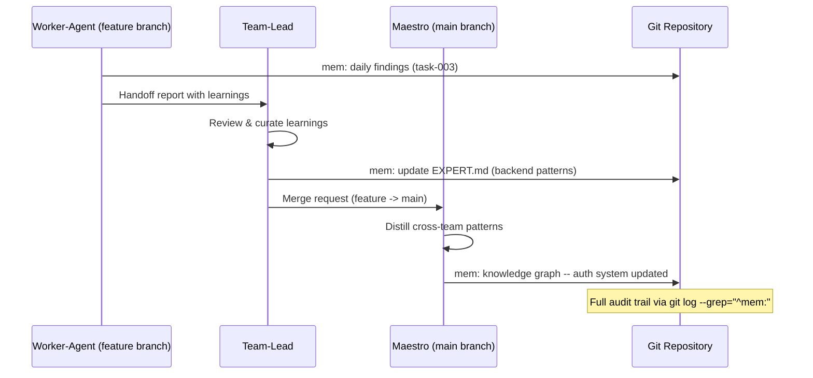
```mermaid
sequenceDiagram
    participant Worker as Worker-Agent (feature branch)
    participant Lead as Team-Lead
    participant Maestro as Maestro (main branch)
    participant Git as Git Repository

    Worker->>Git: mem: daily findings (task-003)
    Worker->>Lead: Handoff report with learnings

    Lead->>Lead: Review & curate learnings
    Lead->>Git: mem: update EXPERT.md (backend patterns)

    Lead->>Maestro: Merge request (feature -> main)
    Maestro->>Maestro: Distill cross-team patterns
    Maestro->>Git: mem: knowledge graph -- auth system updated
    Note over Git: Full audit trail via git log --grep="^mem:"
```

### 8.18 Memory Best Practices

These operational guidelines ensure the memory system remains effective, consistent, and safe across the agent hierarchy.

| Practice | Description | Rationale |
|----------|-------------|-----------|
| **Incremental delta updates** | Always append new entries; never rewrite memory files monolithically | Prevents context collapse and data loss. Atomic appends are safe under concurrent access. |
| **Security isolation** | Worker-Agents execute in Docker sandboxes *[target]*; only Team-Leads and Maestro manage persistent memory on the host filesystem | Prevents untrusted or lower-capability Worker models from corrupting curated knowledge. |
| **Model tiering for memory curation** | Use expensive models (Opus 4.6) for memory curation (Reflector/Curator roles); use cost-effective models (Sonnet/Haiku) for Worker-Agent task execution | Curating knowledge requires higher reasoning quality than executing well-defined atomic tasks. Budget allocation should reflect this. |
| **Memory observability** | Every memory write operation is logged with agent identity, level, and timestamp | "What you don't measure, you can't improve." Memory drift, bloat, and staleness are detectable only with proper instrumentation. |
| **Silent Memory Flush before compaction** | Agents must flush important findings to Level 2 (daily protocol) before their context window is compacted/summarized | Prevents knowledge loss when the LLM's detailed conversation history is truncated for token management. |
| **Domain locking enforcement** | Only the designated domain expert writes to their EXPERT.md; cross-domain writes are blocked | Prevents "knowledge drift" where a less specialized agent overwrites expert-curated patterns. |
| **Confidence-based pruning** *[target]* | Periodically archive entries with confidence < 0.3 or entries older than 90 days without reconfirmation | Prevents unbounded memory growth and keeps the active knowledge base relevant. |
| **Knowledge graph selective loading** | At delegation time, load only the knowledge graph branches relevant to the agent's task domain | Reduces token waste by up to 67% compared to flat full-context injection. Keeps agent reasoning focused. |

### 8.19 Gamification *[target]*

Evidence-gated quality progression system. XP tied to hard signals, not text production.

**XP Formula:**

```
XP = Base x Quality x Difficulty x Novelty x Integrity

Where:
  Base = 10
  Quality = clamp(0..2, 0.5 + 0.5 * q)
    q from: CI passing, review approved, reconcile pass, no reopens
  Difficulty = from task complexity, time budget, risk level
  Novelty = high if skill area untrained; decays with repetition (anti-grind)
  Integrity = 0 if evidence missing or suspicious patterns detected
```

**Anti-Gaming Mechanisms:**

| Mechanism | Purpose |
|-----------|---------|
| Evidence-gating | No XP without evidence object (CI/review/benchmark) |
| Diminishing returns | Same skill category gives less XP short-term |
| Random audits | 1-in-10 runs sampled; fail = XP clawback |
| Reopen penalty | Bug reopened / regression = partial XP reversal |
| Rate limits | Per agent/skill/day caps prevent micro-task farming |
| Cross-agent review | Leads rate workers, workers rate leads (bidirectional) |

**Skill Dimensions** (mapped to existing skills):

| Dimension | Evidence Source | Skill File |
|-----------|---------------|------------|
| API Design | Code review quality, endpoint consistency | `skills/api-design.md` |
| Testing Strategy | Test coverage, regression rate | `skills/testing-strategy.md` |
| Security Hygiene | Vulnerability findings, audit completeness | `skills/security-audit.md` |
| Task Decomposition | Wave efficiency, dependency correctness | `skills/task-decomposition.md` |
| Code Review | Review thoroughness, false positive rate | `skills/code-review.md` |

---

## 9. Architecture Decisions

The ADRs in this section are part of the target-state planning surface:
- **Accepted** means the project intends to implement that target-state choice unless later evidence reopens it
- **Proposed** means the architecture keeps the option open and names the trigger that should resolve it
- **Implementation status note** callouts keep current-repo divergence brief and local rather than turning this section into an audit

### ADR-001: File-based Coordination over Database/Message Queue

**Status:** Accepted  
**Context:** Need a coordination mechanism between independently running AI agent processes that can survive crashes and be human-inspectable.  
**Decision:** Use Markdown/YAML files in `workspace/` as the canonical state store. All agents read/write these files. A file watcher provides the event layer.  
**Alternatives Considered:**
- *SQLite database* -- Better query capability and atomic transactions, but less human-readable and harder to manually inspect/edit during debugging. Would require a shared DB connection across processes.
- *Redis / Message queue* -- Low-latency pub/sub, but adds infrastructure dependency and loses git-trackability. Overkill for single-machine, single-user operation.
- *Shared memory / IPC* -- Fast but volatile; no crash recovery without additional persistence layer.

**Consequences:**
- (+) Human-readable -- developers can inspect and manually edit state
- (+) Git-trackable -- full history of all state changes
- (+) Crash-recoverable -- files persist independently of processes
- (+) No database dependency for core orchestration
- (-) No atomic transactions -- concurrent writes can corrupt (mitigated by wave-based scheduling and single-writer-per-file convention)
- (-) No query capability -- must parse files to extract structured data
- (-) Scaling limited to local file system performance

### ADR-002: Tiered Process Isolation (tmux + Containers)

**Status:** Accepted
**Context:** Need to run multiple AI agents in parallel with output capture, debuggability, and appropriate security boundaries. Different hierarchy levels have different trust and isolation requirements.
**Decision:** Tiered isolation model: Maestro and Team-Leads run in tmux panes (trusted, debuggable via `tmux attach`). Worker-Agents run in rootless containers (Docker/Podman) with cgroup resource limits (CPU, memory, disk). When tmux is unavailable, the Maestro and Team-Leads fall back to a `child_process.spawn`-backed plain-process runtime behind `AgentRuntime`. Dev-mode fallback for full multi-agent local debugging remains all agents in tmux.
**Alternatives Considered:**
- *tmux-only (previous approach)* -- Lightweight and debuggable, but no resource limits and no security boundary for Worker-Agents executing untrusted code.
- *Containers-only* -- Strong isolation for all agents, but heavy startup overhead (~2-5s per container), harder to debug interactively for trusted lead agents.
- *Bare child processes (`child_process.spawn`)* -- Simplest, cross-platform, but no output persistence, no attach capability, no resource limits.
- *Kubernetes pods* -- Enterprise-grade isolation and scheduling, but massive overhead for local single-developer use.

**Consequences:**
- (+) Trusted agents (Maestro, Leads) remain lightweight and debuggable via tmux
- (+) Untrusted execution (Workers) gets proper resource limits and filesystem isolation
- (+) Non-tmux environments and CI still have a supported fallback runtime with unchanged orchestration semantics
- (+) Crash-resilient -- both tmux sessions and containers survive Maestro crashes
- (+) Dev-mode fallback keeps local development simple
- (-) Linux/macOS only -- no native Windows support for either runtime
- (-) Two runtimes to manage increases operational complexity
- (-) Container startup latency for Worker-Agents (~2-5s vs near-instant tmux)

### ADR-003: Unlimited-Depth Recursive Tree over Fixed-Level or Flat Dispatch

**Status:** Accepted  
**Context:** Complex software tasks require decomposition, specialization, and quality review. Flat dispatch (all agents equal) loses accountability. A fixed-depth hierarchy (e.g., exactly 3 levels) artificially limits the system's ability to handle tasks of varying complexity.  
**Decision:** Unlimited-depth recursive tree structure with a level-based role model: Level 1 = Maestro, Level 2..n-1 = Team-Leads, Level n = Worker-Agents. Any agent that has the `delegate` tool in its frontmatter can spawn sub-agents, who can in turn spawn their own sub-agents -- forming an arbitrarily deep hierarchy. The default configuration ships with 3 levels (Maestro -> Team-Leads -> Worker-Agents), but this is a configuration choice, not an architectural constraint. Teams and sub-teams can be added to `multi-team-config.yaml` without code changes, and agents at any level can be granted the `delegate` tool to enable further decomposition.  
**Alternatives Considered:**
- *Flat dispatch* -- All agents parallel, no hierarchy. Simpler, but loses accountability, quality review, and task decomposition capability. No natural quality gates.
- *Fixed 3-level hierarchy* -- Maestro -> Leads -> Workers hardcoded. Simpler to reason about, but artificially constrains complex tasks that benefit from deeper decomposition (e.g., a Backend Dev needing to spawn DB + API specialists).
- *DAG-based workflow (LangGraph-style)* -- Directed acyclic graph of nodes. Powerful for known workflows, but rigid -- requires predefined graph topology. Our recursive tree adapts dynamically to task complexity.

**Consequences:**
- (+) Adapts to task complexity -- shallow trees for simple work, deep trees for complex projects
- (+) Clear accountability at each level via parent-child delegation
- (+) Natural quality gates (parent reviews child output) at every tree level
- (+) No artificial ceiling on team size or specialization depth
- (+) New levels/teams added purely through configuration (agent .md files + config YAML)
- (-) More coordination overhead as depth increases
- (-) Deeper context chains risk information loss across many levels
- (-) Must guard against runaway recursion (mitigated by configurable max-depth limit and agent spawn budget per session)

### ADR-004: Append-only Mental Models over Full Rewrite

**Status:** Accepted (extended by ADR-008: 4-Level Memory System)  
**Context:** Agent learning must persist across sessions without risk of knowledge loss or corruption.  
**Decision:** Memory Level 3 updates (MEMORY.md / EXPERT.md) are append-only Markdown with confidence scores. The `update_memory` tool only adds entries, never removes or overwrites. This principle applies specifically to Memory Level 3 (Long-term Memory & Expertise) within the broader 4-level memory architecture (ADR-008). The **ExpertiseStore** component (Section 5.2.2) enforces append-only semantics and domain locking.  
**Alternatives Considered:**
- *Full rewrite per session* -- Agent rewrites entire mental model after each task. Risks knowledge loss if the LLM hallucinates or forgets prior learnings. No audit trail.
- *Vector database (embeddings)* -- Semantic search over learned patterns. Better retrieval for large knowledge bases, but loses human readability, harder to audit, and adds infrastructure dependency.
- *Versioned snapshots (git-style)* -- Full model stored per version with diffs. Better history, but more complex to implement. Planned as evolution path for compaction.
- *ACE Generator-Reflector-Curator loop* -- Autonomous curation of knowledge with a dedicated reflector agent that distills and prunes. Powerful but adds complexity. Planned for training pipeline *[target]*.

**Consequences:**
- (+) No knowledge loss -- every learning preserved
- (+) Auditable history -- can trace when patterns were learned
- (+) Safe concurrent updates -- append operations don't conflict
- (+) Human-readable and manually editable
- (-) Unbounded growth -- files grow indefinitely
- (-) Potential memory drift -- outdated patterns persist alongside newer corrections
- (-) No compaction -- stale entries accumulate, increasing prompt token cost
- Mitigation (planned): Periodic compaction with confidence-based pruning; curator agent for knowledge hygiene *[target]*

### ADR-005: Plugin-Slot Architecture for Extensibility *[target]*

**Status:** Proposed
**Decision trigger:** Resolve before the project implements a second SCM/tracker/notifier integration or a runtime backend beyond the current Pi/tmux/container/plain-process seam.
**Context:** System must support different runtimes (tmux/container/cloud), SCM providers, issue trackers, and notification channels without core coupling. For the first real runtime, the most immediate extensibility seam is agent execution itself: the orchestration logic must remain independent from Pi, tmux, containers, and plain-process fallbacks.
**Decision:** Define stable plugin interfaces for 6 slots: RuntimePlugin, WorkspacePlugin, SCMPlugin, TrackerPlugin, NotifierPlugin, TerminalPlugin. Core depends on interfaces, not implementations. Within this model, v1 standardizes a concrete `AgentRuntime` contract and ships `PiRuntime` as the default implementation; broader plugin-slot loading remains a target evolution.
**Alternatives Considered:**
- *Monolithic integrations* -- Hardcode each integration into the core. Simpler initially, but every new integration requires core changes and increases coupling.
- *Microservices per integration* -- Each integration runs as a separate service with its own API. Maximum isolation, but massive overhead for local single-user deployment.
- *Event-driven hooks (webhooks/callbacks)* -- Loose coupling via events. Good for notifications, but insufficient for synchronous operations like "create workspace" or "capture terminal output."

**Consequences:**
- (+) Decoupled -- swap implementations without touching core
- (+) Testable -- mock plugins for unit tests
- (+) Extensible -- community can add integrations
- (+) Production-validated pattern -- proven in real-world agent orchestration systems
- (+) Immediate payoff for v1 -- orchestration can support tmux, container, and plain-process execution without runtime-specific branching in core logic
- (-) Interface design must be stable -- breaking changes cascade
- (-) Plugin discovery and loading adds complexity
- (-) Potential abstraction leakage -- not all runtimes have identical capabilities (e.g., container runtime supports resource limits, tmux does not)

### ADR-006: Wave-based Scheduling over Free-form Parallel Execution

**Status:** Accepted
**Context:** Multiple agents working in parallel can create race conditions on shared artifacts (workspace files, source code). Need a scheduling strategy that balances parallelism with correctness.
**Decision:** Tasks are sorted into dependency waves. Developers or LLMs provide task nodes plus dependency edges; the Maestro validates the graph, rejects cycles, and computes `wave_number` by stable topological sort. All tasks in wave N must complete before wave N+1 starts. Within a wave, tasks execute in parallel. Reconciliation runs between waves.
**Alternatives Considered:**
- *Free-form parallel execution with locking* -- Maximum parallelism, but requires complex file-level locking (symbol-level locking via AST parsing as in Wit protocol). Higher throughput but harder to debug and reason about.
- *Strict sequential execution* -- One task at a time. Simplest, no race conditions, but extremely slow for independent tasks.
- *DAG-based fine-grained scheduling* -- Individual task dependencies tracked; a task starts as soon as all its predecessors complete. Maximum efficiency, but complex dependency tracking and harder to insert reconciliation checkpoints.

**Consequences:**
- (+) Clear execution phases -- easy to reason about and debug
- (+) Natural reconciliation points between waves
- (+) No race conditions within a wave (tasks operate on independent artifacts)
- (+) Simple implementation -- topological sort into waves
- (+) Deterministic reruns -- stable ordering aids debugging and repeatability
- (-) Suboptimal parallelism -- fast tasks in wave N must wait for slow tasks before wave N+1 starts
- (-) Coarse-grained -- some wave N+1 tasks could safely start before all wave N tasks complete

### ADR-007: LLM Provider Abstraction with Failover Chain

**Status:** Accepted
**Context:** Agents depend on external LLM APIs that may experience outages, rate limits, or degraded performance. A single-provider dependency creates a single point of failure for the entire orchestration system.
**Decision:** Each agent definition specifies a primary model and the system supports a configurable failover chain. Provider credentials are resolved from shared session-scoped auth storage. If the primary provider returns retryable errors (5xx, rate limit, timeout), the system retries with backoff and then attempts the next provider in the chain before failing the task.
**Alternatives Considered:**
- *Single provider, retry-only* -- Retry the same provider with exponential backoff. Simpler, but useless during extended outages.
- *Load balancing across providers* -- Round-robin or latency-based routing. More complex, and different models have different capabilities/pricing -- not interchangeable for all tasks.

**Consequences:**
- (+) Increased availability -- system continues operating during single-provider outages
- (+) Rate limit resilience -- can spread load across providers
- (+) Operational simplicity for v1 -- shared credential resolution avoids per-agent secret distribution
- (-) Different models produce different quality outputs -- failover may degrade task quality
- (-) API key management for multiple providers increases configuration complexity
- (-) Cost unpredictability when failing over to more expensive providers

### ADR-008: 4-Level Memory System over Flat Mental Models

**Status:** Accepted  
**Context:** The original single-level mental model (append-only YAML per agent) does not address temporal memory needs: ephemeral session state, mid-term episodic knowledge, long-term expertise, and cross-agent organizational knowledge. Agents lose valuable context during session compaction, and there is no mechanism for cross-agent knowledge synthesis.  
**Decision:** Implement a 4-level memory system with hierarchy-based write permissions: (1) Active Session Context (JSONL DAG, ephemeral), (2) Daily Protocols (episodic Markdown, mid-term), (3) Long-term Memory & Expertise (per-agent MEMORY.md/EXPERT.md, domain-locked), (4) Structured Knowledge Graph (Maestro-curated, project-wide). Memory flows upward through Silent Memory Flush (L1->L2), lead curation (L2->L3), and Maestro distillation (L3->L4). At delegation time, relevant knowledge graph branches are selectively loaded downward (L4->L1).  
**Alternatives Considered:**
- *Single-level append-only YAML (previous approach)* -- Simple, but no temporal differentiation. Session knowledge lost on compaction. No cross-agent synthesis. Unbounded growth without compaction strategy.
- *Vector database (RAG)* -- Semantic retrieval from a shared embedding store. Good recall for large knowledge bases, but loses human readability, requires infrastructure dependency, harder to audit, and creates an opaque "black box" of agent knowledge.
- *Centralized database (SQLite/PostgreSQL)* -- Strong query capability and atomic transactions, but loses git-trackability, human readability, and the ability to review memory evolution via `git diff`.

**Consequences:**
- (+) Temporal differentiation -- each memory level matches a distinct cognitive need
- (+) Hierarchy-governed write access -- prevents knowledge drift from less capable models
- (+) Git-integrated -- all persistent memory (Levels 2-4) is auditable via `git log` and `git diff`
- (+) Selective loading -- knowledge graph branches reduce token waste by up to 67%
- (+) Silent Memory Flush prevents knowledge loss during context compaction
- (-) More complex than single-level approach -- 4 levels to manage and coordinate
- (-) Requires discipline in memory promotion workflow (Worker -> Lead -> Maestro)
- (-) Knowledge graph curation adds overhead to the Maestro's responsibilities

---

## 10. Quality Requirements

These quality requirements are **target-state acceptance bars** for the implementation roadmap. They should be read as design constraints and future verification targets, not as a claim that every metric is already instrumented today.

> **Implementation status note:** The current repository already demonstrates parts of these qualities, but several scenarios below intentionally set a higher bar than the present baseline — especially around recursive delegation, strict plan-gate enforcement, provider failover, and prompt-budget enforcement. Keep the scenarios because they define what future implementation must prove.

### 10.1 Quality Tree

```mermaid
graph TB
    Q["Quality"]
    Q --> Reliability
    Q --> Extensibility
    Q --> Observability
    Q --> Resilience
    Q --> Security

    Reliability --> R1["No orphaned processes<br/>after session ends"]
    Reliability --> R2["All reconcile errors<br/>detected and fix-tasked"]
    Reliability --> R3["Wave ordering<br/>respected"]

    Extensibility --> E1["New agent type<br/>in < 30 min"]
    Extensibility --> E2["New skill in < 10 min"]
    Extensibility --> E3["New runtime plugin<br/>without core changes"]

    Observability --> O1["Full delegation chain<br/>traceable in logs"]
    Observability --> O2["Real-time task status<br/>in Web UI"]

    Resilience --> RS1["Session survives<br/>orchestrator crash"]
    Resilience --> RS2["State recoverable<br/>from workspace files"]

    Security --> S1["Agents restricted to<br/>declared domain paths"]
    Security --> S2["Secrets never in<br/>workspace files"]

    style Q fill:#438DD5,color:#fff
```

### 10.2 Quality Scenarios

Quality scenarios follow the arc42-recommended stimulus-response structure: Source -> Stimulus -> Environment -> Response -> Metric.

| ID | Quality Goal | Source | Stimulus | Environment | Expected Response | Metric |
|----|-------------|--------|----------|-------------|-------------------|--------|
| QS-01 | Reliability | Maestro | All tasks in a wave complete; session ends | Normal operation | All runtime handles are cleaned up; no orphaned tmux panes, containers, or fallback processes remain | 0 orphan runtimes |
| QS-02 | Reliability | Engineering wave | TypeScript compilation errors in produced code | Post-wave reconciliation | `reconcile("tsc --noEmit")` detects errors, auto-creates fix-tasks, loops until pass | 0 undetected errors; max 3 fix-task iterations |
| QS-03 | Extensibility | Developer | Wants to add a new worker agent type | Development time | Create agent `.md` file with frontmatter, add to `multi-team-config.yaml`, available on next session | < 30 minutes, 0 code changes |
| QS-04 | Extensibility | Developer | Wants to add a new domain skill | Development time | Create skill `.md` in `skills/`, reference in agent frontmatter, injected at next delegation | < 10 minutes, 0 code changes |
| QS-05 | Observability | Developer | Needs to trace a delegation from goal to final output | Post-session review | `log.md` + `status.md` + task files contain complete delegation chain with timestamps, task IDs, and correlation IDs | 100% traceability for all delegations |
| QS-06 | Observability | Agent | Task status changes (e.g., pending -> in_progress -> complete) | Runtime, Web UI open | Web UI reflects status change via WebSocket broadcast | < 3 second latency from file write to UI update |
| QS-07 | Resilience | System | Maestro process crashes mid-wave | Agents running in tmux panes or worker containers | Runtime processes survive independently where possible; `run.sh --resume` reconstructs state from workspace files; no agent work lost | 0 lost completed work |
| QS-08 | Resilience | LLM Provider | Primary API returns 5xx errors or rate limit | Agent mid-task | System retries with backoff, then fails over to secondary provider; task continues without restart | < 30 second recovery time |
| QS-09 | Security | Agent | Attempts to write to a file path outside its declared `domain.upsert` patterns | Runtime | Pi runtime blocks the write; error logged; agent receives clear error message | 0 unauthorized writes |
| QS-10 | Security | External | Prompt injection attempt via workspace file content | Agent reading task files | System prompt sections (policy/rules) remain separated from user content; sanitized content cannot widen tool authority or trigger unsafe shell execution | 0 successful injections |
| QS-11 | Reliability | Lead Agent | Worker task is marked `plan_first: true` | Runtime, phase 1 active | Worker exits after writing plan and setting `plan_ready`; no implementation work occurs until explicit resume in `phase_2_execute` | 0 execution-side file changes before approval |
| QS-12 | Reliability | Lead Agent | Worker submits incomplete handoff report | Task review | Validation rejects the handoff and the task returns for revision instead of being accepted | 0 accepted tasks with incomplete handoff schema |
| QS-13 | Security | System | Tool output or provider response contains a secret-like token | Persistence path to `log.md`, `logs/*.log`, or prompt snapshots | Secret redaction occurs before persistence; stored artifacts contain only redacted values | 0 unredacted secrets in persisted audit artifacts |
| QS-14 | Performance | Maestro | Wave of 4 parallel agents needs to start | Normal operation, < max_panes | All agents spawned through `AgentRuntime` with assembled prompts and valid runtime handles | < 5 seconds total spawn time |
| QS-15 | Performance | System | 10+ agents accumulated mental model entries over 50 sessions | Long-running project | Agent prompt assembly completes without exceeding context window; mental model pruned/archived if necessary | < 8000 tokens total prompt size |

---

## 11. Risks and Technical Debt

> **Convention:** Risks are things that *might* happen and are managed with contingency plans. Technical debt is shortcuts *already taken* that carry ongoing maintenance cost ("interest rate"). Both are tracked here for visibility, not blame.

### 11.1 Risks

| # | Risk | Probability | Impact | Trigger / Early Warning | Mitigation | Owner |
|---|------|-------------|--------|------------------------|------------|-------|
| R1 | **tmux dependency** -- primary lead/maestro runtime assumes tmux, limiting attach/debug ergonomics on non-tmux environments | Medium | High | User reports / adoption metrics | `AgentRuntime` abstraction with plain-process fallback for local/CI use; container-based and alternative terminal plugins remain evolution paths | Architecture |
| R2 | **Resource exhaustion** -- runaway Worker-Agent exceeds container limits or Maestro/Lead in tmux consumes excessive resources | Low | High | System monitor shows agent consuming >80% RAM or CPU | Worker-Agents in containers with cgroup limits (CPU, memory, disk); spawn budget for concurrent agents; per-agent `time_budget` as backstop; Maestro/Leads monitored via stall detection | Architecture |
| R3 | **LLM provider outage** -- API outages or rate limits halt all active agents simultaneously | Medium | High | HTTP 5xx responses or rate limit headers from provider | Model failover chain per ADR-007; exponential backoff; local model support as ultimate fallback *[target]* | Operations |
| R4 | **Concurrent file writes** -- multiple agents in the same wave write to overlapping files | Medium | Medium | Corrupted `status.md` or `log.md` detected during monitoring | Single-writer convention (see 8.11); mandatory atomic writes for coordination files; file locking *[target]*; wave-based scheduling as primary prevention | Architecture |
| R5 | **Context window overflow** -- mental models + skills + shared context exceed LLM context limit | Medium | Medium | Agent responses degrade in quality; truncation errors from LLM API | Token budget monitoring (see 8.10); mental model pruning *[target]*; skill progressive disclosure | Architecture |
| R6 | **Runaway recursion** -- agent spawns unbounded sub-agents, exhausting panes and API budget | Low | High | Pane count approaching max; delegation depth exceeding expected levels | Configurable `max_delegation_depth` and spawn budget (see 8.8); depth guard in `delegate` tool | Architecture |
| R7 | **Secret exposure** -- OAuth tokens passed via environment variables could leak into log files, task files, or assembled prompts | Low | High | Secrets appearing in `workspace/log.md` or `sessions/prompt-*.md` | Secret-aware logging with redaction before persistence; shared auth storage; never write env vars to workspace files | Security |
| R8 | **Prompt injection via workspace files** -- malicious content in task files or workspace artifacts could manipulate agent behavior | Low | High | Agent produces unexpected behavior after reading a task file with unusual content | System prompt / user content separation; input sanitization before shell execution; static tool/file authority boundaries; domain path restrictions | Security |
| R9 | **Mental model drift** -- outdated or incorrect patterns persist indefinitely in append-only models, degrading agent quality over time | Medium | Medium | Agent repeatedly follows outdated patterns despite newer corrections | Confidence-based pruning *[target]*; curator agent for knowledge hygiene *[target]*; manual review capability | Quality |

### 11.2 Technical Debt

| # | Debt | Impact | Interest Rate | Remediation | Priority |
|---|------|--------|---------------|-------------|----------|
| D1 | ~~**YAML parsing via python3**~~ | -- | -- | Resolved in v3.0: native `yaml` npm package used; Zod schema validation for all config/frontmatter | Done |
| D2 | **No automated tests** -- no test suite for orchestrator extension or web server | High | High -- every change risks regressions; no confidence in refactoring | Add test framework (Vitest); unit tests for config loading, prompt assembly, task parsing; integration tests for delegation flow | High |
| D3 | **No web server authentication** -- terminal access and API endpoints open to anyone on localhost | Medium | Medium -- acceptable for single-user local use, but blocks any multi-user or remote access scenario | Bind to 127.0.0.1 only (current interim); session-bound tokens and rate limiting *[target]* | Medium |
| D4 | **Hardcoded timeouts and limits** -- stall timeout, wave timeout, max panes are hardcoded constants rather than configurable | Low | Low -- but forces code changes for tuning | Extract to `multi-team-config.yaml` system section | Low |
| D5 | **No structured error types** -- errors returned as strings rather than typed error objects with codes | Medium | Medium -- makes error handling in parent agents brittle and hard to match on | Define error type hierarchy: `SpawnError`, `TimeoutError`, `ReconcileError`, `ProviderError` with structured fields | Medium |

---

## 12. Glossary

| Term | Definition |
|------|-----------|
| **Agent** | An AI-powered process with a specific role, system prompt, mental model, skills, and tool permissions. Defined by a Markdown file with YAML frontmatter (`agents/*.md`). |
| **Agent Definition** | The static configuration of an agent: name, model, expertise path, skills, tool permissions, domain restrictions, and system prompt body. Stored in `agents/*.md`. |
| **Agent Instance** | A running agent process, bound to a specific runtime handle, task, and session. Tracked in the `ActiveWorkers` map. |
| **AgentRuntime** | The runtime contract used by the Maestro to launch, resume, monitor, interrupt, and destroy delegated agent executions. `PiRuntime` is the default implementation for v1; tmux/container/plain-process backends live behind this contract. |
| **ACP** | Anthropic Claude Platform -- OAuth-based API access for Claude models. |
| **Backpressure** | Resource management strategy that queues new delegation requests when the system reaches capacity (max panes, rate limits). See Section 8.9. |
| **Context Window** | The finite token budget available to an LLM for a single inference call. Managed via token budget allocation (Section 8.10). |
| **Correlation ID** | A unique identifier propagated through all log entries, task files, and API observations in a delegation subtree. Enables end-to-end tracing independent of human-friendly task IDs. |
| **Delegation** | The act of spawning a new agent process through `AgentRuntime` with an assembled system prompt (agent body + L3 expertise + L4 knowledge graph branches + skills + shared context + task). Any agent with the `delegate` tool (Maestro, Team-Leads) can delegate, enabling recursive sub-trees of arbitrary depth. |
| **Delegation Depth** | The number of levels between the current agent and the Maestro (Level 1). Bounded by `max_delegation_depth` to prevent runaway recursion. |
| **Failover Chain** | Ordered list of LLM providers to attempt when the primary provider fails. See ADR-007. |
| **Handoff Report** | A structured task output with four mandatory sections: Changes Made, Patterns Followed, Unresolved Concerns, Suggested Follow-up Tasks. It is validated as a lead-level quality gate before task acceptance. |
| **Knowledge Graph (Level 4)** | The project-wide, cross-agent organizational memory maintained as a hierarchical Markdown mind-map in `memory/knowledge-graph/`. Curated primarily by the Maestro. Selective branch loading reduces token consumption at delegation time. |
| **Team-Lead (Level 2..n-1)** | An intermediate agent managing a specialized team of sub-agents (e.g., Planning Lead, Engineering Lead). Has the `delegate` tool to spawn sub-agents. Creates domain strategies, manages domain-specific expertise files (`EXPERT.md`), and enforces quality gates. Team-Leads can exist at any depth between the Maestro and the leaf Worker-Agents. |
| **Maestro (Level 1)** | The root agent in the hierarchy tree. Decomposes goals into tasks, delegates to Team-Leads, monitors progress, runs reconciliation, and manages the central project memory (knowledge graph, Level 4). The Maestro holds the strategic overview and is the sole curator of the cross-agent knowledge graph. |
| **Memory Level** | One of four tiers in the Agent Memory System: Level 1 (Active Session Context / Ephemeral), Level 2 (Daily Protocols / Episodic), Level 3 (Long-term Memory & Expertise / Semantic), Level 4 (Knowledge Graph / Persistent). See Section 8.4. |
| **Mental Model (Level 3)** | Per-agent Markdown files (`memory/agents/{name}/MEMORY.md` and `EXPERT.md`) storing learned patterns, preferences, strengths, mistakes to avoid, and domain expertise. Part of Memory Level 3. Append-only updates with confidence scores. Domain-locked write access (enforced by MemoryAccessControl) prevents knowledge drift. |
| **Meta-Agent** *[target]* | A planned agent that optimizes team composition based on historical mission data, agent skill levels, and quality metrics. |
| **NotebookLM** | Google's AI notebook tool that answers questions exclusively from user-uploaded documents (source-grounded, no internet search). |
| **Orchestrator** | Legacy term for the Maestro role, used in earlier versions. Superseded by **Maestro** in v3.0. |
| **Pi** | The default coding-agent framework for v1 (`@mariozechner/pi-coding-agent`). Provides tool-use, extensions, and session management behind the `AgentRuntime` contract. |
| **Plan-Approval Gate** | A runtime-enforced two-phase quality protocol: (1) worker runs in `phase_1_plan`, writes a proposed approach, and exits with status `plan_ready`, (2) lead approves or requests revision, and only then does the orchestrator resume the worker in `phase_2_execute`. |
| **Plain-Process Fallback** | The non-tmux fallback runtime for Maestro and Team-Leads. Implemented via `child_process.spawn` behind `AgentRuntime` so orchestration behavior remains consistent when attachable panes are unavailable. |
| **Plugin Slot** *[target]* | A swappable interface for system capabilities. Six slots: Runtime, Workspace, SCM, Tracker, Notifier, Terminal. Each has multiple possible implementations. |
| **Progressive Disclosure** | Skill injection pattern where only skill descriptions sit in the permanent context; full instructions are loaded on-demand when matched by task type. Prevents prompt pollution. |
| **Reconciliation** | Running a validation command (e.g., `tsc --noEmit`, `npm test`) after an engineering wave. On failure, automatically creates a fix-task. Loops until pass (max 3 iterations). |
| **RuntimeHandle** | An opaque runtime reference returned by `AgentRuntime.launch()`. Used for liveness checks, output capture, resumption, interruption, and cleanup. |
| **Shared Context** | Files injected into every agent's system prompt: `shared-context/README.md` plus workspace state files (goal.md, plan.md, status.md). |
| **Skill** | A reusable Markdown document (`skills/*.md`) injected into an agent's system prompt at delegation time. Defines domain knowledge and best practices. |
| **Spawn Budget** | Maximum number of concurrent runtime slots per session. New delegations are queued when the budget is exhausted. |
| **Stall Detection** | Monitoring mechanism that detects agents producing no output within a configurable timeout. Triggers escalation: nudge -> interrupt/abort -> reassign. |
| **Task Phase** | Execution mode of a task: `phase_1_plan` for plan-only work, or `phase_2_execute` after approval. Phase changes occur only between runtime turns. |
| **Training Pipeline** *[target]* | A reflection-based improvement process: Outcome Evidence -> Reflection Summary -> Mental Model Update -> Skill Delta -> XP Event. No weight fine-tuning. |
| **Wave** | A group of tasks with no mutual dependencies that can execute in parallel. Wave N+1 starts only after wave N completes. Reconciliation runs between waves. |
| **Worker-Agent (Level n)** | A leaf agent that executes atomic tasks in isolated containers (production) or tmux panes (dev mode) and delivers structured handoff reports. Worker-Agents do not have the `delegate` tool by default. Granting `delegate: true` promotes a Worker-Agent to a Team-Lead. |
| **Silent Memory Flush** | A mandatory lifecycle transition (`pre_compaction` hook) where an agent writes important findings from Level 1 to Level 2 before context compaction. Managed by the DailyProtocolFlusher component (Section 5.2.2). Uses NO_REPLY sentinel to remain invisible to users. See runtime sequence in Section 6.8. |
| **Domain Locking** | Memory access control mechanism enforced by MemoryAccessControl (Section 5.2.2). Only the designated domain expert (Team-Lead) has write access to their `EXPERT.md`. All denials are logged. |
| **Conventional Memory Commit** | Git commit with a `mem:` prefix for memory operations (e.g., `mem: update backend patterns`). Created by GitCheckpointEngine (Section 5.2.2). Enables filtering memory evolution via `git log --grep="^mem:"`. |
| **Session DAG** | A JSONL-based Directed Acyclic Graph (Level 1 memory) that records every message and tool call with `id`/`parentId` for branching. Enables rewind to stable checkpoints without losing history. Managed by SessionDAGManager (Section 5.2.2). See runtime sequence in Section 6.7. |
| **Memory Subsystem** | A first-class container (Section 5.1, 5.2.2) responsible for operating all four memory levels. Contains: SessionDAGManager, DailyProtocolFlusher, ExpertiseStore, KnowledgeGraphLoader, GitCheckpointEngine, MemoryAccessControl. |
| **Model Tier** | Classification of LLM usage by agent role: `curator` (Maestro, high-reasoning for memory curation), `lead` (Team-Leads, domain strategy), `worker` (Worker-Agents, cost-effective for atomic tasks). Configured in agent frontmatter and resolved to concrete model IDs via `model_tier_policy` in project config. See Section 8.15. |
| **RuntimeManager** | Component that selects and manages the execution runtime for agents: tmux for Maestro/Team-Leads, containers for Worker-Agents, and a `child_process.spawn`-backed plain-process fallback when tmux is unavailable. |
| **ExpertiseStore** | Memory Subsystem component (Section 5.2.2) that manages Level 3 memory: reads/writes MEMORY.md and EXPERT.md per agent, enforces domain locking, and runs confidence-based compaction. |
| **KnowledgeGraphLoader** | Memory Subsystem component (Section 5.2.2) that manages Level 4 memory: reads the knowledge graph index, selects relevant branches by task domain, and returns a token-budgeted context slice for prompt assembly. |
| **Write-Ahead Queue** *[target]* | Fault tolerance pattern where task queue is persisted to disk before execution. Enables checkpoint/restart after crashes. |
| **XP Event** *[target]* | A gamification event recording evidence-backed quality score for a completed task. XP = Base x Quality x Difficulty x Novelty x Integrity. |

---

## 13. Future Improvements and Evolution Roadmap

This roadmap translates the target architecture into a concrete brownfield implementation sequence. It is intentionally grounded in the repository as it exists on **2026-04-08**, not just in the idealized target-state diagrams above.

**Roadmap principle:** stabilize execution trust first, then close the biggest current-vs-target architecture gaps, then expand memory/quality/extensibility capabilities on top of a reliable core.

### 13.1 Current brownfield baseline (validated 2026-04-08)

| Area | Current state in the repository | Evidence / files |
|---|---|---|
| Control plane | A deterministic TypeScript control loop already exists and owns bootstrapping, plan loading/generation, delegation, monitoring, remediation, reconciliation, and web startup. | `src/main.ts`, `src/orchestration-engine.ts`, `src/delegation-engine.ts`, `src/monitor-engine.ts`, `src/reconcile-engine.ts` |
| Task/workspace model | File-based coordination is real today: tasks are materialized as Markdown, `plan_first` and phase transitions are persisted, and write scopes are already first-class plan data. | `src/task-manager.ts`, `src/task-plan.ts`, `src/task-plan-provider.ts`, `workspace/` |
| Runtime abstraction | The repo already has `tmux`, plain-process, container, hybrid, dry-run, runtime policy, recovery, and runtime logging seams. | `src/startup.ts`, `src/runtime/*`, `src/runtime-manager.ts`, `src/pi-runtime-support.ts` |
| Memory substrate | The Level 1-4 memory facade and core components exist, but promotion/curation/training loops are still partial. | `src/memory/index.ts`, `src/memory/session-dag.ts`, `src/memory/daily-protocol.ts`, `src/memory/expertise-store.ts`, `src/memory/knowledge-graph.ts`, `src/memory/git-checkpoint.ts` |
| Web/UI surface | The local web server, REST routes, WebSocket push, file watcher, and a basic SPA already exist. Security headers, loopback-only access, and mutation rate limiting are implemented. | `web/server/index.ts`, `web/server/routes/*`, `web/server/ws/handler.ts`, `web/client/index.html`, `tests/web-security.test.mjs`, `tests/web-realtime.test.mjs` |
| Quality baseline | The repository currently passes type-checking and the automated test suite. | `npm run lint` ✅ on 2026-04-08; `npm test` ✅ on 2026-04-08 with 74 passing tests |
| Important current gaps | Recursive delegation is not production-realized, durable resume is partial, file locking is absent, plugin/training/XP services are target-only, NotebookLM is documented but not implemented, and the memory explorer remains a placeholder. | `README.md`, `docs/arc42-architecture.md`, current module inventory |
| Important architecture drift to resolve early | `README.md` still describes `auto` runtime as container-preferring, but `src/startup.ts` currently returns `PlainProcessAgentRuntime` for `auto` unless dev mode is active. The roadmap should treat this as real implementation drift, not mere documentation wording. | `README.md`, `src/startup.ts` |

### 13.2 Planning guardrails for implementation work

The following assumptions, non-goals, and decision boundaries make the roadmap executable instead of open-ended.

| Category | Planning rule |
|---|---|
| Scope assumption | This roadmap covers the **full target architecture**, but sequences it so earlier phases deliver concrete code value before later target-only capabilities such as plugins, XP, and meta-agents. |
| Delivery style | Implement by **small, reversible vertical slices** rather than by a one-shot rewrite. Prefer compatibility shims and feature flags over broad file moves until behavior is protected by tests. |
| Non-goal | Do **not** replace file-based coordination as the v1 core datastore. SQLite enters only where the target architecture explicitly calls for event/score/training persistence. |
| Non-goal | Do **not** rewrite Sections 1–12 into a parity audit. Those sections remain target-state contracts with local implementation status notes. |
| Non-goal | Do **not** introduce remote/cloud execution, multi-user hosting, or a non-Node control plane before the local-first runtime, recovery, and security phases are complete. |
| Decision boundary OMX may decide without further confirmation | Exact module/file seams under the existing `src/`, `src/runtime/`, `src/memory/`, and `web/server/` trees; internal schemas for queue/lock/event artifacts; test layout additions; and phase-internal sequencing. |
| Decision boundary that should still trigger explicit approval | New external paid services, breaking config-file format changes, abandoning local-first execution, or replacing Pi as the default runtime contract instead of keeping it behind a seam. |
| Pressure-pass finding | The main ambiguity was whether the user wanted only near-term work or the full future-state plan. The existing Section 13 already covered high-level sequencing, so the higher-leverage interpretation is: keep end-to-end scope, but deepen it into current-state-grounded code work packages, touchpoints, and exit criteria. |

### 13.3 Delivery model and phase exit discipline

| Rule | Practical implication |
|---|---|
| One roadmap item = one reviewable implementation track | Prefer one branch/PR/epic per roadmap item (`P1`, `A3`, `M4`, etc.) even when multiple files are touched. |
| Each phase must leave the repo greener than it found it | Every item adds or strengthens automated tests, updates architecture notes, and preserves `npm run lint` + `npm test`. |
| Runtime changes need scenario tests before broad rollout | Anything that changes launch/resume/recovery/policy behavior must ship with end-to-end tests that simulate failure, resume, or approval transitions. |
| Architecture drift must be resolved as code or as explicit compatibility notes | If implementation and docs disagree, either change the code or document the divergence where the roadmap item lands. |
| Later phases may start design work early, but not production coupling | For example, plugin interfaces can be sketched earlier, but plugin loading should not become a hard dependency before the reliability and runtime-contract phases are complete. |

### 13.4 Phase 1 — Reliability foundation and planning trust

These are the first implementation priorities because they make every later architecture step safer to execute and easier to verify.

| ID | Improvement | Current repo evidence / gap | Primary code touchpoints | Detailed implementation plan | Verification / exit criteria |
|---|---|---|---|---|---|
| P1 | **Structured error types** | A baseline error contract now exists (`MaestroError`, `RetryableMaestroError`, `SpawnBudgetExhaustedError`, plus config/orchestration specializations), but adoption is still incomplete across startup, reconciliation, recovery, and web API boundaries. | `src/main.ts`, `src/orchestration-engine.ts`, `src/delegation-engine.ts`, `src/reconcile-engine.ts`, `src/startup.ts`, `src/runtime/recovery.ts`, `web/server/routes/*`, `src/types.ts` | Extend the existing taxonomy so every orchestration-path failure is emitted as a machine-readable error with stable codes/details, then map those errors to remediation behavior and API responses. Preserve the current additive serialization shape so existing queue/runtime records remain readable. | Unit tests assert class-aware behavior and stable error codes/details; web route tests assert stable status/body mapping; logs carry machine-readable error kinds. |
| P2 | **Durable resume via write-ahead task queue** | Launch and reconciliation intents are now persisted under `workspace/runtime-state/execution-intents.json`, replayable on resume, and summarized via the session API. Remaining gaps are resume/runtime reconstruction, remediation-intent coverage, and clearer terminal cleanup semantics. | `src/orchestration-engine.ts`, `src/delegation-engine.ts`, `src/task-manager.ts`, `src/startup.ts`, `src/runtime/recovery.ts`, `src/status-manager.ts`, `web/server/routes/session.ts` | Harden the existing queue into the full brownfield target: add retry/remediation/resume coverage where needed, keep intents idempotent via task ID + correlation ID + phase, and clear them only after durable completion markers are written. | Resume tests cover crash-before-launch, crash-after-launch, and crash-during-remediation scenarios; queue replay never duplicates completed work; session API exposes queued actions. |
| P3 | **File-level locking for shared coordination files** | Atomic writes exist (`atomicWrite`), but concurrent mutation protection is still a documented target. | `src/utils.ts`, `src/task-manager.ts`, `src/status-manager.ts`, `src/logger.ts`, `src/task-plan.ts`, `src/delegation-engine.ts`, `web/server/routes/actions.ts` | Add a lightweight lock manager for `workspace/status.md`, `workspace/log.md`, canonical plan artifacts, and task mutation paths. Use lease files or advisory locks, include stale-lock detection, and keep write-temp-then-rename as the final commit step. | Concurrency tests simulate overlapping writes; no corrupted coordination artifacts under parallel mutation; contention surfaces clear retryable errors instead of silent overwrites. |
| P4 | **Correlation-aware observability in the Web UI** | Correlation IDs already exist on tasks and in logs, but the UI cannot yet use them as a first-class execution trace. | `src/logger.ts`, `src/runtime/runtime-log.ts`, `web/server/ws/handler.ts`, `web/server/routes/session.ts`, `web/client/index.html`, `web/client/style.css` | Standardize a structured event envelope for delegation, runtime output, monitor transitions, reconcile runs, and recovery actions. Expose filtered session/event endpoints and upgrade the SPA with task/correlation drill-down views instead of a flat activity feed only. | Web realtime tests assert event classification and filtering; manual smoke test shows a correlation timeline from delegation to completion/failure; event schema is documented in Section 8 and used consistently. |
| P5 | **Per-agent git worktree isolation** | A worktree manager now provisions isolated worktrees for mutating tasks and parks or removes them based on task outcome. Remaining work is runtime-resume polish, broader operator visibility, and confirming every backend honors the isolated workspace root consistently. | `src/delegation-engine.ts`, `src/runtime/*`, `src/memory/git-checkpoint.ts`, `src/config.ts`, `multi-team-config.yaml`, `run.sh` | Harden the current worktree path: keep read-only tasks on the primary tree, ensure all runtimes and resume flows preserve the correct workspace root, and add operator surfaces for parked-worktree inspection/cleanup. | Integration tests create and clean worktrees in a temp repo; runtime launches see the correct workspace root; parallel edit scenarios no longer share one mutable checkout by default. |

### 13.5 Phase 2 — Core architecture realization

This phase closes the most important target-state gaps in orchestration, runtime policy, and deployment semantics.

| ID | Improvement | Current repo evidence / gap | Primary code touchpoints | Detailed implementation plan | Open option / verification trigger |
|---|---|---|---|---|---|
| A1 | **Recursive delegation realization** | The current shipped hierarchy is effectively `Maestro -> Team Leads -> Workers`; unlimited-depth delegation is still architectural intent, not production behavior. | `src/config.ts`, `src/types.ts`, `src/delegation-engine.ts`, `src/orchestration-engine.ts`, `src/prompt-assembler.ts`, `src/task-manager.ts`, `agents/*.md`, `web/client/index.html` | Decide whether sub-delegation is direct agent spawning or Maestro-mediated proposal materialization, then implement the full task-tree model: parent/child task lineage, delegation-depth accounting, task-graph persistence, hierarchical monitoring, and UI tree rendering. Preserve quality gates so deeper delegation does not bypass approval, handoff validation, or budgets. | Resolve the Section 6 recursive-delegation option before production rollout; add an end-to-end scenario with at least three hierarchy levels and a failed child-task recovery path. |
| A2 | **Strict runtime-enforced plan gate** | Phase tracking and policy narrowing already exist, but the architecture still relies too much on convention to keep planning turns from mutating implementation-owned files. | `src/task-manager.ts`, `src/runtime/policy.ts`, `src/runtime/maestro-policy-extension.ts`, `src/delegation-engine.ts`, `src/monitor-engine.ts`, `web/server/routes/actions.ts`, `tests/runtime-policy.test.mjs` | Make `phase_1_plan -> plan_ready -> plan_approved -> phase_2_execute` a hard state machine. Persist approval artifacts, reject illegal jumps on resume or UI actions, and ensure planning-turn runtimes are technically unable to write outside explicitly allowed planning artifacts. | Policy tests cover illegal transitions and mutation attempts; integration test proves an unapproved plan-first task cannot modify code or falsely self-approve. |
| A3 | **Runtime contract and handoff artifact normalization** | Multiple runtime backends exist, but launch/result/resume/handoff semantics are not yet normalized into one portable contract. | `src/runtime/agent-runtime.ts`, `src/runtime/plain-process-runtime.ts`, `src/runtime/tmux-agent-runtime.ts`, `src/runtime/container-agent-runtime.ts`, `src/runtime/hybrid-agent-runtime.ts`, `src/runtime/inactive-runtime.ts`, `src/handoff-validator.ts` | Define one canonical runtime lifecycle contract: launch request, progress envelope, terminal result, resume request, artifact capture, and handoff validation status. Make every runtime adapter conform to it and remove backend-specific edge behavior from higher orchestration layers. | Adapter-level tests prove all runtimes emit the same core state/result semantics; orchestration code stops needing runtime-specific conditionals for common lifecycle paths. |
| A4 | **Host-runtime safety hardening** | The repo already has runtime policy enforcement, but plain-process and tmux execution still inherit more host authority than the target posture intends. | `src/runtime/maestro-policy-extension.ts`, `src/runtime/policy.ts`, `src/runtime/plain-process-runtime.ts`, `src/runtime/tmux-agent-runtime.ts`, `src/security.ts`, `tests/runtime-policy.test.mjs`, `tests/web-security.test.mjs` | Tighten path resolution, shell command classification, secret/environment forwarding, and workspace root enforcement. Add explicit high-trust escape hatches only as opt-in config, not as the default host runtime posture. | Existing policy tests expand to cover path traversal, env leakage, and wrapper-command evasions; manual runtime smoke tests confirm safe defaults still allow intended workflows. |
| A5 | **Provider failover + model-tier resolution** | Model preset selection and Pi credential support exist, but there is no architecture-grade retry/failover chain for provider outages or tier exhaustion. | `src/model-presets.ts`, `src/pi-runtime-support.ts`, `src/delegation-engine.ts`, `src/prompt-assembler.ts`, runtime launch code, config schema | Introduce an explicit provider/model resolution pipeline: preferred tier, fallback tier, provider capability checks, retry budget, and logged failover reasons. Keep the decision surface behind the runtime seam so Pi remains the default execution contract while provider policy becomes observable and testable. | Resolve the Section 3 provider seam before full failover implementation; tests simulate missing credentials and transient provider failures without collapsing the whole session. |
| A6 | **Deployment contract normalization** | Hybrid/container/runtime support exists, but actual startup behavior, worker image guarantees, and README claims are not yet aligned with the target deployment contract. | `src/startup.ts`, `src/runtime/container-agent-runtime.ts`, `src/runtime/hybrid-agent-runtime.ts`, `docker/`, `run.sh`, `README.md`, deployment sections of this doc | Reconcile the intended default runtime behavior with the real startup path, normalize container image assumptions, document resource/network guarantees, and define explicit fallback semantics when `tmux` or `docker` are absent. Treat runtime-selection drift as a code-plus-doc issue. | Startup tests cover every runtime mode and tooling-availability combination; README/runtime docs match executable behavior; deployment section no longer contains silent drift. |

### 13.6 Phase 3 — Memory and knowledge-system maturation

This phase turns the existing memory architecture from a strong concept plus partial scaffolding into a reliable execution substrate.

| ID | Improvement | Current repo evidence / gap | Primary code touchpoints | Detailed implementation plan | Verification / exit criteria |
|---|---|---|---|---|---|
| M1 | **L2→L3→L4 promotion flow** | Memory components exist, but promotion from session evidence to curated expertise/knowledge-graph artifacts is still narrower than the documented lifecycle. | `src/memory/session-dag.ts`, `src/memory/daily-protocol.ts`, `src/memory/expertise-store.ts`, `src/memory/knowledge-graph.ts`, orchestration completion hooks | Implement explicit promotion jobs: session close -> daily protocol flush -> lead-curated expertise candidates -> Maestro-approved knowledge-graph distillation. Record provenance so later pruning or correction can trace back to source sessions. | Tests prove promotion preserves provenance and respects access control; completed sessions can be promoted without manual file surgery. |
| M2 | **Level 3 compaction and pruning** | Expertise storage is append-friendly today, but long-term usefulness will degrade without archival and contradiction handling. | `src/memory/expertise-store.ts`, `src/memory/access-control.ts`, prompt assembly code, future curation helpers | Add compaction policies for stale, duplicate, low-confidence, or superseded memory entries. Keep append-only raw evidence if needed, but generate curated active views for prompt injection. | Compaction tests cover merge/supersede/archive behavior; prompt inputs shrink predictably without losing the most recent trusted patterns. |
| M3 | **Knowledge-graph curation tooling** | Level 4 loading exists, but editing/metadata hygiene is still largely manual. | `src/memory/knowledge-graph.ts`, `memory/knowledge-graph/`, web memory routes/UI, docs | Standardize graph-node metadata, add validation/repair tools, and create lightweight browse/filter affordances in the web UI so curated knowledge is inspectable instead of opaque files only. | Memory route tests cover graph validation and safe listing; curated nodes can be queried/loaded selectively by domain and confidence. |
| M4 | **Prompt-budget and progressive skill disclosure** | Prompt assembly already exists, but explicit token budgets and adaptive context loading remain target-only. | `src/prompt-assembler.ts`, `src/memory/*`, `skills/`, `shared-context/`, config schema | Add budget accounting per prompt component (goal, task, skills, memory, shared context), progressive skill loading, and overflow strategies (truncate, summarize, defer). Make the budget visible in logs/events so context pressure becomes observable. | Prompt-assembler tests assert deterministic inclusion/exclusion under constrained budgets; no prompt path exceeds configured limits without a logged reason. |
| M5 | **Git-memory/worktree integration hardening** | Git checkpoints and future worktree isolation will touch the same operational surface, but they are not yet one coherent lifecycle. | `src/memory/git-checkpoint.ts`, `src/delegation-engine.ts`, `src/runtime/*`, future worktree manager, recovery logic | Unify commit/checkpoint naming, worktree ownership, session resume semantics, and cleanup rules so memory promotion, worker isolation, and replay/recovery do not fight each other. | End-to-end tests cover checkpoint + worktree + resume in one scenario; orphaned worktrees/checkpoints are detectable and recoverable. |

### 13.7 Phase 4 — Quality, training, and automated review loops

Once the reliability and memory substrate is stable, the project can safely layer on autonomous improvement loops.

| ID | Improvement | Current repo evidence / gap | Primary code touchpoints | Detailed implementation plan | Verification / exit criteria |
|---|---|---|---|---|---|
| Q1 | **Reflection-based training pipeline** | The architecture describes it, but there is no in-repo training/reflection pipeline yet. | New `src/training/*` (or equivalent), orchestration completion hooks, memory promotion flow, future event store | Define the minimal pipeline first: outcome evidence collection -> reflection summary -> curated memory update proposal -> optional skill delta. Keep it file-native at first, even if SQLite-backed events appear later. | A completed session can produce a reflection artifact with source evidence links and a reviewable proposed memory/skill update. |
| Q2 | **Evidence-gated XP / gamification** | No XP ledger exists today; quality signals are present only indirectly through tests/reconcile/handoff outcomes. | Future score/event storage, logger/event schema, reconciliation outputs, review protocol | Introduce XP only after hard evidence sources are normalized. Store XP events as derived artifacts tied to tests, review approvals, reconcile passes, and integrity penalties. Avoid any incentive system that rewards raw task count alone. | XP calculations are reproducible from evidence; no XP path exists without verifiable source events; anti-gaming rules are documented and tested. |
| Q3 | **Cross-agent review protocol** | Handoff validation exists, but lead/worker review is not yet a richer bidirectional protocol with durable semantics. | `src/handoff-validator.ts`, `src/task-manager.ts`, delegation/remediation flows, web task/action routes | Expand handoffs into reviewable artifacts: reviewer identity, finding severity, required revisions, follow-up closure, and acceptance evidence. Make remediation loops consume structured findings instead of only free-form text. | Task tests cover review-requested, revised, approved, and rejected cycles; remediation becomes more explainable and less heuristic. |
| Q4 | **Meta-agent team composition** | Historical mission optimization is a target-only idea and should be deferred until telemetry quality is high. | Future analytics/training modules, config/team composition code, event store | Start with offline recommendations based on successful mission history, model tiers, domain coverage, and failure patterns before attempting autonomous staffing decisions. | Team-shape recommendations can be regenerated from telemetry; no autonomous staffing changes happen without operator visibility and override. |

### 13.8 Phase 5 — Extensibility and ecosystem integration

This phase expands the local-first core outward without weakening the main control-plane guarantees.

| ID | Improvement | Current repo evidence / gap | Primary code touchpoints | Detailed implementation plan | Open option / verification trigger |
|---|---|---|---|---|---|
| E1 | **Plugin registry and discovery** | The architecture wants six plugin slots, but today only the runtime seam is materially implemented in code. | `src/runtime/agent-runtime.ts`, config loading, future `src/plugins/*`, docs/ADRs | Formalize slot interfaces incrementally: Runtime first (already present), then Workspace/SCM/Tracker/Notifier/Terminal. Add discovery/registration only after interfaces are stable and tested with at least one non-core implementation. | Resolve ADR-005 before introducing the second integration in any slot family; plugin registry does not become a hard dependency for built-in functionality. |
| E2 | **SCM integration** | Git exists locally, but PR/branch/CI awareness is not a first-class orchestration capability. | git helpers, future SCM plugin seam, web actions/session views, config | Build SCM integration on top of stable worktree/runtime/handoff semantics: branch provenance, PR summaries, CI status ingestion, and evidence links back into task/review flows. | SCM actions are traceable to task/correlation IDs; failures in external SCM systems do not break local orchestration invariants. |
| E3 | **Issue tracker integration** | Tracker support is entirely target-state today. | Future tracker plugin seam, task/plan materialization, config | Only add tracker sync after SCM or alongside it if both share the same plugin/event model. Keep external issues as augmenting context, not the sole source of truth for execution state. | A task can link to an external issue without losing local workspace authority; sync failures degrade gracefully. |
| E4 | **Notifier integration** | Alerts are ad hoc today and not part of a formal slot. | Future notifier plugin seam, event stream, web/session status | Add configurable notifications for important lifecycle events only after correlation-aware observability is in place, so notifications are signal-rich and deduplicated. | Notification rules are testable against structured events; users can disable or swap notifiers without touching core orchestration logic. |
| E5 | **Session-bound web auth and remote-access posture** | The current server is intentionally loopback-only with security headers and rate limiting, but no auth model exists beyond localhost trust. | `web/server/index.ts`, auth middleware, config, session routes, client boot flow | Introduce session-bound tokens, CSRF-safe mutating flows, and explicit remote-access posture controls only when there is a real need to go beyond localhost. Preserve localhost-safe defaults. | Remote-capable mode is opt-in, authenticated, rate-limited, and documented; localhost-only mode remains the default and simplest path. |
| E6 | **Event transport evolution (WebSocket vs SSE)** | WebSocket push works today; the architecture keeps transport evolution open. | `web/server/ws/handler.ts`, server bootstrap, client event consumption | Keep the event envelope transport-agnostic. Only revisit the transport after event schemas, filtering, and multi-client needs are clearer. | Decide before adding multi-client dashboards or external consumers; whichever transport remains must preserve correlation-aware event semantics. |

### 13.9 Exploration / research backlog

These items remain valuable, but they should not block the earlier roadmap phases.

| ID | Area | Why it matters later | Earliest sensible trigger |
|---|---|---|---|
| R1 | **Agent-to-Agent protocol (A2A)** | Could improve dynamic capability discovery and team formation once the hierarchy model is stable. | After A1 + A3 are in production shape |
| R2 | **Model Context Protocol (MCP)** | Could standardize tool discovery and external capability integration once plugin seams mature. | After E1 with at least one non-runtime slot is real |
| R3 | **Symbol-level locking** | Could increase safe parallelism after file-level locking has proven out. | After P3 and P5 demonstrate reliable file/worktree isolation |
| R4 | **Local model support** | Could improve resilience and cost posture once provider failover has a clean contract. | After A5 |
| R5 | **Delta-based context optimization** | Could reduce token cost once budget-aware prompt assembly exists. | After M4 |
| R6 | **Time-travel debugging via session DAGs** | Could turn Level 1 branching into an operational debugging/recovery tool once DAG semantics are production-ready. | After M1 and P2 |

### 13.10 Recommended execution cadence

To keep this roadmap implementable in code rather than permanently aspirational, use the following cadence rules:

1. **Finish Phase 1 before claiming production-grade reliability.** The current codebase is already useful, but crash/retry/trace semantics are not yet strong enough to safely support all later ambitions.
2. **Treat Phase 2 as the architecture-convergence phase.** This is where the target diagrams and the real code structure must become meaningfully aligned.
3. **Do not start Phase 4 telemetry-dependent automation on weak evidence.** Training, XP, and meta-agent logic should consume normalized events and review artifacts, not heuristics built on unstable runtime behavior.
4. **Implement Phase 5 through seams proven earlier, not parallel one-offs.** Every external integration should arrive through a stable slot or contract, not by bypassing the control plane.
5. **Keep Section 13 live.** Each completed roadmap item should update this section with a short status note, any decision that got collapsed, and the verification evidence that proved completion.

---

> **Legend:**  
> - *[target]* — Planned or target-state element  
> - **Implementation status note** — brief present-vs-target divergence that matters for planning  
> - **Open option** — viable unresolved path with explicit tradeoffs  
> - **Decision trigger** — the milestone or event that should resolve an open option  
> - All file paths are relative to the repository root unless noted otherwise
